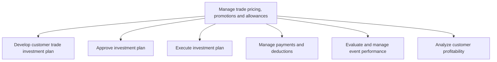

# Manage trade pricing, promotions and allowances

> TODO: Business-as-Code definition for manage trade pricing, promotions and allowances (consumer-products)

## Overview

TODO: Add process overview

## Process Hierarchy



## GraphDL

```yaml
manage:
  object: Trade Pricing, Promotions And Allowances
  actor: TODO
  result: TODO
```

## Actions

| Action | Description |
|--------|-------------|
| TODO | TODO |

## Events

| Event | Description |
|-------|-------------|
| TODO | TODO |

## Searches

| Search | Description |
|--------|-------------|
| TODO | TODO |

## Process Flow


## RACI Matrix

| Activity | Responsible | Accountable | Consulted | Informed |
|----------|-------------|-------------|-----------|----------|
| TODO | TODO | TODO | TODO | TODO |

## Sub-Processes

| ID | Name | Description |
|----|------|-------------|
| 3.3.6.1 | Develop customer trade investment plan | TODO |
| 3.3.6.2 | Approve investment plan | TODO |
| 3.3.6.3 | Execute investment plan | TODO |
| 3.3.6.4 | Manage payments and deductions | TODO |
| 3.3.6.5 | Evaluate and manage event performance | TODO |
| 3.3.6.6 | Analyze customer profitability | TODO |

## Related Processes

| Process | Relationship |
|---------|-------------|
| TODO | TODO |

## Related Departments

| Department | Role |
|-----------|------|
| TODO | TODO |

## Related Occupations

| Occupation | Involvement |
|-----------|-------------|
| TODO | TODO |

## KPIs

| KPI | Description | Unit |
|-----|-------------|------|
| TODO | TODO | TODO |

## Usage

```typescript
import { TODO } from '@headlessly/manage-trade-pricing,-promotions-and-allowances'

const client = TODO()

// TODO: Example action calls
```
