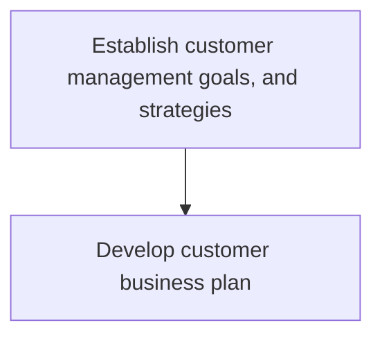

# Establish customer management goals, and strategies

> TODO: Business-as-Code definition for establish customer management goals, and strategies (consumer-products)

## Overview

Developing the business plan, strategy, targets, and funding options for major customer accounts.  Planning activities are conducted and in collaboration with these key accounts, sales and promotional plans are created.  For each account, promotional and category management calendars are created as well as strategic and tactical sales plans, all of which is communicated to the customer account teams.

## Process Hierarchy



## GraphDL

```yaml
establish:
  object: Customer Management Goals, And Strategies
  actor: TODO
  result: TODO
```

## Actions

| Action | Description |
|--------|-------------|
| TODO | TODO |

## Events

| Event | Description |
|-------|-------------|
| TODO | TODO |

## Searches

| Search | Description |
|--------|-------------|
| TODO | TODO |

## Process Flow


## RACI Matrix

| Activity | Responsible | Accountable | Consulted | Informed |
|----------|-------------|-------------|-----------|----------|
| TODO | TODO | TODO | TODO | TODO |

## Sub-Processes

| ID | Name | Description |
|----|------|-------------|
| 3.4.6.1 | Develop customer business plan | TODO |

## Related Processes

| Process | Relationship |
|---------|-------------|
| TODO | TODO |

## Related Departments

| Department | Role |
|-----------|------|
| TODO | TODO |

## Related Occupations

| Occupation | Involvement |
|-----------|-------------|
| TODO | TODO |

## KPIs

| KPI | Description | Unit |
|-----|-------------|------|
| TODO | TODO | TODO |

## Usage

```typescript
import { TODO } from '@headlessly/establish-customer-management-goals,-and-strategies'

const client = TODO()

// TODO: Example action calls
```
