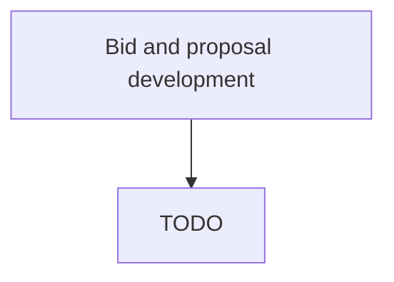

# Bid and proposal development

> TODO: Business-as-Code definition for bid and proposal development (life-sciences)

## Overview

Analyzing requirements, competition, and pricing to develop bids and proposals. The organization will understand and refine the customer requirements as provided in a RFP (Request for Proposal) or RFI (Request for Information). Take into consideration whether the requirements are a match with the strategic or tactical plans of the organization and whether they are able to submit a bid/proposal that is competitive based on an understanding of the offerings of other competing organizations.  Define the pricing and scheduling of the proposed solution and determine whether the proposal will be profitable for the company if accepted.  The bid is then submitted and a notification of whether or not it was successful is received.

## Process Hierarchy



## GraphDL

```yaml
bid:
  object: And Proposal Development
  actor: TODO
  result: TODO
```

## Actions

| Action | Description |
|--------|-------------|
| TODO | TODO |

## Events

| Event | Description |
|-------|-------------|
| TODO | TODO |

## Searches

| Search | Description |
|--------|-------------|
| TODO | TODO |

## Process Flow


## RACI Matrix

| Activity | Responsible | Accountable | Consulted | Informed |
|----------|-------------|-------------|-----------|----------|
| TODO | TODO | TODO | TODO | TODO |

## Related Processes

| Process | Relationship |
|---------|-------------|
| TODO | TODO |

## Related Departments

| Department | Role |
|-----------|------|
| TODO | TODO |

## Related Occupations

| Occupation | Involvement |
|-----------|-------------|
| TODO | TODO |

## KPIs

| KPI | Description | Unit |
|-----|-------------|------|
| TODO | TODO | TODO |

## Usage

```typescript
import { TODO } from '@headlessly/bid-and-proposal-development'

const client = TODO()

// TODO: Example action calls
```
