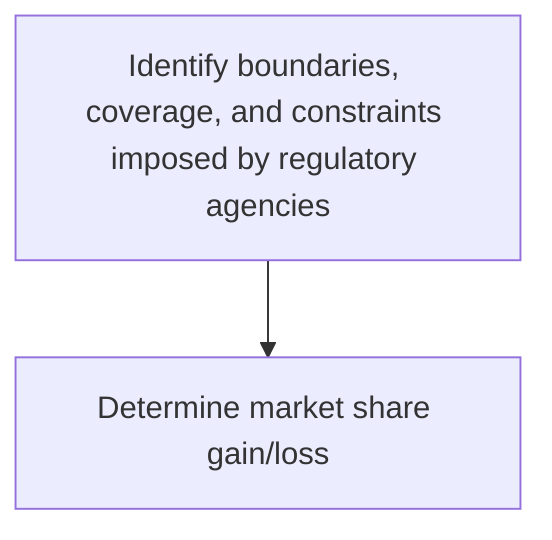

# Identify boundaries, coverage, and constraints imposed by regulatory agencies

> TODO: Business-as-Code definition for identify boundaries, coverage, and constraints imposed by regulatory agencies (petroleum-downstream)

## Overview

TODO: Add process overview

## Process Hierarchy



## GraphDL

```yaml
identify:
  object: Boundaries, Coverage, And Constraints Imposed By Regulatory Agencies
  actor: TODO
  result: TODO
```

## Actions

| Action | Description |
|--------|-------------|
| TODO | TODO |

## Events

| Event | Description |
|-------|-------------|
| TODO | TODO |

## Searches

| Search | Description |
|--------|-------------|
| TODO | TODO |

## Process Flow


## RACI Matrix

| Activity | Responsible | Accountable | Consulted | Informed |
|----------|-------------|-------------|-----------|----------|
| TODO | TODO | TODO | TODO | TODO |

## Sub-Processes

| ID | Name | Description |
|----|------|-------------|
| 3.1.1.3.1 | Determine market share gain/loss | Determining the increase or decrease of the company's sales volume in the targeted markets. Conduct  |

## Related Processes

| Process | Relationship |
|---------|-------------|
| TODO | TODO |

## Related Departments

| Department | Role |
|-----------|------|
| TODO | TODO |

## Related Occupations

| Occupation | Involvement |
|-----------|-------------|
| TODO | TODO |

## KPIs

| KPI | Description | Unit |
|-----|-------------|------|
| TODO | TODO | TODO |

## Usage

```typescript
import { TODO } from '@headlessly/identify-boundaries,-coverage,-and-constraints-imposed-by-regulatory-agencies'

const client = TODO()

// TODO: Example action calls
```
