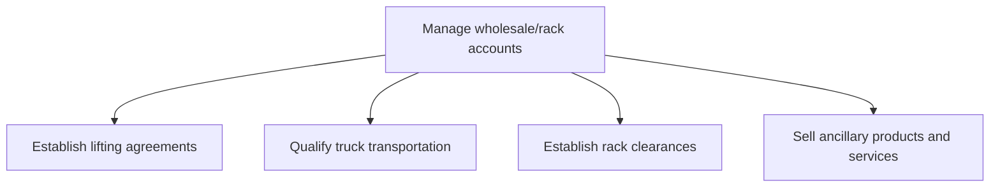

# Manage wholesale/rack accounts

> TODO: Business-as-Code definition for manage wholesale/rack accounts (petroleum-downstream)

## Overview

Managing accounts for oil lifting.  Oil lifting is the process by which oil is collected by refinery companies. The oil is then processed at the refinery and distributed throughout the company's global network using various methods. Agreements setting out rights, obligations and procedures for the lifting of oil are established; truck transportation is qualified; rack clearances are established and ancillary products and services are sold.

## Process Hierarchy



## GraphDL

```yaml
manage:
  object: Wholesale/rack Accounts
  actor: TODO
  result: TODO
```

## Actions

| Action | Description |
|--------|-------------|
| TODO | TODO |

## Events

| Event | Description |
|-------|-------------|
| TODO | TODO |

## Searches

| Search | Description |
|--------|-------------|
| TODO | TODO |

## Process Flow


## RACI Matrix

| Activity | Responsible | Accountable | Consulted | Informed |
|----------|-------------|-------------|-----------|----------|
| TODO | TODO | TODO | TODO | TODO |

## Sub-Processes

| ID | Name | Description |
|----|------|-------------|
| 3.5.3.1 | Establish lifting agreements | TODO |
| 3.5.3.2 | Qualify truck transportation | TODO |
| 3.5.3.3 | Establish rack clearances | TODO |
| 3.5.3.4 | Sell ancillary products and services | TODO |

## Related Processes

| Process | Relationship |
|---------|-------------|
| TODO | TODO |

## Related Departments

| Department | Role |
|-----------|------|
| TODO | TODO |

## Related Occupations

| Occupation | Involvement |
|-----------|-------------|
| TODO | TODO |

## KPIs

| KPI | Description | Unit |
|-----|-------------|------|
| TODO | TODO | TODO |

## Usage

```typescript
import { TODO } from '@headlessly/manage-wholesale/rack-accounts'

const client = TODO()

// TODO: Example action calls
```
