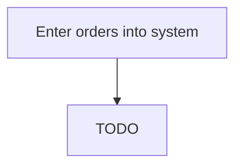

# Enter orders into system

> TODO: Business-as-Code definition for enter orders into system (petroleum-downstream)

## Overview

Analyzing all data relating to sales orders by entering it into a centralized repository, and using the insights generated to create opportunities for cross-/up-selling. Maintain up-to-date records of sales, along with current status. Include all sales activity with relevant information about the associated customers, and identify patterns in the data. Glean insights from these patterns to persuade customers to purchase additional offerings or upgrade purchased products/services.

## Process Hierarchy



## GraphDL

```yaml
enter:
  object: Orders Into System
  actor: TODO
  result: TODO
```

## Actions

| Action | Description |
|--------|-------------|
| TODO | TODO |

## Events

| Event | Description |
|-------|-------------|
| TODO | TODO |

## Searches

| Search | Description |
|--------|-------------|
| TODO | TODO |

## Process Flow


## RACI Matrix

| Activity | Responsible | Accountable | Consulted | Informed |
|----------|-------------|-------------|-----------|----------|
| TODO | TODO | TODO | TODO | TODO |

## Related Processes

| Process | Relationship |
|---------|-------------|
| TODO | TODO |

## Related Departments

| Department | Role |
|-----------|------|
| TODO | TODO |

## Related Occupations

| Occupation | Involvement |
|-----------|-------------|
| TODO | TODO |

## KPIs

| KPI | Description | Unit |
|-----|-------------|------|
| TODO | TODO | TODO |

## Usage

```typescript
import { TODO } from '@headlessly/enter-orders-into-system'

const client = TODO()

// TODO: Example action calls
```
