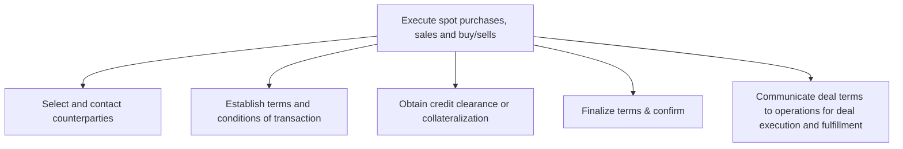

# Execute spot purchases, sales and buy/sells

> TODO: Business-as-Code definition for execute spot purchases, sales and buy/sells (petroleum-downstream)

## Overview

Executing trade opportunities. Counterparties are selected and contacted, the terms and conditions of transactions are established and credit clearance or collateralizations are obtained.  The terms are finalized and confirmed and deal terms are communicated to the operation team so that they can be executed and fulfilled.

## Process Hierarchy



## GraphDL

```yaml
execute:
  object: Spot Purchases, Sales And Buy/sells
  actor: TODO
  result: TODO
```

## Actions

| Action | Description |
|--------|-------------|
| TODO | TODO |

## Events

| Event | Description |
|-------|-------------|
| TODO | TODO |

## Searches

| Search | Description |
|--------|-------------|
| TODO | TODO |

## Process Flow


## RACI Matrix

| Activity | Responsible | Accountable | Consulted | Informed |
|----------|-------------|-------------|-----------|----------|
| TODO | TODO | TODO | TODO | TODO |

## Sub-Processes

| ID | Name | Description |
|----|------|-------------|
| 3.6.3.1 | Select and contact counterparties | TODO |
| 3.6.3.2 | Establish terms and conditions of transaction | TODO |
| 3.6.3.3 | Obtain credit clearance or collateralization | TODO |
| 3.6.3.4 | Finalize terms & confirm | TODO |
| 3.6.3.5 | Communicate deal terms to operations for deal execution and fulfillment | TODO |

## Related Processes

| Process | Relationship |
|---------|-------------|
| TODO | TODO |

## Related Departments

| Department | Role |
|-----------|------|
| TODO | TODO |

## Related Occupations

| Occupation | Involvement |
|-----------|-------------|
| TODO | TODO |

## KPIs

| KPI | Description | Unit |
|-----|-------------|------|
| TODO | TODO | TODO |

## Usage

```typescript
import { TODO } from '@headlessly/execute-spot-purchases,-sales-and-buy/sells'

const client = TODO()

// TODO: Example action calls
```
