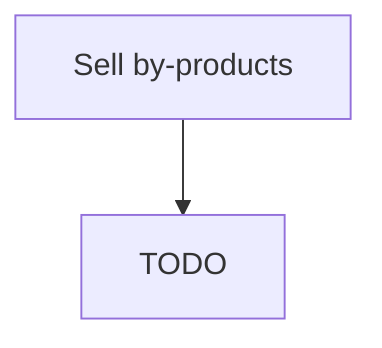

# Sell by-products

> TODO: Business-as-Code definition for sell by-products (petroleum-downstream)

## Overview

Selling  by-products that have commercial value.  When oil and gas wells are depleted and the hydrocarbons are processed into a format that can be pipelined to the end user market, a number of by-products that have commercial value are yielded and sold.  For example, when raw natural gas is processed into sales gas for the end user, a number of by products are yielded.  These are natural-gas condensate, sulfur, ethane, natural-gas liquids (NGL): propane, butanes and C5+ (which is the commonly used term for pentanes plus higher molecular weight hydrocarbons).  Coal gas is a flammable gaseous fuel made from coal and supplied to the user via a piped distribution system.  In the process of converting coal into coke, a fuel with few impurities and high carbon content, the volatile matter in the coal is vaporized and driven off. This volatile matter is processed to recover by-product coal chemicals and to condition the gas so that it can be used as a fuel gas.

## Process Hierarchy



## GraphDL

```yaml
sell:
  object: By-products
  actor: TODO
  result: TODO
```

## Actions

| Action | Description |
|--------|-------------|
| TODO | TODO |

## Events

| Event | Description |
|-------|-------------|
| TODO | TODO |

## Searches

| Search | Description |
|--------|-------------|
| TODO | TODO |

## Process Flow


## RACI Matrix

| Activity | Responsible | Accountable | Consulted | Informed |
|----------|-------------|-------------|-----------|----------|
| TODO | TODO | TODO | TODO | TODO |

## Related Processes

| Process | Relationship |
|---------|-------------|
| TODO | TODO |

## Related Departments

| Department | Role |
|-----------|------|
| TODO | TODO |

## Related Occupations

| Occupation | Involvement |
|-----------|-------------|
| TODO | TODO |

## KPIs

| KPI | Description | Unit |
|-----|-------------|------|
| TODO | TODO | TODO |

## Usage

```typescript
import { TODO } from '@headlessly/sell-by-products'

const client = TODO()

// TODO: Example action calls
```
