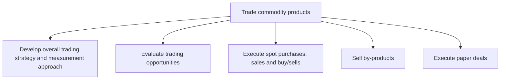

# Trade commodity products

> TODO: Business-as-Code definition for trade commodity products (petroleum-downstream)

## Overview

Buying and selling of energy (or energy producing) commodities such as crude oil, coal, natural gas, electrical power, etc. Manage the movement and delivery of energy commodities, and manage associated risks.  Purchase transmission and gas transportation space from transmission providers and pipeline owners respectively. Define overall trading strategy and measurement approach, evaluate trading opportunities, monitor environment for trading opportunities and executes physical energy pool, and spot trade as well as bilateral and over-the-counter trade. Hedging is a prevalent practice with energy commodity, where generators and retailers sell or buy at a set price in the future to avoid the market volatility.

## Process Hierarchy



## GraphDL

```yaml
trade:
  object: Commodity Products
  actor: TODO
  result: TODO
```

## Actions

| Action | Description |
|--------|-------------|
| TODO | TODO |

## Events

| Event | Description |
|-------|-------------|
| TODO | TODO |

## Searches

| Search | Description |
|--------|-------------|
| TODO | TODO |

## Process Flow


## RACI Matrix

| Activity | Responsible | Accountable | Consulted | Informed |
|----------|-------------|-------------|-----------|----------|
| TODO | TODO | TODO | TODO | TODO |

## Sub-Processes

| ID | Name | Description |
|----|------|-------------|
| 3.6.1 | Develop overall trading strategy and measurement approach | Defining key trading objectives and evaluation criteria for commodity trading.  The long term market |
| 3.6.2 | Evaluate trading opportunities | Gathering and analyzing market data using various quantitative and qualitative techniques. Discover  |
| 3.6.3 | Execute spot purchases, sales and buy/sells | Executing trade opportunities. Counterparties are selected and contacted, the terms and conditions o |
| 3.6.4 | Sell by-products | Selling  by-products that have commercial value.  When oil and gas wells are depleted and the hydroc |
| 3.6.5 | Execute paper deals | TODO |

## Related Processes

| Process | Relationship |
|---------|-------------|
| TODO | TODO |

## Related Departments

| Department | Role |
|-----------|------|
| TODO | TODO |

## Related Occupations

| Occupation | Involvement |
|-----------|-------------|
| TODO | TODO |

## KPIs

| KPI | Description | Unit |
|-----|-------------|------|
| TODO | TODO | TODO |

## Usage

```typescript
import { TODO } from '@headlessly/trade-commodity-products'

const client = TODO()

// TODO: Example action calls
```
