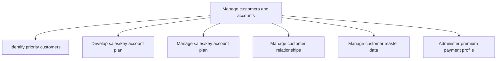

# Manage customers and accounts

> TODO: Business-as-Code definition for manage customers and accounts (property-and-casualty-insurance)

## Overview

TODO: Add process overview

## Process Hierarchy



## GraphDL

```yaml
manage:
  object: Customers And Accounts
  actor: TODO
  result: TODO
```

## Actions

| Action | Description |
|--------|-------------|
| TODO | TODO |

## Events

| Event | Description |
|-------|-------------|
| TODO | TODO |

## Searches

| Search | Description |
|--------|-------------|
| TODO | TODO |

## Process Flow


## RACI Matrix

| Activity | Responsible | Accountable | Consulted | Informed |
|----------|-------------|-------------|-----------|----------|
| TODO | TODO | TODO | TODO | TODO |

## Sub-Processes

| ID | Name | Description |
|----|------|-------------|
| 3.5.3.1 | Identify priority customers | TODO |
| 3.5.3.2 | Develop sales/key account plan | TODO |
| 3.5.3.3 | Manage sales/key account plan | TODO |
| 3.5.3.4 | Manage customer relationships | TODO |
| 3.5.3.5 | Manage customer master data | TODO |
| 3.5.3.6 | Administer premium payment profile | TODO |

## Related Processes

| Process | Relationship |
|---------|-------------|
| TODO | TODO |

## Related Departments

| Department | Role |
|-----------|------|
| TODO | TODO |

## Related Occupations

| Occupation | Involvement |
|-----------|-------------|
| TODO | TODO |

## KPIs

| KPI | Description | Unit |
|-----|-------------|------|
| TODO | TODO | TODO |

## Usage

```typescript
import { TODO } from '@headlessly/manage-customers-and-accounts'

const client = TODO()

// TODO: Example action calls
```
