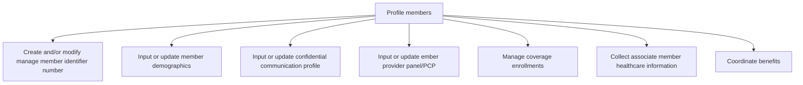

# Profile members

> TODO: Business-as-Code definition for profile members (unknown)

## Overview

TODO: Add process overview

## Process Hierarchy



## GraphDL

```yaml
profile:
  object: Members
  actor: TODO
  result: TODO
```

## Actions

| Action | Description |
|--------|-------------|
| TODO | TODO |

## Events

| Event | Description |
|-------|-------------|
| TODO | TODO |

## Searches

| Search | Description |
|--------|-------------|
| TODO | TODO |

## Process Flow


## RACI Matrix

| Activity | Responsible | Accountable | Consulted | Informed |
|----------|-------------|-------------|-----------|----------|
| TODO | TODO | TODO | TODO | TODO |

## Sub-Processes

| ID | Name | Description |
|----|------|-------------|
| 3.6.2.1 | Create and/or modify manage member identifier number | TODO |
| 3.6.2.2 | Input or update member demographics | TODO |
| 3.6.2.3 | Input or update confidential communication profile | TODO |
| 3.6.2.4 | Input or update ember provider panel/PCP | TODO |
| 3.6.2.5 | Manage coverage enrollments | TODO |
| 3.6.2.6 | Collect associate member healthcare information | TODO |
| 3.6.2.7 | Coordinate benefits | TODO |

## Related Processes

| Process | Relationship |
|---------|-------------|
| TODO | TODO |

## Related Departments

| Department | Role |
|-----------|------|
| TODO | TODO |

## Related Occupations

| Occupation | Involvement |
|-----------|-------------|
| TODO | TODO |

## KPIs

| KPI | Description | Unit |
|-----|-------------|------|
| TODO | TODO | TODO |

## Usage

```typescript
import { TODO } from '@headlessly/profile-members'

const client = TODO()

// TODO: Example action calls
```
