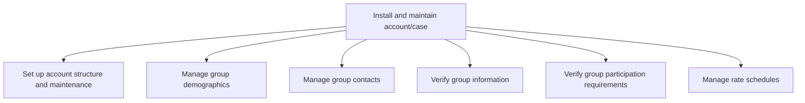

# Install and maintain account/case

> TODO: Business-as-Code definition for install and maintain account/case (unknown)

## Overview

TODO: Add process overview

## Process Hierarchy



## GraphDL

```yaml
install:
  object: And Maintain Account/case
  actor: TODO
  result: TODO
```

## Actions

| Action | Description |
|--------|-------------|
| TODO | TODO |

## Events

| Event | Description |
|-------|-------------|
| TODO | TODO |

## Searches

| Search | Description |
|--------|-------------|
| TODO | TODO |

## Process Flow


## RACI Matrix

| Activity | Responsible | Accountable | Consulted | Informed |
|----------|-------------|-------------|-----------|----------|
| TODO | TODO | TODO | TODO | TODO |

## Sub-Processes

| ID | Name | Description |
|----|------|-------------|
| 3.6.4.1 | Set up account structure and maintenance | TODO |
| 3.6.4.2 | Manage group demographics | TODO |
| 3.6.4.3 | Manage group contacts | TODO |
| 3.6.4.4 | Verify group information | TODO |
| 3.6.4.5 | Verify group participation requirements | TODO |
| 3.6.4.6 | Manage rate schedules | TODO |

## Related Processes

| Process | Relationship |
|---------|-------------|
| TODO | TODO |

## Related Departments

| Department | Role |
|-----------|------|
| TODO | TODO |

## Related Occupations

| Occupation | Involvement |
|-----------|-------------|
| TODO | TODO |

## KPIs

| KPI | Description | Unit |
|-----|-------------|------|
| TODO | TODO | TODO |

## Usage

```typescript
import { TODO } from '@headlessly/install-and-maintain-account/case'

const client = TODO()

// TODO: Example action calls
```
