# Execute physical energy pool and spot trading

> TODO: Business-as-Code definition for execute physical energy pool and spot trading (utilities)

## Overview

TODO: Add process overview

## Process Hierarchy

```mermaid
graph TD
    A[Execute physical energy pool and spot trading]
    A --> B[Determine medium term plant availability and demand forecasts]
    A --> C[Analyze bid/offer tactics]
    A --> D[Prepare and submit basic weekly dispatch offers]
    A --> E[Determine short term plant availability and demand forecasts]
    A --> F[Analyze rebid tactics]
    A --> G[Prepare and submit short term market rebids]
    A --> H[Report on pool trading activities]
    A --> I[Manage physical dispatch]
    A --> J[Communicate with market and system operators]
    A --> K[Communicate with generation and demand management operators]
    A --> L[Conduct pool/exchange balancing]
    A --> M[Perform settlement and reconciliation]
```



## GraphDL

```yaml
execute:
  object: Physical Energy Pool And Spot Trading
  actor: TODO
  result: TODO
```

## Actions

| Action | Description |
|--------|-------------|
| TODO | TODO |

## Events

| Event | Description |
|-------|-------------|
| TODO | TODO |

## Searches

| Search | Description |
|--------|-------------|
| TODO | TODO |

## Process Flow


## RACI Matrix

| Activity | Responsible | Accountable | Consulted | Informed |
|----------|-------------|-------------|-----------|----------|
| TODO | TODO | TODO | TODO | TODO |

## Sub-Processes

| ID | Name | Description |
|----|------|-------------|
| 3.6.3.1 | Determine medium term plant availability and demand forecasts | TODO |
| 3.6.3.2 | Analyze bid/offer tactics | TODO |
| 3.6.3.3 | Prepare and submit basic weekly dispatch offers | TODO |
| 3.6.3.4 | Determine short term plant availability and demand forecasts | TODO |
| 3.6.3.5 | Analyze rebid tactics | TODO |
| 3.6.3.6 | Prepare and submit short term market rebids | TODO |
| 3.6.3.7 | Report on pool trading activities | TODO |
| 3.6.3.8 | Manage physical dispatch | TODO |
| 3.6.3.9 | Communicate with market and system operators | TODO |
| 3.6.3.10 | Communicate with generation and demand management operators | TODO |
| 3.6.3.11 | Conduct pool/exchange balancing | TODO |
| 3.6.3.12 | Perform settlement and reconciliation | TODO |

## Related Processes

| Process | Relationship |
|---------|-------------|
| TODO | TODO |

## Related Departments

| Department | Role |
|-----------|------|
| TODO | TODO |

## Related Occupations

| Occupation | Involvement |
|-----------|-------------|
| TODO | TODO |

## KPIs

| KPI | Description | Unit |
|-----|-------------|------|
| TODO | TODO | TODO |

## Usage

```typescript
import { TODO } from '@headlessly/execute-physical-energy-pool-and-spot-trading'

const client = TODO()

// TODO: Example action calls
```
