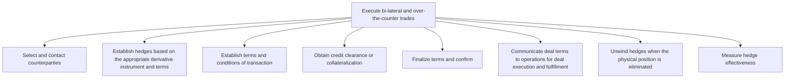

# Execute bi-lateral and over-the-counter trades

> TODO: Business-as-Code definition for execute bi-lateral and over-the-counter trades (utilities)

## Overview

TODO: Add process overview

## Process Hierarchy



## GraphDL

```yaml
execute:
  object: Bi-lateral And Over-the-counter Trades
  actor: TODO
  result: TODO
```

## Actions

| Action | Description |
|--------|-------------|
| TODO | TODO |

## Events

| Event | Description |
|-------|-------------|
| TODO | TODO |

## Searches

| Search | Description |
|--------|-------------|
| TODO | TODO |

## Process Flow


## RACI Matrix

| Activity | Responsible | Accountable | Consulted | Informed |
|----------|-------------|-------------|-----------|----------|
| TODO | TODO | TODO | TODO | TODO |

## Sub-Processes

| ID | Name | Description |
|----|------|-------------|
| 3.6.4.1 | Select and contact counterparties | TODO |
| 3.6.4.2 | Establish hedges based on the appropriate derivative instrument and terms | TODO |
| 3.6.4.3 | Establish terms and conditions of transaction | TODO |
| 3.6.4.4 | Obtain credit clearance or collateralization | TODO |
| 3.6.4.5 | Finalize terms and confirm | TODO |
| 3.6.4.6 | Communicate deal terms to operations for deal execution and fulfillment | TODO |
| 3.6.4.7 | Unwind hedges when the physical position is eliminated | TODO |
| 3.6.4.8 | Measure hedge effectiveness | TODO |

## Related Processes

| Process | Relationship |
|---------|-------------|
| TODO | TODO |

## Related Departments

| Department | Role |
|-----------|------|
| TODO | TODO |

## Related Occupations

| Occupation | Involvement |
|-----------|-------------|
| TODO | TODO |

## KPIs

| KPI | Description | Unit |
|-----|-------------|------|
| TODO | TODO | TODO |

## Usage

```typescript
import { TODO } from '@headlessly/execute-bi-lateral-and-over-the-counter-trades'

const client = TODO()

// TODO: Example action calls
```
