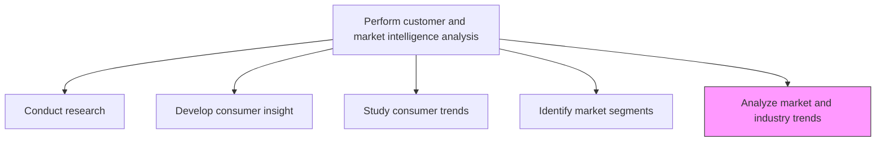
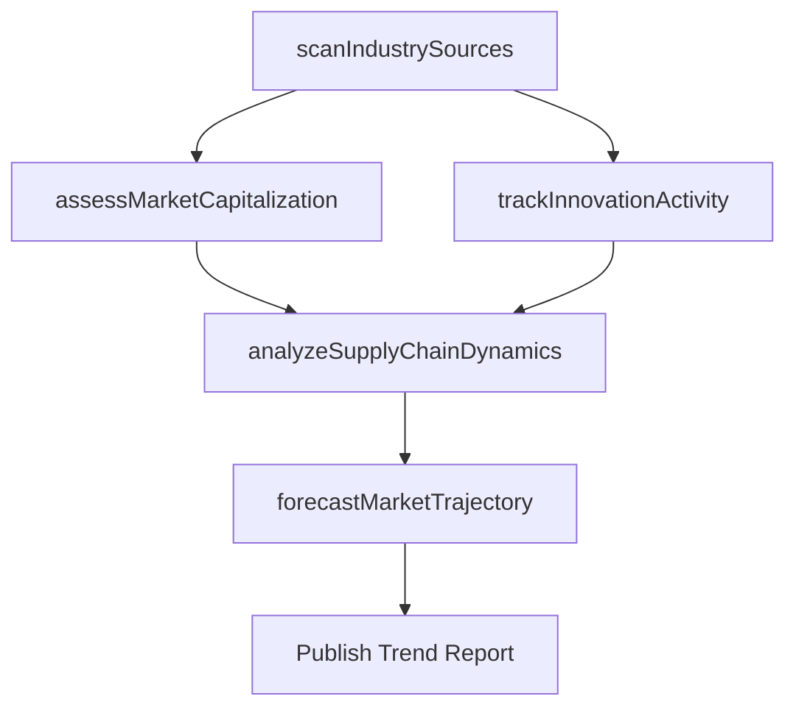

# Analyze market and industry trends

> Business-as-Code definition for macro market and industry trend analysis. Models the systematic monitoring, evaluation, and forecasting of industry-wide shifts that affect competitive positioning and product demand.

## Overview

Examining large-scale shifts and trends, with relevance to the organization's products/services. Vet the industrial and larger market landscape to identify broad-based movements that could have a direct or tangential impact on the uptake of the organization's products/services. Examine, among other things, the market capitalization of similar products, the profitability of organizations offering competing products/services, the stock price of key vendors/suppliers in the organizational value-chain, the rate and scale of innovation activity in the organization's product/service category, the price and availability of raw materials, and the shelf-life of similar products/services. Conduct primary and secondary research, and consider enlisting professional services.

## Process Hierarchy



## GraphDL

```yaml
analyze:
  object: Market And Industry Trends
  actor: IndustryAnalyst
  result: TrendAnalysisReport
```

## Actions

| Action | Description |
|--------|-------------|
| scanIndustrySources | Monitor publications, analysts, and databases for emerging trends |
| assessMarketCapitalization | Evaluate market cap and valuation trends in the product category |
| trackInnovationActivity | Monitor patent filings, R&D spending, and technology adoption rates |
| analyzeSupplyChainDynamics | Examine raw material availability, pricing, and vendor health |
| forecastMarketTrajectory | Project market direction based on identified trend vectors |

## Events

| Event | Description |
|-------|-------------|
| industrySourcesScanned | Industry scan cycle completed with key findings summarized |
| marketCapitalizationAssessed | Market valuation trend analysis delivered |
| innovationActivityTracked | Innovation and R&D activity report updated |
| supplyChainDynamicsAnalyzed | Supply chain trend assessment completed |
| marketTrajectoryForecasted | Market forecast model updated with latest trend data |

## Searches

| Search | Description |
|--------|-------------|
| getIndustryTrends | Retrieve industry trend reports by vertical and timeframe |
| getMarketForecasts | Query market size and growth projections |
| getInnovationMetrics | Retrieve R&D and patent activity metrics by category |
| getSupplyChainIndicators | Query supply chain health and pricing trend data |

## Process Flow



## RACI Matrix

| Activity | Responsible | Accountable | Consulted | Informed |
|----------|-------------|-------------|-----------|----------|
| scanIndustrySources | IndustryAnalyst | ResearchDirector | Strategy | Marketing |
| assessMarketCapitalization | FinancialAnalyst | ResearchDirector | Finance | ExecutiveTeam |
| trackInnovationActivity | IndustryAnalyst | ResearchDirector | R&D | ProductManagement |
| forecastMarketTrajectory | IndustryAnalyst | VP Marketing | Finance | Board |

## Related Processes

| Process | Relationship |
|---------|-------------|
| 3.1.1.3 Study consumer insights and trends | Parallel - consumer trends complement industry trends |
| 3.1.1.6 Analyze competing organizations | Parallel - competitor trends contribute to industry picture |
| 3.1.1.8 Assess internal and external business environment | Downstream - industry trends feed environment assessment |

## Related Departments

| Department | Role |
|-----------|------|
| Market Research | Leads industry trend monitoring and analysis |
| Strategy | Integrates industry trends into corporate planning |
| Finance | Provides market capitalization and financial trend data |
| R&D | Contributes technology and innovation trend context |

## Related Occupations

| Occupation | Involvement |
|-----------|-------------|
| Industry Analyst | Monitors and reports on macro industry trends |
| Economist | Provides economic modeling and market forecasting |
| Technology Analyst | Tracks innovation and technology adoption trends |

## KPIs

| KPI | Description | Unit |
|-----|-------------|------|
| Trend Report Frequency | Number of industry trend reports published per quarter | Count |
| Forecast Accuracy | Accuracy of market trajectory predictions vs actuals | % |
| Source Coverage | Number of industry data sources monitored regularly | Count |
| Trend Lead Time | Months ahead of market a trend was identified | Months |

## Usage

```typescript
import { analyzeMarketAndIndustryTrends } from '@headlessly/analyze-market-and-industry-trends'

const trends = analyzeMarketAndIndustryTrends()

// Scan industry for emerging trends
const scan = await trends.scanIndustrySources({
  industry: 'Financial Services',
  trendCategories: ['regulation', 'technology', 'consolidation'],
  lookbackMonths: 18
})

// Forecast market trajectory
const forecast = await trends.forecastMarketTrajectory({
  market: 'Digital Payments',
  horizon: '3-years',
  confidenceLevel: 0.9
})
```
