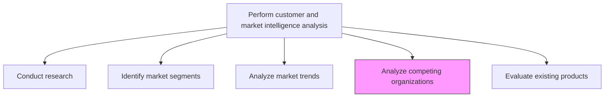
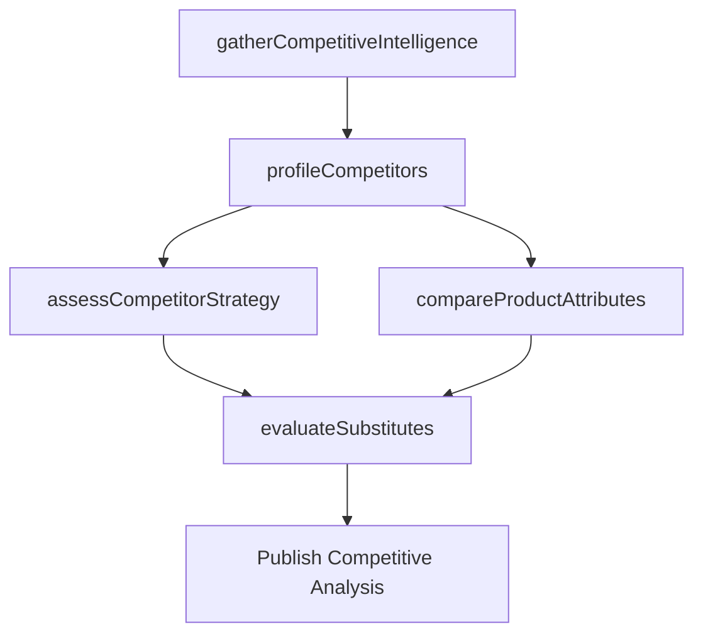

# Analyze competing organizations, competitive/substitute products/services

> Business-as-Code definition for competitive and substitute product analysis. Models the assessment of competing organizations, their strategic capabilities, product offerings, and substitute threats to inform competitive positioning.

## Overview

Examining the strengths and weaknesses of competing organizations. Assess competing organizations for offerings, product strategy, marketing and delivery channels, etc. Analyze the usability experience, durability, USP, and other key attributes of competing and substitute products. Gather competitive intelligence, and consider enlisting professional services.

## Process Hierarchy



## GraphDL

```yaml
analyze:
  object: Competing Organizations, Competitive/substitute Products/services
  actor: CompetitiveIntelligenceAnalyst
  result: CompetitiveAnalysisReport
```

## Actions

| Action | Description |
|--------|-------------|
| profileCompetitors | Build detailed profiles of competing organizations and their capabilities |
| assessCompetitorStrategy | Evaluate competitor go-to-market strategies, channels, and positioning |
| evaluateSubstitutes | Identify and analyze substitute products that could displace demand |
| compareProductAttributes | Benchmark competitor product usability, durability, and unique selling points |
| gatherCompetitiveIntelligence | Collect competitive data from public sources, industry reports, and field sales |

## Events

| Event | Description |
|-------|-------------|
| competitorsProfiled | Competitor organization profiles created or updated |
| competitorStrategyAssessed | Competitor strategy evaluation completed |
| substitutesEvaluated | Substitute product threat analysis delivered |
| productAttributesCompared | Competitive product comparison matrix finalized |
| competitiveIntelligenceGathered | Competitive intelligence collection cycle completed |

## Searches

| Search | Description |
|--------|-------------|
| getCompetitorProfiles | Retrieve competitor profiles by market or product category |
| getSubstituteThreats | Query substitute product threats ranked by displacement risk |
| getCompetitiveComparison | Retrieve product attribute comparison across competitors |
| getCompetitorStrategy | Query competitor strategic positioning and go-to-market data |

## Process Flow



## RACI Matrix

| Activity | Responsible | Accountable | Consulted | Informed |
|----------|-------------|-------------|-----------|----------|
| profileCompetitors | CompetitiveIntelligenceAnalyst | ResearchDirector | Sales | Marketing |
| assessCompetitorStrategy | CompetitiveIntelligenceAnalyst | VP Marketing | Strategy | ProductManagement |
| evaluateSubstitutes | ProductAnalyst | VP Product | Engineering | Marketing |
| compareProductAttributes | ProductAnalyst | VP Product | Sales | Marketing |

## Related Processes

| Process | Relationship |
|---------|-------------|
| 3.1.1.1.1 Study competitor category and brand positioning | Upstream - brand positioning data feeds competitor analysis |
| 3.1.1.5 Analyze market and industry trends | Parallel - industry trends provide context for competitor moves |
| 3.5.3.4 Perform competitive analysis | Downstream - competitive data used in bid/proposal preparation |

## Related Departments

| Department | Role |
|-----------|------|
| Competitive Intelligence | Leads competitor profiling and monitoring |
| Product Management | Evaluates competitive product features and substitutes |
| Sales | Provides win/loss feedback and field competitive intelligence |
| Strategy | Incorporates competitive analysis into strategic planning |

## Related Occupations

| Occupation | Involvement |
|-----------|-------------|
| Competitive Intelligence Analyst | Profiles competitors and gathers strategic intelligence |
| Product Analyst | Compares product attributes and evaluates substitutes |
| Sales Engineer | Provides technical competitive comparison data |

## KPIs

| KPI | Description | Unit |
|-----|-------------|------|
| Competitor Profile Coverage | Percentage of known competitors with current profiles | % |
| Win/Loss Attribution Rate | Percentage of deals with competitive win/loss reasons documented | % |
| Substitute Threat Detection | Number of new substitute threats identified per quarter | Count |
| Intelligence Freshness | Average age of competitor profile data | Days |

## Usage

```typescript
import { analyzeCompetingOrganizations } from '@headlessly/analyze-competing-organizations'

const competitive = analyzeCompetingOrganizations()

// Profile key competitors in the market
const profiles = await competitive.profileCompetitors({
  market: 'Enterprise Software',
  depth: 'comprehensive',
  includeFinancials: true
})

// Evaluate substitute product threats
const substitutes = await competitive.evaluateSubstitutes({
  productCategory: 'CRM',
  threatThreshold: 'medium',
  includeSelfService: true
})
```
