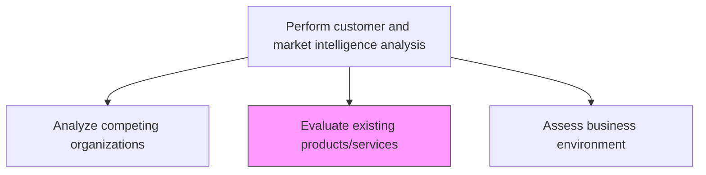
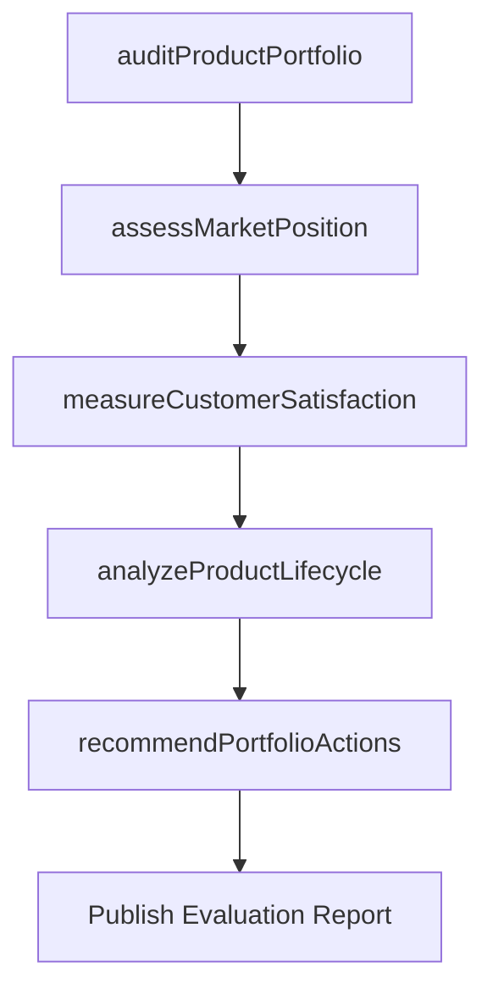

# Evaluate existing products/services

> Business-as-Code definition for existing product and service portfolio evaluation. Models the assessment of current offerings against market positioning, customer satisfaction, and competitive benchmarks to inform portfolio decisions.

## Overview

Examining the brands owned and products offered in the market. Determine the relative position of the existing products/brands in the marketplace.

## Process Hierarchy



## GraphDL

```yaml
evaluate:
  object: Existing Products/services
  actor: ProductAnalyst
  result: ProductEvaluationReport
```

## Actions

| Action | Description |
|--------|-------------|
| auditProductPortfolio | Review all current products and brands for market relevance |
| assessMarketPosition | Determine relative positioning of each product in its category |
| measureCustomerSatisfaction | Collect and analyze customer satisfaction data per product |
| analyzeProductLifecycle | Evaluate where each product sits in its lifecycle stage |
| recommendPortfolioActions | Propose invest, maintain, harvest, or divest decisions per product |

## Events

| Event | Description |
|-------|-------------|
| productPortfolioAudited | Complete product portfolio review finalized |
| marketPositionAssessed | Product market positioning analysis delivered |
| customerSatisfactionMeasured | Customer satisfaction scores updated for product line |
| productLifecycleAnalyzed | Lifecycle stage assessment completed for all products |
| portfolioActionsRecommended | Portfolio investment recommendations published |

## Searches

| Search | Description |
|--------|-------------|
| getProductPerformance | Retrieve revenue, margin, and growth metrics by product |
| getProductSatisfaction | Query customer satisfaction scores and NPS by product |
| getLifecycleStage | Retrieve lifecycle stage classification for products |

## Process Flow



## RACI Matrix

| Activity | Responsible | Accountable | Consulted | Informed |
|----------|-------------|-------------|-----------|----------|
| auditProductPortfolio | ProductAnalyst | VP Product | Marketing | Finance |
| assessMarketPosition | ProductAnalyst | VP Product | Sales | Marketing |
| measureCustomerSatisfaction | CustomerInsightsAnalyst | VP Product | CustomerSuccess | Sales |
| recommendPortfolioActions | VP Product | CMO | Finance | ExecutiveTeam |

## Related Processes

| Process | Relationship |
|---------|-------------|
| 3.1.1.1.4 Identify brand and portfolio gaps | Downstream - evaluation findings reveal portfolio gaps |
| 3.1.1.6 Analyze competing organizations | Parallel - competitive context informs product evaluation |
| 2.1 Manage product and service portfolio | Consumer - evaluation drives portfolio management decisions |

## Related Departments

| Department | Role |
|-----------|------|
| Product Management | Leads product evaluation and lifecycle analysis |
| Marketing | Provides brand positioning and market perception data |
| Customer Success | Contributes customer satisfaction and usage data |
| Finance | Provides product-level revenue and profitability data |

## Related Occupations

| Occupation | Involvement |
|-----------|-------------|
| Product Analyst | Conducts portfolio audits and lifecycle analysis |
| Product Marketing Manager | Assesses market positioning and messaging effectiveness |
| Financial Analyst | Evaluates product profitability and investment returns |

## KPIs

| KPI | Description | Unit |
|-----|-------------|------|
| Product Health Score | Composite metric of revenue, growth, and satisfaction per product | Score (1-100) |
| Portfolio Revenue Concentration | Revenue share held by top products | % |
| Customer Satisfaction (NPS) | Net Promoter Score by product line | Score (-100 to 100) |
| Product Lifecycle Accuracy | Correctness of lifecycle stage assignments | % |

## Usage

```typescript
import { evaluateExistingProductsServices } from '@headlessly/evaluate-existing-products-services'

const evaluation = evaluateExistingProductsServices()

// Audit the complete product portfolio
const audit = await evaluation.auditProductPortfolio({
  includeRevenue: true,
  includeMargin: true,
  period: 'last-12-months'
})

// Analyze lifecycle stage for underperforming products
const lifecycle = await evaluation.analyzeProductLifecycle({
  products: audit.filter(p => p.growthRate < 0),
  includeRecommendations: true
})
```
