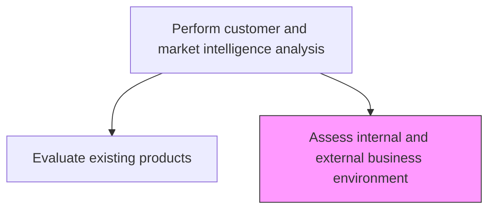
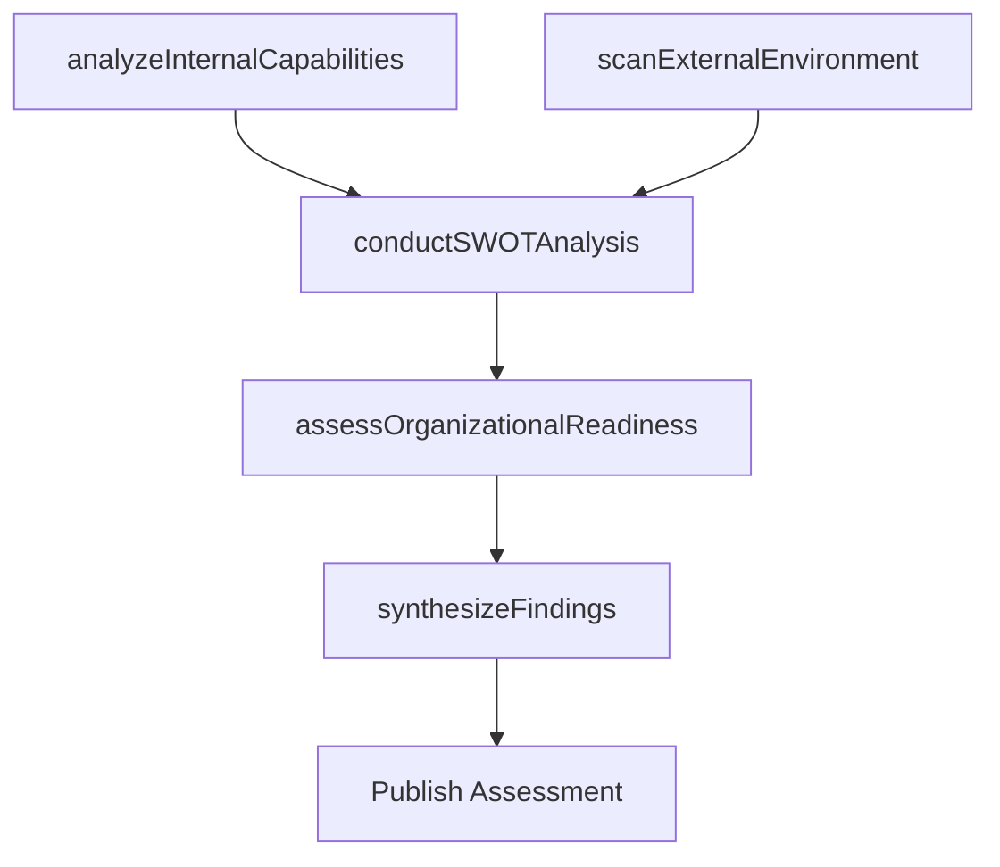

# Assess internal and external business environment

> Business-as-Code definition for business environment assessment. Models SWOT-style analysis of internal organizational capabilities and external market conditions to determine readiness for product-market initiatives.

## Overview

Understanding the culture and environment in which you're operating. Analyze how internal decision-making, thought processes, financial circumstances, and more affect the ability to bring new products to market. Survey or analyze the market into which the products would be introduced.

## Process Hierarchy



## GraphDL

```yaml
assess:
  object: Internal And External Business Environment
  actor: StrategyAnalyst
  result: EnvironmentAssessment
```

## Actions

| Action | Description |
|--------|-------------|
| analyzeInternalCapabilities | Evaluate organizational strengths, resources, and decision-making capacity |
| scanExternalEnvironment | Survey regulatory, economic, technological, and competitive conditions |
| conductSWOTAnalysis | Perform structured strengths, weaknesses, opportunities, threats assessment |
| assessOrganizationalReadiness | Determine the organization's readiness to pursue identified opportunities |
| synthesizeFindings | Consolidate internal and external analysis into an actionable assessment |

## Events

| Event | Description |
|-------|-------------|
| internalCapabilitiesAnalyzed | Internal capability assessment completed |
| externalEnvironmentScanned | External environment scan delivered |
| swotAnalysisConducted | SWOT analysis finalized and reviewed |
| organizationalReadinessAssessed | Readiness assessment completed |
| findingsSynthesized | Combined environment assessment published |

## Searches

| Search | Description |
|--------|-------------|
| getCapabilityAssessment | Retrieve internal capability scores by function or competency |
| getExternalFactors | Query external environment factors by category |
| getSWOTAnalysis | Retrieve SWOT analysis results by business unit or product |

## Process Flow



## RACI Matrix

| Activity | Responsible | Accountable | Consulted | Informed |
|----------|-------------|-------------|-----------|----------|
| analyzeInternalCapabilities | StrategyAnalyst | VP Strategy | HR | Operations |
| scanExternalEnvironment | StrategyAnalyst | VP Strategy | Legal | Finance |
| conductSWOTAnalysis | StrategyAnalyst | CMO | ProductManagement | ExecutiveTeam |
| assessOrganizationalReadiness | VP Strategy | CMO | Finance | Board |

## Related Processes

| Process | Relationship |
|---------|-------------|
| 3.1.1.5 Analyze market and industry trends | Upstream - external trends feed environment assessment |
| 3.1.2 Evaluate and prioritize market opportunities | Downstream - assessment informs opportunity prioritization |
| 1.1.1 Assess the external environment | Related - corporate-level environment assessment |

## Related Departments

| Department | Role |
|-----------|------|
| Strategy | Leads SWOT and environment analysis |
| Operations | Provides internal capacity and capability data |
| Finance | Assesses financial readiness and resource availability |
| Legal | Evaluates regulatory environment factors |

## Related Occupations

| Occupation | Involvement |
|-----------|-------------|
| Strategy Analyst | Conducts SWOT and environment assessments |
| Business Analyst | Evaluates internal processes and capabilities |
| Regulatory Affairs Specialist | Assesses regulatory environment impact |

## KPIs

| KPI | Description | Unit |
|-----|-------------|------|
| Assessment Frequency | Number of environment assessments conducted per year | Count |
| Factor Coverage | Percentage of relevant environmental factors tracked | % |
| Readiness Score | Organizational readiness composite score | Score (1-10) |
| Assessment Utilization | Percentage of assessments cited in strategic decisions | % |

## Usage

```typescript
import { assessInternalAndExternalBusinessEnvironment } from '@headlessly/assess-internal-and-external-business-environment'

const assessment = assessInternalAndExternalBusinessEnvironment()

// Conduct a SWOT analysis for a product line
const swot = await assessment.conductSWOTAnalysis({
  scope: 'Enterprise CRM',
  includeCompetitorContext: true,
  includeRegulatoryFactors: true
})

// Assess organizational readiness for a new market
const readiness = await assessment.assessOrganizationalReadiness({
  targetMarket: 'Healthcare',
  dimensions: ['talent', 'technology', 'capital', 'compliance']
})
```
