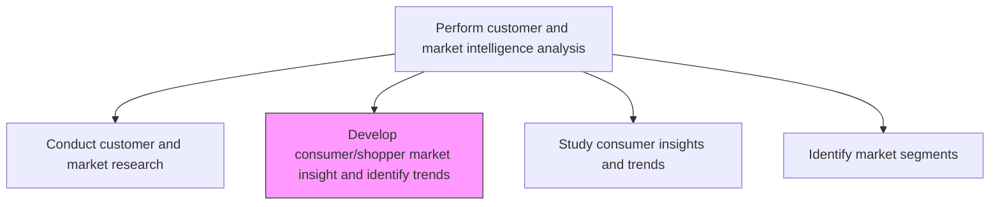
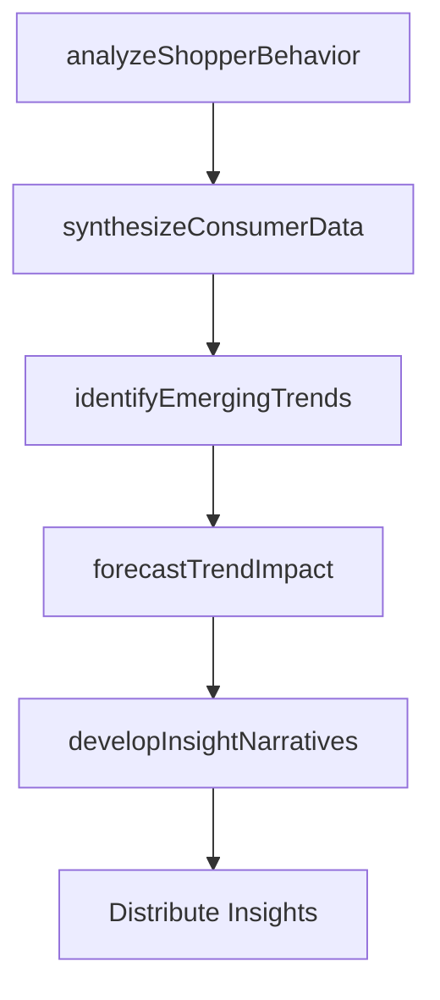

# Develop consumer/shopper market insight and identify trends

> Business-as-Code definition for consumer and shopper insight development. Models the synthesis of shopping behavior data, consumer attitude research, and market trends into actionable commercial insights.

## Overview

Synthesizing shopper behavior data, point-of-sale analytics, and consumer attitude research to develop deep market insights. Identifying emerging trends in consumer preferences, shopping patterns, and category dynamics that inform product development, merchandising, and marketing strategy.

## Process Hierarchy



## GraphDL

```yaml
develop:
  object: Consumer/shopper Market Insight And Identify Trends
  actor: ConsumerInsightsManager
  result: ShopperInsightReport
```

## Actions

| Action | Description |
|--------|-------------|
| analyzeShopperBehavior | Study in-store and online shopping patterns and purchase triggers |
| synthesizeConsumerData | Combine multiple data sources into unified consumer profiles |
| identifyEmergingTrends | Detect early signals of shifting consumer preferences |
| developInsightNarratives | Translate data findings into actionable business narratives |
| forecastTrendImpact | Project how identified trends will affect product demand |

## Events

| Event | Description |
|-------|-------------|
| shopperBehaviorAnalyzed | Shopper behavior analysis completed |
| consumerDataSynthesized | Multi-source consumer data consolidated |
| emergingTrendsIdentified | New consumer trends documented and validated |
| insightNarrativesDeveloped | Insight reports written and distributed |
| trendImpactForecasted | Trend impact projections delivered to stakeholders |

## Searches

| Search | Description |
|--------|-------------|
| getShopperInsights | Retrieve shopper behavior insights by channel or category |
| getTrendSignals | Query emerging consumer trend indicators |
| getConsumerProfiles | Retrieve unified consumer profiles with behavioral attributes |

## Process Flow



## RACI Matrix

| Activity | Responsible | Accountable | Consulted | Informed |
|----------|-------------|-------------|-----------|----------|
| analyzeShopperBehavior | ConsumerInsightsAnalyst | ConsumerInsightsManager | Sales | Merchandising |
| synthesizeConsumerData | DataAnalyst | ConsumerInsightsManager | IT | Marketing |
| identifyEmergingTrends | ConsumerInsightsManager | VP Marketing | Strategy | ProductManagement |
| developInsightNarratives | ConsumerInsightsManager | VP Marketing | Sales | ExecutiveTeam |

## Related Processes

| Process | Relationship |
|---------|-------------|
| 3.1.1.1 Conduct customer and market research | Upstream - research data feeds insight development |
| 3.1.1.3 Study consumer insights and trends | Parallel - complementary consumer trend analysis |
| 3.2.1 Define offering and customer value proposition | Downstream - insights shape value propositions |

## Related Departments

| Department | Role |
|-----------|------|
| Consumer Insights | Owns insight development and trend identification |
| Market Research | Provides primary and secondary research data |
| Category Management | Applies shopper insights to merchandising decisions |
| Marketing | Uses insights to inform campaign strategy |

## Related Occupations

| Occupation | Involvement |
|-----------|-------------|
| Consumer Insights Manager | Leads insight synthesis and narrative development |
| Shopper Marketing Analyst | Analyzes in-store and digital shopping behavior |
| Trend Analyst | Monitors and forecasts emerging consumer trends |

## KPIs

| KPI | Description | Unit |
|-----|-------------|------|
| Insight Generation Rate | Number of actionable insights produced per quarter | Count |
| Trend Detection Lead Time | Average time to identify a trend before market saturation | Months |
| Insight Adoption Rate | Percentage of insights acted upon by business teams | % |

## Usage

```typescript
import { developConsumerShopperMarketInsightAndIdentifyTrends } from '@headlessly/develop-consumer-shopper-market-insight-and-identify-trends'

const insights = developConsumerShopperMarketInsightAndIdentifyTrends()

// Analyze shopper behavior across channels
const behavior = await insights.analyzeShopperBehavior({
  channels: ['ecommerce', 'brick-and-mortar', 'mobile'],
  category: 'Consumer Electronics',
  period: 'last-12-months'
})

// Identify emerging consumer trends
const trends = await insights.identifyEmergingTrends({
  minSignalStrength: 0.6,
  categories: ['sustainability', 'convenience', 'personalization']
})
```
