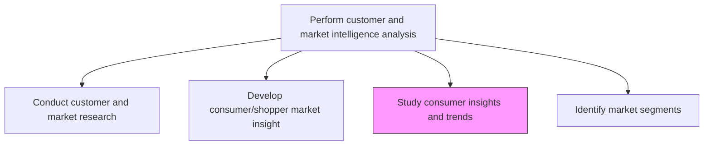
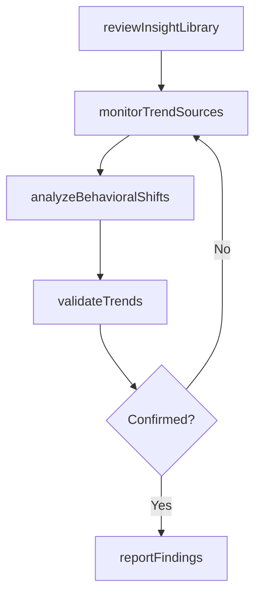

# Study consumer insights and trends

> Business-as-Code definition for consumer insight and trend analysis. Models the deep examination of consumer behavior patterns, attitude shifts, and macro trends to anticipate market evolution.

## Overview

Studying existing consumer insights and emerging market trends to understand how customer attitudes, preferences, and behaviors are evolving. Analyzing qualitative and quantitative consumer data to identify shifts in demand patterns, lifestyle changes, and emerging needs that will shape future market dynamics.

## Process Hierarchy



## GraphDL

```yaml
study:
  object: Consumer Insights And Trends
  actor: TrendAnalyst
  result: ConsumerTrendReport
```

## Actions

| Action | Description |
|--------|-------------|
| reviewInsightLibrary | Examine existing consumer research and insight repositories |
| monitorTrendSources | Track industry publications, social media, and trend services |
| analyzeBehavioralShifts | Identify significant changes in consumer attitudes and habits |
| validateTrends | Confirm trend signals through multiple data sources |
| reportFindings | Compile and communicate consumer trend findings to stakeholders |

## Events

| Event | Description |
|-------|-------------|
| insightLibraryReviewed | Existing insight repository scan completed |
| trendSourcesMonitored | External trend sources scanned and summarized |
| behavioralShiftsAnalyzed | Consumer behavioral shift analysis delivered |
| trendsValidated | Trend hypotheses confirmed through cross-source validation |
| findingsReported | Consumer trend report published to decision-makers |

## Searches

| Search | Description |
|--------|-------------|
| getConsumerTrends | Retrieve consumer trend reports by category or timeframe |
| getInsightArchive | Query historical consumer insights by topic or segment |
| getBehavioralShifts | List detected behavioral shifts ranked by magnitude |

## Process Flow



## RACI Matrix

| Activity | Responsible | Accountable | Consulted | Informed |
|----------|-------------|-------------|-----------|----------|
| reviewInsightLibrary | TrendAnalyst | ConsumerInsightsManager | MarketResearch | Marketing |
| monitorTrendSources | TrendAnalyst | ConsumerInsightsManager | Strategy | ProductManagement |
| analyzeBehavioralShifts | ConsumerInsightsAnalyst | ConsumerInsightsManager | Sales | Marketing |
| reportFindings | ConsumerInsightsManager | VP Marketing | ExecutiveTeam | Sales |

## Related Processes

| Process | Relationship |
|---------|-------------|
| 3.1.1.2 Develop consumer/shopper market insight and identify trends | Parallel - complementary insight development process |
| 3.1.1.5 Analyze market and industry trends | Parallel - macro trend analysis informs consumer-level study |
| 3.2.1 Define offering and customer value proposition | Downstream - trend insights shape future value propositions |

## Related Departments

| Department | Role |
|-----------|------|
| Consumer Insights | Leads consumer trend research and analysis |
| Strategy | Integrates consumer trends into strategic planning |
| Product Development | Uses trend insights for innovation pipeline |
| Marketing | Applies trend knowledge to messaging and positioning |

## Related Occupations

| Occupation | Involvement |
|-----------|-------------|
| Trend Analyst | Monitors and analyzes consumer trend signals |
| Consumer Insights Analyst | Interprets behavioral data for trend validation |
| Futurist | Provides macro-level context for emerging consumer shifts |

## KPIs

| KPI | Description | Unit |
|-----|-------------|------|
| Trend Identification Rate | Number of validated consumer trends identified per quarter | Count |
| Insight Library Currency | Percentage of insight library updated within last 12 months | % |
| Trend Validation Accuracy | Percentage of identified trends confirmed by market outcomes | % |

## Usage

```typescript
import { studyConsumerInsightsAndTrends } from '@headlessly/study-consumer-insights-and-trends'

const trends = studyConsumerInsightsAndTrends()

// Monitor external trend sources for consumer shifts
const signals = await trends.monitorTrendSources({
  categories: ['digital-health', 'remote-work', 'sustainability'],
  sources: ['industry-reports', 'social-media', 'patent-filings']
})

// Validate a detected trend through cross-referencing
const validated = await trends.validateTrends({
  trendId: signals[0].id,
  requiredConfidenceLevel: 0.8
})
```
