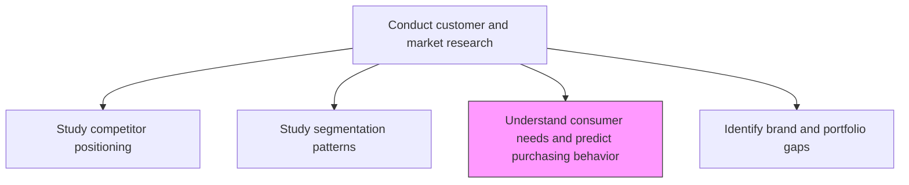
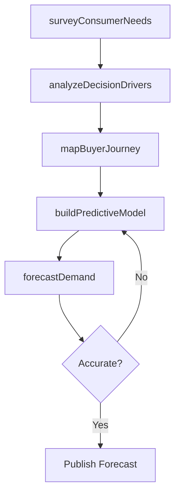

# Understand consumer needs and predict customer purchasing behavior

> Business-as-Code definition for consumer needs analysis and purchase behavior prediction. Models the identification of customer decision drivers and the construction of predictive models for purchasing patterns.

## Overview

Identifying the factors that drive the targeted market segment. Model customer purchasing patterns, and forecast their future purchasing behavior.

## Process Hierarchy



## GraphDL

```yaml
understand:
  object: Consumer Needs And Predict Customer Purchasing Behavior
  actor: ConsumerInsightsAnalyst
  result: PurchaseBehaviorForecast
```

## Actions

| Action | Description |
|--------|-------------|
| surveyConsumerNeeds | Conduct surveys and interviews to capture stated and latent needs |
| analyzeDecisionDrivers | Identify factors that influence purchase decisions by segment |
| buildPredictiveModel | Construct statistical models forecasting purchasing likelihood |
| mapBuyerJourney | Document the end-to-end decision and purchasing journey |
| forecastDemand | Project future purchase volumes based on behavior models |

## Events

| Event | Description |
|-------|-------------|
| consumerNeedsSurveyed | Customer needs research data collection completed |
| decisionDriversAnalyzed | Purchase decision factor analysis finalized |
| predictiveModelBuilt | Purchasing behavior prediction model trained and validated |
| buyerJourneyMapped | Customer buying journey documentation published |
| demandForecasted | Demand forecast generated from behavioral models |

## Searches

| Search | Description |
|--------|-------------|
| getConsumerNeeds | Retrieve stated and latent consumer needs by segment |
| getPurchaseDrivers | Query ranked purchase decision factors by customer group |
| getDemandForecast | Retrieve purchase volume projections by product and segment |

## Process Flow



## RACI Matrix

| Activity | Responsible | Accountable | Consulted | Informed |
|----------|-------------|-------------|-----------|----------|
| surveyConsumerNeeds | ConsumerInsightsAnalyst | ResearchDirector | Sales | Marketing |
| analyzeDecisionDrivers | ConsumerInsightsAnalyst | ResearchDirector | ProductManagement | Strategy |
| buildPredictiveModel | DataScientist | ResearchDirector | Marketing | Finance |
| forecastDemand | DataScientist | VP Marketing | SupplyChain | Finance |

## Related Processes

| Process | Relationship |
|---------|-------------|
| 3.1.1.1.2 Study customer segmentation patterns | Upstream - segments define populations for needs analysis |
| 3.1.1.4 Identify market segments | Downstream - needs data refines segment definitions |
| 3.3.5.3 Define target audience | Downstream - behavior insights drive audience targeting |

## Related Departments

| Department | Role |
|-----------|------|
| Consumer Insights | Leads needs research and behavioral analysis |
| Data Science | Builds predictive purchasing models |
| Marketing | Applies insights to campaign targeting and messaging |
| Sales | Provides frontline customer feedback on purchase drivers |

## Related Occupations

| Occupation | Involvement |
|-----------|-------------|
| Consumer Insights Analyst | Primary researcher of consumer needs and motivations |
| Data Scientist | Develops predictive purchasing behavior models |
| Behavioral Economist | Applies decision science frameworks to purchase analysis |

## KPIs

| KPI | Description | Unit |
|-----|-------------|------|
| Forecast Accuracy | Accuracy of purchase behavior predictions vs actuals | % |
| Needs Coverage | Percentage of target segments with current needs profiles | % |
| Model Refresh Rate | Frequency of predictive model retraining | Per Quarter |

## Usage

```typescript
import { understandConsumerNeedsAndPredictCustomerPurchasingBehavior } from '@headlessly/understand-consumer-needs-and-predict-customer-purchasing-behavior'

const consumer = understandConsumerNeedsAndPredictCustomerPurchasingBehavior()

// Survey consumer needs for a target segment
const needs = await consumer.surveyConsumerNeeds({
  segment: 'Small Business Owners',
  methodology: 'conjoint-analysis',
  sampleSize: 1500
})

// Build a predictive model for purchasing behavior
const model = await consumer.buildPredictiveModel({
  features: ['needsScore', 'priceElasticity', 'brandAffinity'],
  targetVariable: 'purchaseLikelihood'
})
```
