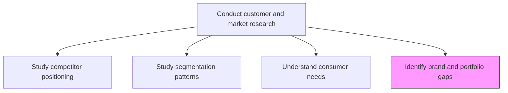
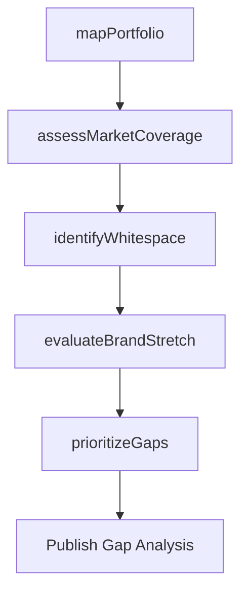

# Identify brand and portfolio gaps

> Business-as-Code definition for brand and product portfolio gap analysis. Models the systematic mapping of product portfolios against market demand to identify unmet customer needs and brand coverage gaps.

## Overview

Analyzing the current brand architecture and product portfolio to detect gaps where customer needs are not being addressed. Mapping existing offerings against market segments, price tiers, and use cases to find whitespace opportunities for new products, brand extensions, or portfolio rationalization.

## Process Hierarchy



## GraphDL

```yaml
identify:
  object: Brand And Portfolio Gaps
  actor: PortfolioStrategist
  result: GapAnalysisReport
```

## Actions

| Action | Description |
|--------|-------------|
| mapPortfolio | Chart current product and brand offerings across segments and tiers |
| assessMarketCoverage | Evaluate which market needs are served and which are unaddressed |
| identifyWhitespace | Detect unserved market segments or price points |
| evaluateBrandStretch | Assess whether existing brands can extend to fill identified gaps |
| prioritizeGaps | Rank identified gaps by revenue potential and strategic fit |

## Events

| Event | Description |
|-------|-------------|
| portfolioMapped | Product portfolio matrix created across segments and tiers |
| marketCoverageAssessed | Market coverage analysis completed |
| whitespaceIdentified | Unserved market whitespace opportunities documented |
| brandStretchEvaluated | Brand extension feasibility assessment delivered |
| gapsPrioritized | Portfolio gaps ranked and recommended for action |

## Searches

| Search | Description |
|--------|-------------|
| getPortfolioMap | Retrieve current portfolio map by segment and price tier |
| getGapAnalysis | Query identified gaps filtered by market or product category |
| getWhitespaceOpportunities | List whitespace opportunities ranked by revenue potential |

## Process Flow



## RACI Matrix

| Activity | Responsible | Accountable | Consulted | Informed |
|----------|-------------|-------------|-----------|----------|
| mapPortfolio | PortfolioStrategist | VP Marketing | ProductManagement | Sales |
| assessMarketCoverage | MarketResearchAnalyst | VP Marketing | Sales | Finance |
| identifyWhitespace | PortfolioStrategist | CMO | Strategy | ProductDevelopment |
| prioritizeGaps | VP Marketing | CMO | Finance | ExecutiveTeam |

## Related Processes

| Process | Relationship |
|---------|-------------|
| 3.1.1.1.1 Study competitor category and brand positioning | Upstream - competitor positioning reveals own portfolio gaps |
| 3.1.1.7 Evaluate existing products/services | Parallel - product evaluation feeds gap identification |
| 2.1 Manage product and service portfolio | Consumer - gaps drive portfolio investment decisions |

## Related Departments

| Department | Role |
|-----------|------|
| Portfolio Strategy | Leads gap identification and prioritization |
| Product Management | Provides product performance data and roadmap context |
| Brand Management | Evaluates brand extension opportunities |
| Finance | Assesses revenue potential of identified gaps |

## Related Occupations

| Occupation | Involvement |
|-----------|-------------|
| Brand Strategist | Evaluates brand architecture and extension opportunities |
| Product Portfolio Manager | Maps product coverage against market needs |
| Market Research Analyst | Provides market demand data for gap analysis |

## KPIs

| KPI | Description | Unit |
|-----|-------------|------|
| Portfolio Coverage | Percentage of addressable market segments with active products | % |
| Gap-to-Launch Rate | Percentage of identified gaps resulting in new product launches | % |
| Whitespace Revenue | Revenue generated from products addressing identified gaps | USD |

## Usage

```typescript
import { identifyBrandAndPortfolioGaps } from '@headlessly/identify-brand-and-portfolio-gaps'

const gaps = identifyBrandAndPortfolioGaps()

// Map current portfolio across market segments
const portfolio = await gaps.mapPortfolio({
  dimensions: ['segment', 'priceTier', 'useCase'],
  includeCompetitorCoverage: true
})

// Identify whitespace opportunities
const whitespace = await gaps.identifyWhitespace({
  minMarketSize: 10000000,
  excludeDecliningSements: true
})
```
