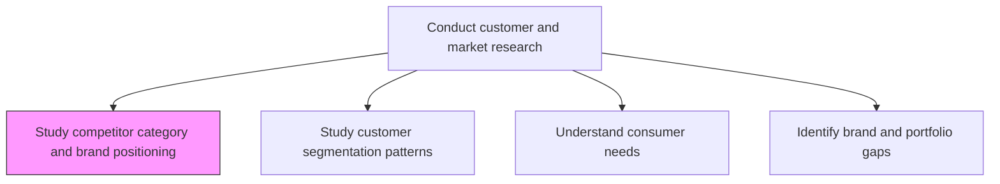
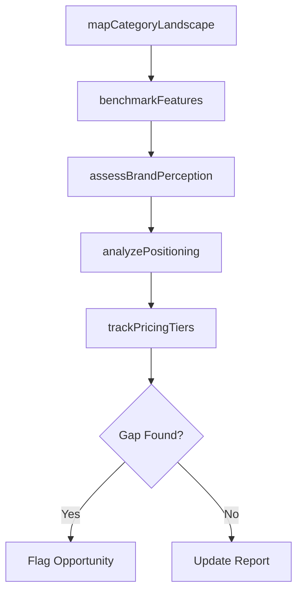

# Study competitor category and brand positioning (e.g. by benchmarking competitor products)

> Business-as-Code definition for competitive positioning analysis. Models the benchmarking of competitor products across category placement, brand perception, feature sets, and market positioning.

## Overview

Studying how competitors position their products and brands within the market category. Benchmarking competitor products across dimensions such as feature sets, pricing tiers, brand awareness, and customer satisfaction to understand relative positioning and identify differentiation opportunities.

## Process Hierarchy



## GraphDL

```yaml
study:
  object: Competitor Category And Brand Positioning (e.g. By Benchmarking Competitor Products)
  actor: CompetitiveIntelligenceAnalyst
  result: CompetitorPositioningReport
```

## Actions

| Action | Description |
|--------|-------------|
| mapCategoryLandscape | Chart the competitive landscape showing all players by category position |
| benchmarkFeatures | Compare product features across competitors in a structured matrix |
| assessBrandPerception | Measure competitor brand awareness, recall, and sentiment |
| analyzePositioning | Evaluate competitor value propositions and messaging strategies |
| trackPricingTiers | Monitor competitor pricing structures and tier configurations |

## Events

| Event | Description |
|-------|-------------|
| categoryLandscapeMapped | Competitive category map completed and published |
| featuresBenchmarked | Product feature comparison matrix finalized |
| brandPerceptionAssessed | Competitor brand perception study delivered |
| positioningAnalyzed | Competitor positioning analysis report generated |
| pricingTiersTracked | Competitor pricing data refreshed |

## Searches

| Search | Description |
|--------|-------------|
| getCompetitorProfiles | Retrieve competitor profiles by category or market segment |
| getBenchmarkMatrix | Query feature benchmark data across competitors |
| getBrandPerceptionData | Retrieve brand awareness and sentiment scores by competitor |

## Process Flow



## RACI Matrix

| Activity | Responsible | Accountable | Consulted | Informed |
|----------|-------------|-------------|-----------|----------|
| mapCategoryLandscape | CompetitiveIntelligenceAnalyst | ResearchDirector | Sales | Marketing |
| benchmarkFeatures | ProductAnalyst | VP Product | Engineering | Sales |
| assessBrandPerception | BrandResearcher | ResearchDirector | Marketing | ExecutiveTeam |
| analyzePositioning | CompetitiveIntelligenceAnalyst | VP Marketing | ProductManagement | Strategy |

## Related Processes

| Process | Relationship |
|---------|-------------|
| 3.1.1.1.2 Study customer segmentation patterns | Parallel - segmentation informs positioning analysis |
| 3.1.1.6 Analyze competing organizations | Upstream - broader competitive analysis feeds positioning study |
| 3.2.1.1 Define offering and positioning | Downstream - competitor positioning informs own positioning |

## Related Departments

| Department | Role |
|-----------|------|
| Competitive Intelligence | Leads competitor benchmarking and tracking |
| Product Management | Provides feature comparison data and product roadmap context |
| Marketing | Consumes positioning insights for messaging development |

## Related Occupations

| Occupation | Involvement |
|-----------|-------------|
| Competitive Intelligence Analyst | Conducts benchmarking and positioning analysis |
| Product Marketing Manager | Translates competitor insights into positioning strategy |
| Brand Strategist | Interprets brand perception findings |

## KPIs

| KPI | Description | Unit |
|-----|-------------|------|
| Competitor Coverage | Percentage of category competitors with current benchmarks | % |
| Benchmark Freshness | Average age of competitor benchmark data | Days |
| Positioning Insight Utilization | Percentage of findings incorporated into marketing strategy | % |

## Usage

```typescript
import { studyCompetitorCategoryAndBrandPositioning } from '@headlessly/study-competitor-category-and-brand-positioning'

const positioning = studyCompetitorCategoryAndBrandPositioning()

// Map the competitive landscape for a product category
const landscape = await positioning.mapCategoryLandscape({
  category: 'Marketing Automation',
  includeEmergingPlayers: true
})

// Benchmark features against top competitors
const benchmarks = await positioning.benchmarkFeatures({
  competitors: landscape.top10,
  dimensions: ['features', 'integrations', 'pricing', 'support']
})
```
