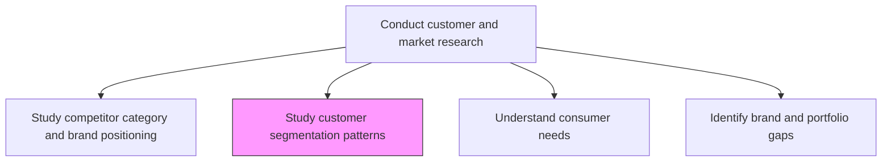
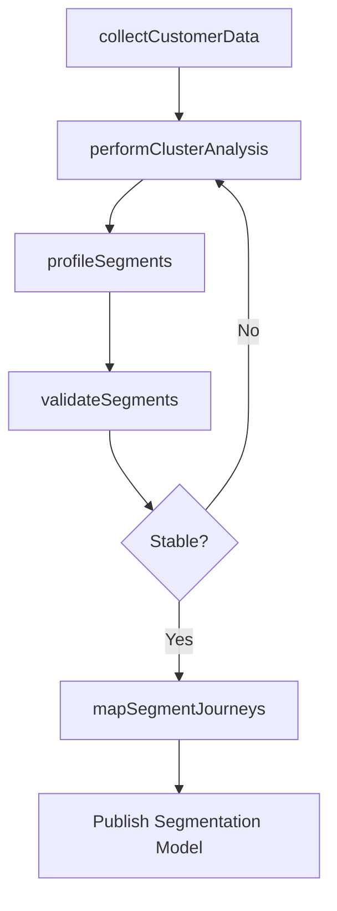

# Study customer segmentation patterns (e.g. by performing data driven segmentation analysis)

> Business-as-Code definition for data-driven customer segmentation analysis. Models the clustering and profiling of customer populations using behavioral, demographic, and transactional data to identify distinct market segments.

## Overview

Analyzing customer data to identify distinct segmentation patterns using statistical and machine learning techniques. Performing cluster analysis on customer demographics, purchase behavior, engagement metrics, and psychographic attributes to create actionable customer segments for targeted marketing and product development.

## Process Hierarchy



## GraphDL

```yaml
study:
  object: Customer Segmentation Patterns (e.g. By Performing Data Driven Segmentation Analysis)
  actor: DataScientist
  result: SegmentationModel
```

## Actions

| Action | Description |
|--------|-------------|
| collectCustomerData | Aggregate customer demographic, behavioral, and transactional data |
| performClusterAnalysis | Apply clustering algorithms to identify natural customer groupings |
| profileSegments | Create detailed profiles for each identified customer segment |
| validateSegments | Test segment stability and predictive power against holdout data |
| mapSegmentJourneys | Trace typical customer journeys for each segment |

## Events

| Event | Description |
|-------|-------------|
| customerDataCollected | Customer dataset assembled and cleaned for analysis |
| clusterAnalysisPerformed | Clustering model run completed with segment assignments |
| segmentsProfiled | Segment profiles with demographic and behavioral attributes published |
| segmentsValidated | Segmentation model validated against test data |
| segmentJourneysMapped | Customer journey maps created for each segment |

## Searches

| Search | Description |
|--------|-------------|
| getSegmentProfiles | Retrieve detailed profiles for identified customer segments |
| getSegmentDistribution | Query segment size and growth metrics |
| getSegmentBehavior | Retrieve behavioral patterns and purchase metrics by segment |

## Process Flow



## RACI Matrix

| Activity | Responsible | Accountable | Consulted | Informed |
|----------|-------------|-------------|-----------|----------|
| collectCustomerData | DataEngineer | DataScientist | IT | Marketing |
| performClusterAnalysis | DataScientist | ResearchDirector | Marketing | ProductManagement |
| profileSegments | MarketResearchAnalyst | ResearchDirector | Sales | Marketing |
| validateSegments | DataScientist | ResearchDirector | QualityAssurance | Marketing |

## Related Processes

| Process | Relationship |
|---------|-------------|
| 3.1.1.1.3 Understand consumer needs and predict purchasing behavior | Downstream - segments feed purchasing behavior models |
| 3.1.1.4 Identify market segments | Downstream - data-driven patterns inform formal segment definitions |
| 3.2.1.2 Develop value proposition for target segments | Consumer - segments determine value proposition targets |

## Related Departments

| Department | Role |
|-----------|------|
| Data Science | Builds and validates segmentation models |
| Market Research | Provides customer survey and behavioral data |
| Marketing | Applies segments to targeting and campaign design |
| IT | Manages customer data infrastructure and pipelines |

## Related Occupations

| Occupation | Involvement |
|-----------|-------------|
| Data Scientist | Builds clustering models and validates segment stability |
| Market Research Analyst | Interprets segments and creates profile narratives |
| Marketing Analyst | Applies segments to campaign targeting |

## KPIs

| KPI | Description | Unit |
|-----|-------------|------|
| Segment Stability | Percentage of customers remaining in same segment over time | % |
| Model Accuracy | Predictive accuracy of segment assignment model | % |
| Segment Actionability | Percentage of segments with active marketing programs | % |

## Usage

```typescript
import { studyCustomerSegmentationPatterns } from '@headlessly/study-customer-segmentation-patterns'

const segmentation = studyCustomerSegmentationPatterns()

// Run cluster analysis on customer base
const model = await segmentation.performClusterAnalysis({
  features: ['recency', 'frequency', 'monetaryValue', 'engagement'],
  algorithm: 'k-means',
  maxClusters: 8
})

// Get detailed profile for a specific segment
const profile = await segmentation.profileSegments({
  segmentId: model.segments[0].id,
  includeJourney: true
})
```
