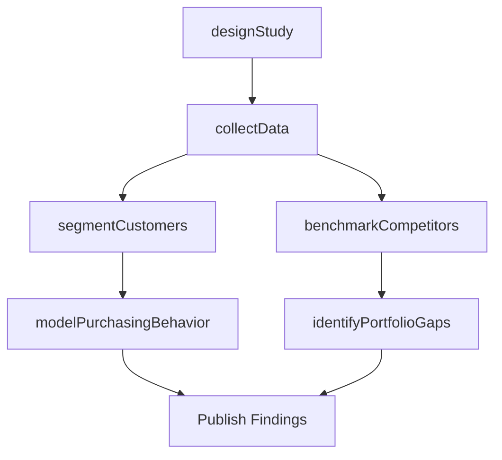

# Conduct customer and market research

> Business-as-Code definition for primary and secondary customer and market research. Models the execution of research studies including competitor benchmarking, segmentation analysis, consumer behavior modeling, and portfolio gap identification.

## Overview

Executing systematic research to understand customer needs, competitive positioning, and market structure. Involves benchmarking competitor products, performing data-driven segmentation analysis, predicting customer purchasing behavior, and identifying gaps in brand and product portfolios.

## Process Hierarchy

```mermaid
graph TD
    A[Conduct customer and market research]
    A --> B[Study competitor category and brand positioning (e.g. by benchmarking competitor products)]
    A --> C[Study customer segmentation patterns (e.g. by performing data driven segmentation analysis)]
    A --> D[Understand consumer needs and predict customer purchasing behavior]
    A --> E[Identify brand and portfolio gaps]
```

## GraphDL

```yaml
conduct:
  object: Customer And Market Research
  actor: MarketResearcher
  result: ResearchFindings
```

## Actions

| Action | Description |
|--------|-------------|
| benchmarkCompetitors | Compare competitor product features, pricing, and positioning |
| segmentCustomers | Perform data-driven clustering to identify distinct customer groups |
| modelPurchasingBehavior | Build predictive models of customer purchase decision drivers |
| identifyPortfolioGaps | Map product portfolio against market needs to find unmet demand |
| designStudy | Define research methodology, sample size, and data collection plan |
| collectData | Execute surveys, interviews, or secondary data extraction |

## Events

| Event | Description |
|-------|-------------|
| competitorsBenchmarked | Competitor benchmarking analysis completed |
| customersSegmented | Customer segmentation model finalized |
| purchasingBehaviorModeled | Predictive purchasing model validated |
| portfolioGapsIdentified | Product portfolio gap analysis delivered |
| studyDesigned | Research study design approved and ready for execution |
| dataCollected | Research data collection phase completed |

## Searches

| Search | Description |
|--------|-------------|
| getResearchStudies | Retrieve completed research studies by topic or methodology |
| findSegmentProfiles | Query customer segment profiles with demographic and behavioral data |
| getBenchmarkResults | Retrieve competitor benchmarking data by product category |
| getPortfolioGapReport | Retrieve current portfolio gap analysis results |

## Process Flow



## RACI Matrix

| Activity | Responsible | Accountable | Consulted | Informed |
|----------|-------------|-------------|-----------|----------|
| designStudy | MarketResearcher | ResearchDirector | Marketing | ProductManagement |
| collectData | ResearchAssociate | MarketResearcher | ExternalVendors | DataScience |
| segmentCustomers | DataScientist | MarketResearcher | Sales | Marketing |
| benchmarkCompetitors | CompetitiveIntelligenceAnalyst | ResearchDirector | ProductManagement | Strategy |
| modelPurchasingBehavior | DataScientist | ResearchDirector | Sales | Marketing |

## Sub-Processes

| ID | Name | Description |
|----|------|-------------|
| 3.1.1.1.1 | Study competitor category and brand positioning (e.g. by benchmarking competitor products) | Studying how competitors position their products and brands within the market category. Benchmarking  |
| 3.1.1.1.2 | Study customer segmentation patterns (e.g. by performing data driven segmentation analysis) | Analyzing customer data to identify distinct segmentation patterns using statistical and machine lear |
| 3.1.1.1.3 | Understand consumer needs and predict customer purchasing behavior | Identifying the factors that drive the targeted market segment. Model customer purchasing patterns,  |
| 3.1.1.1.4 | Identify brand and portfolio gaps | Analyzing the current brand architecture and product portfolio to detect gaps where customer needs ar |

## Related Processes

| Process | Relationship |
|---------|-------------|
| 3.1.1.2 Develop consumer/shopper market insight and identify trends | Downstream - research feeds consumer insight development |
| 3.1.1.4 Identify market segments | Downstream - segmentation data used for formal segment definition |
| 3.1.1.6 Analyze competing organizations | Parallel - competitive research supports competitor analysis |

## Related Departments

| Department | Role |
|-----------|------|
| Market Research | Designs and executes primary research studies |
| Data Science | Builds segmentation and predictive models |
| Marketing | Sponsors research and acts on findings |
| Product Management | Provides product data and consumes gap analysis |

## Related Occupations

| Occupation | Involvement |
|-----------|-------------|
| Market Research Analyst | Designs studies and interprets research data |
| Data Scientist | Builds segmentation and behavioral prediction models |
| Survey Researcher | Administers primary data collection instruments |

## KPIs

| KPI | Description | Unit |
|-----|-------------|------|
| Study Completion Rate | Percentage of planned research studies completed on schedule | % |
| Sample Adequacy | Percentage of studies meeting minimum sample size requirements | % |
| Segmentation Model Accuracy | Predictive accuracy of customer segmentation models | % |
| Research Turnaround Time | Average days from study initiation to final report | Days |

## Usage

```typescript
import { conductCustomerAndMarketResearch } from '@headlessly/conduct-customer-and-market-research'

const research = conductCustomerAndMarketResearch()

// Design a customer segmentation study
const study = await research.designStudy({
  type: 'segmentation',
  sampleSize: 2000,
  methodology: 'online-survey'
})

// Benchmark competitors in target category
const benchmarks = await research.benchmarkCompetitors({
  category: 'Project Management Software',
  dimensions: ['features', 'pricing', 'satisfaction']
})
```
