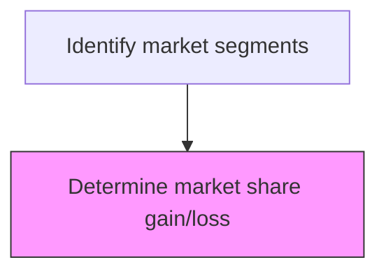
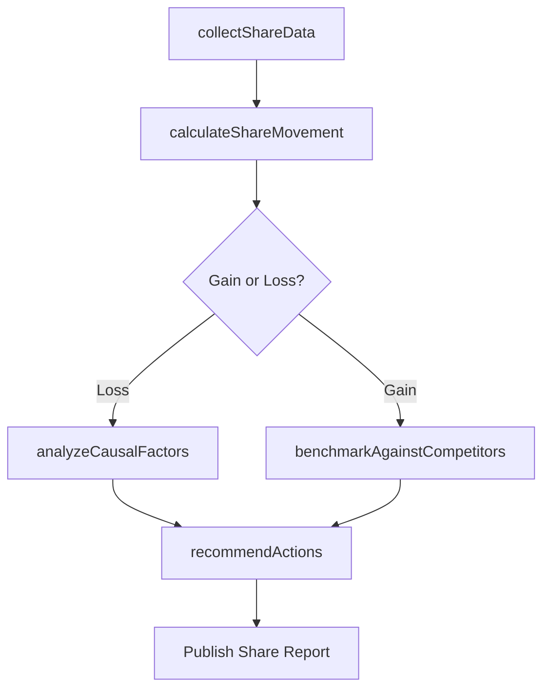

# Determine market share gain/loss

> Business-as-Code definition for market share tracking and analysis. Models the measurement of share gains and losses across segments, identification of causal factors, and development of share recovery strategies.

## Overview

Determining the increase or decrease of the company's sales volume in the targeted markets. Conduct an analysis to determine the factors and underlying causes that affect the changes in the demand for products or services offered. Consider changes in offerings or in the business strategy to regain or increase the market share.

## Process Hierarchy



## GraphDL

```yaml
determine:
  object: Market Share Gain/loss
  actor: MarketAnalyst
  result: MarketShareReport
```

## Actions

| Action | Description |
|--------|-------------|
| collectShareData | Gather sales volume and revenue data by segment and period |
| calculateShareMovement | Compute market share changes relative to prior periods |
| analyzeCausalFactors | Identify drivers behind market share gains or losses |
| benchmarkAgainstCompetitors | Compare share movements against key competitors |
| recommendActions | Propose strategies to recover or grow market share |

## Events

| Event | Description |
|-------|-------------|
| shareDataCollected | Market share data aggregated from all sources |
| shareMovementCalculated | Market share gain/loss figures computed |
| causalFactorsAnalyzed | Root cause analysis of share changes completed |
| competitorsBenchmarked | Competitor share comparison finalized |
| actionsRecommended | Share recovery or growth actions proposed |

## Searches

| Search | Description |
|--------|-------------|
| getMarketShareHistory | Retrieve market share data over time by segment |
| getShareDrivers | Query factors contributing to share gains or losses |
| getCompetitorShareData | Retrieve competitor market share comparison data |

## Process Flow



## RACI Matrix

| Activity | Responsible | Accountable | Consulted | Informed |
|----------|-------------|-------------|-----------|----------|
| collectShareData | MarketAnalyst | VP Marketing | Sales | Finance |
| calculateShareMovement | MarketAnalyst | VP Marketing | Finance | ExecutiveTeam |
| analyzeCausalFactors | MarketAnalyst | VP Marketing | ProductManagement | Strategy |
| recommendActions | VP Marketing | CMO | Sales | ExecutiveTeam |

## Related Processes

| Process | Relationship |
|---------|-------------|
| 3.1.1.4 Identify market segments | Parent - share analysis is performed within defined segments |
| 3.1.1.6 Analyze competing organizations | Upstream - competitor analysis provides share context |
| 3.4.4.1 Calculate product market share | Related - product-level share calculation |

## Related Departments

| Department | Role |
|-----------|------|
| Market Research | Collects and analyzes market share data |
| Sales | Provides revenue data and field-level share intelligence |
| Finance | Validates revenue figures and market sizing |
| Strategy | Incorporates share trends into strategic planning |

## Related Occupations

| Occupation | Involvement |
|-----------|-------------|
| Market Analyst | Calculates and tracks market share movements |
| Business Intelligence Analyst | Builds share dashboards and reporting |
| Sales Analyst | Provides sales volume data for share calculations |

## KPIs

| KPI | Description | Unit |
|-----|-------------|------|
| Market Share | Percentage of total market revenue captured | % |
| Share Growth Rate | Period-over-period change in market share | Percentage Points |
| Share of Voice | Percentage of category marketing spend | % |
| Win Rate | Percentage of competitive deals won | % |

## Usage

```typescript
import { determineMarketShareGainLoss } from '@headlessly/determine-market-share-gain-loss'

const shareAnalysis = determineMarketShareGainLoss()

// Calculate share movement for a specific segment
const movement = await shareAnalysis.calculateShareMovement({
  segment: 'Enterprise',
  currentPeriod: 'Q4-2025',
  comparisonPeriod: 'Q4-2024'
})

// Analyze causal factors for a share decline
const drivers = await shareAnalysis.analyzeCausalFactors({
  segment: 'Mid-Market',
  direction: 'loss',
  period: 'last-4-quarters'
})
```
