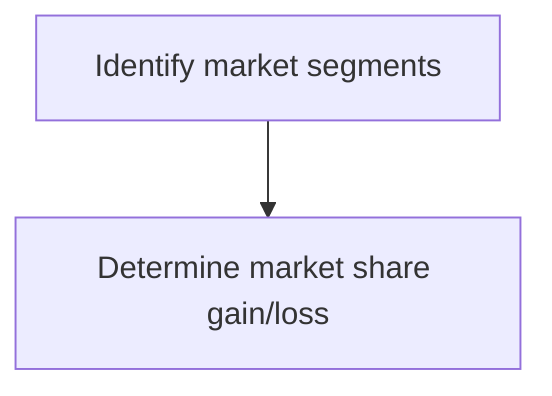
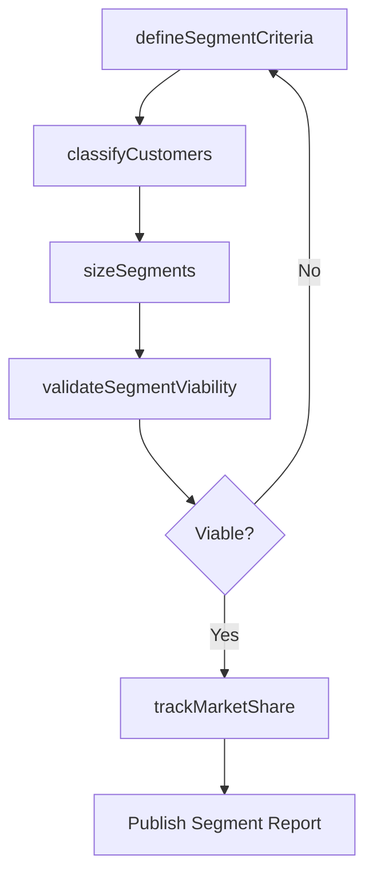

# Identify market segments

> Business-as-Code definition for market segmentation. Models the process of dividing addressable markets into distinct customer groups based on shared characteristics, then sizing and tracking market share within each segment.

## Overview

Identifying a section of the customer population to target for marketing products/services. Create segments within the customer population for targeted marketing campaigns, which increase the efficacy of marketing outlay. Determine the right customer segments, craft effective marketing messages, and efficiently communicate them. Determine the optimal pricing mix. Consider assistance from professional services for market segmentation studies, with coordination and oversight from the marketing/sales functions.

## Process Hierarchy



## GraphDL

```yaml
identify:
  object: Market Segments
  actor: MarketSegmentationAnalyst
  result: SegmentDefinition
```

## Actions

| Action | Description |
|--------|-------------|
| defineSegmentCriteria | Establish the variables used to divide the market into segments |
| classifyCustomers | Assign customers to segments based on defined criteria |
| sizeSegments | Estimate total addressable market and revenue potential per segment |
| trackMarketShare | Monitor the organization's share within each identified segment |
| validateSegmentViability | Confirm segments are measurable, accessible, and actionable |

## Events

| Event | Description |
|-------|-------------|
| segmentCriteriaDefined | Segmentation variables and rules established |
| customersClassified | Customer base assigned to segments |
| segmentsSized | Segment sizing and revenue estimates completed |
| marketShareTracked | Market share data refreshed for all segments |
| segmentViabilityValidated | Segment viability assessment approved |

## Searches

| Search | Description |
|--------|-------------|
| getSegmentDefinitions | Retrieve segment definitions with criteria and characteristics |
| getSegmentSizing | Query segment size, growth rate, and revenue potential |
| getMarketShareBySegment | Retrieve market share data by segment over time |

## Process Flow



## RACI Matrix

| Activity | Responsible | Accountable | Consulted | Informed |
|----------|-------------|-------------|-----------|----------|
| defineSegmentCriteria | MarketSegmentationAnalyst | VP Marketing | Sales | ProductManagement |
| classifyCustomers | DataScientist | MarketSegmentationAnalyst | IT | Marketing |
| sizeSegments | MarketResearchAnalyst | VP Marketing | Finance | Strategy |
| trackMarketShare | MarketResearchAnalyst | VP Marketing | Sales | ExecutiveTeam |

## Sub-Processes

| ID | Name | Description |
|----|------|-------------|
| 3.1.1.4.1 | Determine market share gain/loss | Determining the increase or decrease of the company's sales volume in the targeted markets. Conduct  |

## Related Processes

| Process | Relationship |
|---------|-------------|
| 3.1.1.1.2 Study customer segmentation patterns | Upstream - data-driven patterns inform segment definitions |
| 3.1.2.2 Determine target segments | Downstream - identified segments feed target segment selection |
| 3.2.4.4 Select channels for target segments | Downstream - segments drive channel selection |

## Related Departments

| Department | Role |
|-----------|------|
| Market Research | Conducts segmentation analysis and market sizing |
| Marketing | Applies segments to campaign targeting and messaging |
| Sales | Provides frontline segment-level customer feedback |
| Finance | Validates segment revenue potential estimates |

## Related Occupations

| Occupation | Involvement |
|-----------|-------------|
| Market Segmentation Analyst | Defines and validates market segments |
| Data Scientist | Builds analytical models for customer classification |
| Marketing Strategist | Translates segments into marketing strategies |

## KPIs

| KPI | Description | Unit |
|-----|-------------|------|
| Segment Coverage | Percentage of total addressable market assigned to segments | % |
| Market Share Accuracy | Accuracy of market share estimates vs third-party data | % |
| Segment Profitability | Average revenue per segment relative to cost to serve | USD |
| Segmentation Refresh Cycle | Time between segment model updates | Months |

## Usage

```typescript
import { identifyMarketSegments } from '@headlessly/identify-market-segments'

const segmentation = identifyMarketSegments()

// Define segment criteria for a product category
const criteria = await segmentation.defineSegmentCriteria({
  variables: ['companySize', 'industry', 'techAdoption', 'budget'],
  method: 'hierarchical-clustering'
})

// Track market share within each segment
const share = await segmentation.trackMarketShare({
  segmentIds: ['enterprise', 'mid-market', 'smb'],
  period: 'Q4-2025'
})
```
