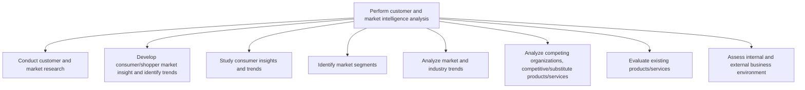
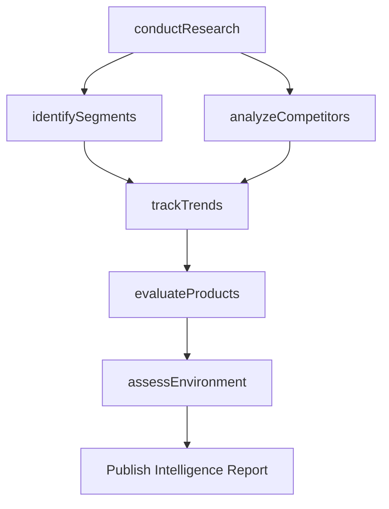

# Perform customer and market intelligence analysis

> Business-as-Code definition for systematic market and customer intelligence gathering. Models the research, segmentation, trend analysis, and competitive assessment processes that inform go-to-market decisions.

## Overview

Gathering intelligence on the market and customers. Closely examine the inherent attributes and collective behavior of the various market and customer segments. Track trends in the market. Determine what drives the customers to make purchasing decisions in order to identify opportunities in the market.

## Process Hierarchy



## GraphDL

```yaml
perform:
  object: Customer And Market Intelligence Analysis
  actor: MarketIntelligenceAnalyst
  result: IntelligenceAnalysisReport
```

## Actions

| Action | Description |
|--------|-------------|
| conductResearch | Execute primary and secondary market research studies |
| analyzeCompetitors | Profile competing organizations and substitute offerings |
| identifySegments | Define and characterize distinct market segments |
| trackTrends | Monitor macro and micro industry trends over time |
| evaluateProducts | Assess current product portfolio against market demands |
| assessEnvironment | Analyze internal and external business environment factors |

## Events

| Event | Description |
|-------|-------------|
| researchConducted | Market research study completed and data collected |
| competitorsAnalyzed | Competitive landscape assessment finalized |
| segmentsIdentified | Market segmentation model published |
| trendsTracked | Industry trend report updated with latest data |
| productsEvaluated | Product portfolio evaluation completed |
| environmentAssessed | Business environment scan delivered to stakeholders |

## Searches

| Search | Description |
|--------|-------------|
| getResearchStudies | Retrieve completed research studies by topic or date range |
| findCompetitorProfiles | List competitor profiles by market or product category |
| getSegmentData | Query segment attributes including size, growth, and demographics |
| getTrendReports | Retrieve trend analysis reports by industry vertical |

## Process Flow



## RACI Matrix

| Activity | Responsible | Accountable | Consulted | Informed |
|----------|-------------|-------------|-----------|----------|
| conductResearch | MarketResearchAnalyst | ResearchDirector | Sales | Marketing |
| analyzeCompetitors | CompetitiveIntelligenceAnalyst | ResearchDirector | ProductManagement | Strategy |
| identifySegments | MarketResearchAnalyst | VP Marketing | Sales | Finance |
| trackTrends | MarketResearchAnalyst | ResearchDirector | Strategy | ExecutiveTeam |
| evaluateProducts | ProductAnalyst | VP Product | Engineering | Marketing |

## Sub-Processes

| ID | Name | Description |
|----|------|-------------|
| 3.1.1.1 | Conduct customer and market research | Executing systematic research to understand customer needs, competitive positioning, and market struc |
| 3.1.1.2 | Develop consumer/shopper market insight and identify trends | Synthesizing shopper behavior data, point-of-sale analytics, and consumer attitude research to devel |
| 3.1.1.3 | Study consumer insights and trends | Studying existing consumer insights and emerging market trends to understand how customer attitudes,  |
| 3.1.1.4 | Identify market segments | Identifying a section of the customer population to target for marketing products/services. Create s |
| 3.1.1.5 | Analyze market and industry trends | Examining large-scale shifts and trends, with relevance to the organization's products/services. Vet |
| 3.1.1.6 | Analyze competing organizations, competitive/substitute products/services | Examining the strengths and weaknesses of competing organizations. Assess competing organizations fo |
| 3.1.1.7 | Evaluate existing products/services | Examining the brands owned and products offered in the market. Determine the relative position of th |
| 3.1.1.8 | Assess internal and external business environment | Understanding the culture and environment in which you're operating. Analyze how internal decision-m |

## Related Processes

| Process | Relationship |
|---------|-------------|
| 3.1.2 Evaluate and prioritize market opportunities | Downstream - intelligence feeds opportunity evaluation |
| 3.2.1 Define offering and customer value proposition | Consumer - uses intelligence to shape value propositions |
| 3.4.1 Develop sales forecast | Consumer - market data supports forecast models |

## Related Departments

| Department | Role |
|-----------|------|
| Market Research | Leads data collection, surveys, and analysis |
| Competitive Intelligence | Monitors competitor activities and strategies |
| Marketing | Defines research questions and consumes insights |
| Product Management | Provides product performance data for evaluation |

## Related Occupations

| Occupation | Involvement |
|-----------|-------------|
| Market Research Analyst | Designs and executes research studies |
| Competitive Intelligence Analyst | Tracks and profiles competitors |
| Data Scientist | Builds segmentation and predictive models |

## KPIs

| KPI | Description | Unit |
|-----|-------------|------|
| Research Cycle Time | Average time from research initiation to report delivery | Days |
| Competitor Coverage | Percentage of known competitors with current profiles | % |
| Segment Penetration | Percentage of identified segments with active research | % |
| Insight Utilization Rate | Percentage of intelligence reports cited in strategy decisions | % |

## Usage

```typescript
import { performCustomerAndMarketIntelligenceAnalysis } from '@headlessly/perform-customer-and-market-intelligence-analysis'

const intelligence = performCustomerAndMarketIntelligenceAnalysis()

// Conduct research across target segments
const study = await intelligence.conductResearch({
  type: 'quantitative',
  segments: ['SMB', 'Enterprise'],
  methodology: 'survey'
})

// Analyze competitors in the product category
const landscape = await intelligence.analyzeCompetitors({
  category: 'CRM Software',
  includeSubstitutes: true
})
```
