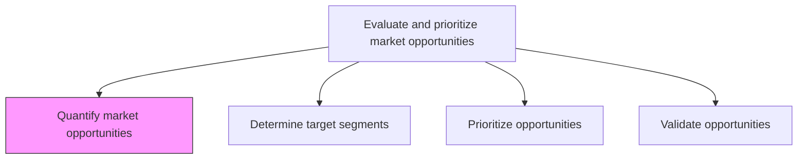
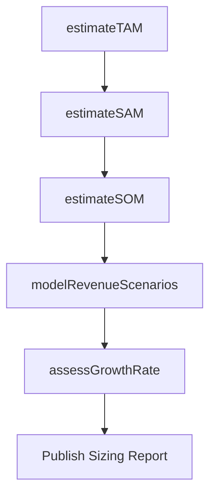

# Quantify market opportunities

> Business-as-Code definition for market opportunity quantification. Models the estimation of total addressable market, revenue potential, and financial value of identified market opportunities.

## Overview

Attaching quantifiable indicators to opportunities that have been identified in the market. Compute estimated figures of the approximate value that can be captured with the provision of existing products/services (i.e., the extent of financial benefits that can be reaped in the market).

## Process Hierarchy



## GraphDL

```yaml
quantify:
  object: Market Opportunities
  actor: MarketAnalyst
  result: OpportunitySizingEstimate
```

## Actions

| Action | Description |
|--------|-------------|
| estimateTAM | Calculate total addressable market size for the opportunity |
| estimateSAM | Determine serviceable addressable market based on current capabilities |
| estimateSOM | Project serviceable obtainable market given competitive dynamics |
| modelRevenueScenarios | Build best-case, expected, and worst-case revenue projections |
| assessGrowthRate | Estimate compound annual growth rate for the opportunity |

## Events

| Event | Description |
|-------|-------------|
| tamEstimated | Total addressable market calculation completed |
| samEstimated | Serviceable addressable market determined |
| somEstimated | Serviceable obtainable market projected |
| revenueScenariosModeled | Revenue scenario models finalized |
| growthRateAssessed | Market growth rate estimate validated |

## Searches

| Search | Description |
|--------|-------------|
| getOpportunitySizing | Retrieve TAM/SAM/SOM estimates for an opportunity |
| getRevenueProjections | Query revenue scenario models by opportunity |
| getGrowthRates | Retrieve growth rate estimates by market or segment |

## Process Flow



## RACI Matrix

| Activity | Responsible | Accountable | Consulted | Informed |
|----------|-------------|-------------|-----------|----------|
| estimateTAM | MarketAnalyst | VP Marketing | Finance | Strategy |
| estimateSAM | MarketAnalyst | VP Marketing | ProductManagement | Sales |
| modelRevenueScenarios | FinancialAnalyst | VP Marketing | Finance | ExecutiveTeam |

## Related Processes

| Process | Relationship |
|---------|-------------|
| 3.1.1 Perform customer and market intelligence analysis | Upstream - market data enables opportunity quantification |
| 3.1.2.3 Prioritize opportunities | Downstream - quantified opportunities feed prioritization |
| 3.4.4 Establish overall sales budgets | Consumer - opportunity sizing informs budget planning |

## Related Departments

| Department | Role |
|-----------|------|
| Market Research | Provides market size and growth data |
| Finance | Validates financial assumptions and revenue models |
| Strategy | Frames opportunity sizing within corporate planning |

## Related Occupations

| Occupation | Involvement |
|-----------|-------------|
| Market Analyst | Builds TAM/SAM/SOM models |
| Financial Analyst | Develops revenue scenarios and growth projections |
| Business Development Manager | Provides ground-level market opportunity intelligence |

## KPIs

| KPI | Description | Unit |
|-----|-------------|------|
| Estimation Accuracy | Variance between projected and actual market values | % |
| Sizing Turnaround | Average days to complete opportunity sizing | Days |
| Pipeline Value | Total estimated revenue across all quantified opportunities | USD |

## Usage

```typescript
import { quantifyMarketOpportunities } from '@headlessly/quantify-market-opportunities'

const sizing = quantifyMarketOpportunities()

// Estimate total addressable market
const tam = await sizing.estimateTAM({
  market: 'Enterprise Collaboration Tools',
  geography: 'Global',
  year: 2026
})

// Model revenue scenarios
const scenarios = await sizing.modelRevenueScenarios({
  opportunity: tam.id,
  cases: ['optimistic', 'expected', 'conservative'],
  horizon: '3-years'
})
```
