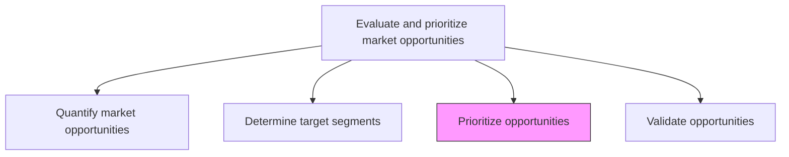
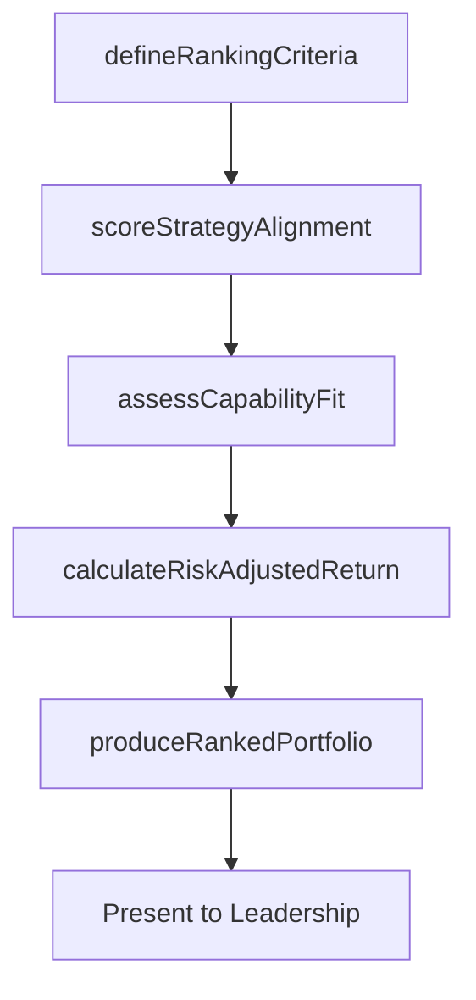

# Prioritize opportunities consistent with capabilities and overall business strategy

> Business-as-Code definition for strategic opportunity prioritization. Models the ranking of market opportunities by alignment with organizational capabilities, corporate strategy, and risk-adjusted return potential.

## Overview

Creating an index of market opportunities, and arrange them in order of preference. Prioritize based on the opportunities' adherence to the overall business strategy. Correlate with the competencies and capacities that the organization, as a whole, processes.

## Process Hierarchy



## GraphDL

```yaml
prioritize:
  object: Opportunities Consistent With Capabilities And Overall Business Strategy
  actor: StrategyDirector
  result: PrioritizedOpportunityRanking
```

## Actions

| Action | Description |
|--------|-------------|
| defineRankingCriteria | Establish weighted criteria for opportunity evaluation |
| scoreStrategyAlignment | Rate each opportunity against corporate strategic objectives |
| assessCapabilityFit | Evaluate organizational readiness to capture each opportunity |
| calculateRiskAdjustedReturn | Estimate risk-weighted financial returns per opportunity |
| produceRankedPortfolio | Generate a prioritized ranking of all evaluated opportunities |

## Events

| Event | Description |
|-------|-------------|
| rankingCriteriaDefined | Opportunity ranking criteria and weights approved |
| strategyAlignmentScored | Strategic alignment scores assigned to all opportunities |
| capabilityFitAssessed | Capability fit assessment completed for all opportunities |
| riskAdjustedReturnCalculated | Risk-weighted return estimates finalized |
| rankedPortfolioProduced | Final prioritized opportunity portfolio published |

## Searches

| Search | Description |
|--------|-------------|
| getRankedOpportunities | Retrieve opportunities sorted by priority score |
| getAlignmentMatrix | Query strategy alignment scores across all opportunities |
| getCapabilityGaps | Retrieve capability gaps identified per opportunity |

## Process Flow



## RACI Matrix

| Activity | Responsible | Accountable | Consulted | Informed |
|----------|-------------|-------------|-----------|----------|
| defineRankingCriteria | StrategyDirector | CMO | Finance | ExecutiveTeam |
| scoreStrategyAlignment | StrategyDirector | CMO | ProductManagement | Sales |
| assessCapabilityFit | VP Operations | CMO | HR | Engineering |
| produceRankedPortfolio | StrategyDirector | CEO | Finance | Board |

## Related Processes

| Process | Relationship |
|---------|-------------|
| 3.1.2.1 Quantify market opportunities | Upstream - sizing data feeds prioritization scoring |
| 3.1.2.4 Validate opportunities | Downstream - top-priority opportunities proceed to validation |
| 1.2.2 Define and evaluate strategic options | Parallel - corporate strategy shapes prioritization criteria |

## Related Departments

| Department | Role |
|-----------|------|
| Strategy | Leads opportunity-to-strategy alignment and prioritization |
| Finance | Provides ROI modeling and risk assessment |
| Operations | Assesses capability and capacity fit |
| Product Management | Evaluates product development feasibility |

## Related Occupations

| Occupation | Involvement |
|-----------|-------------|
| Strategy Director | Defines criteria and produces final rankings |
| Financial Analyst | Calculates risk-adjusted return estimates |
| Operations Manager | Assesses delivery and scaling capabilities |

## KPIs

| KPI | Description | Unit |
|-----|-------------|------|
| Portfolio Alignment Score | Average strategy alignment across prioritized opportunities | Score (1-10) |
| Capability Readiness | Percentage of top opportunities with full capability match | % |
| Prioritization Cycle Time | Time from opportunity identification to final ranking | Days |
| Portfolio Conversion | Percentage of ranked opportunities that proceed to execution | % |

## Usage

```typescript
import { prioritizeOpportunities } from '@headlessly/prioritize-opportunities-consistent-with-capabilities-and-overall-business-strategy'

const priority = prioritizeOpportunities()

// Score strategy alignment for all opportunities
const aligned = await priority.scoreStrategyAlignment({
  strategicPillars: ['innovation', 'marketExpansion', 'customerRetention'],
  opportunities: ['ai-analytics', 'apac-expansion', 'loyalty-platform']
})

// Produce final ranked portfolio
const portfolio = await priority.produceRankedPortfolio({
  maxOpportunities: 10,
  minimumAlignmentScore: 7
})
```
