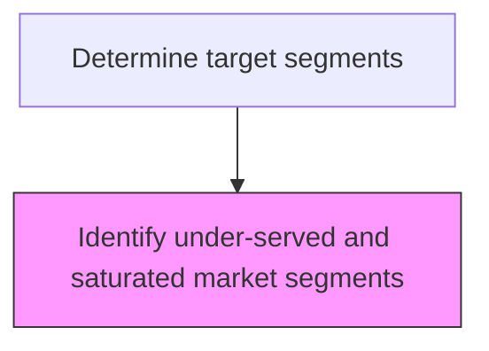
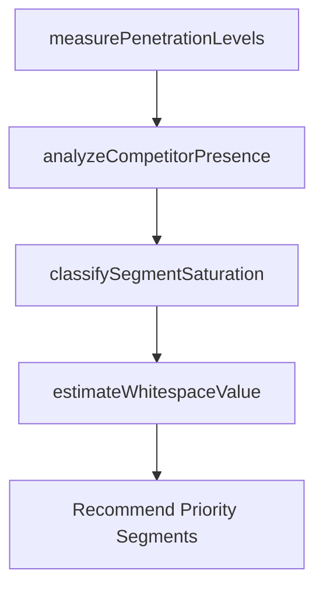

# Identify under-served and saturated market segments

> Business-as-Code definition for under-served and saturated segment identification. Models the analysis of market penetration levels to distinguish high-opportunity segments from those with diminishing returns.

## Overview

Determining which groups of potential customers do not yet, or already do have access to the product or a service that the company produces or markets. Use those findings to create specialized product offerings and differentiated marketing campaigns.

## Process Hierarchy



## GraphDL

```yaml
identify:
  object: Under-served And Saturated Market Segments
  actor: MarketAnalyst
  result: SegmentPenetrationReport
```

## Actions

| Action | Description |
|--------|-------------|
| measurePenetrationLevels | Calculate current market penetration rates per segment |
| classifySegmentSaturation | Categorize segments as under-served, adequately served, or saturated |
| analyzeCompetitorPresence | Assess competitor density and offerings in each segment |
| estimateWhitespaceValue | Calculate revenue potential in under-served segments |

## Events

| Event | Description |
|-------|-------------|
| penetrationLevelsMeasured | Segment penetration data collected and calculated |
| segmentSaturationClassified | Segments classified by saturation level |
| competitorPresenceAnalyzed | Competitive density per segment assessed |
| whitespaceValueEstimated | Under-served segment revenue potential quantified |

## Searches

| Search | Description |
|--------|-------------|
| getUnderservedSegments | List segments classified as under-served with opportunity size |
| getSaturationLevels | Retrieve penetration and saturation data by segment |
| getWhitespaceMap | Query whitespace opportunities across all segments |

## Process Flow



## RACI Matrix

| Activity | Responsible | Accountable | Consulted | Informed |
|----------|-------------|-------------|-----------|----------|
| measurePenetrationLevels | MarketAnalyst | VP Marketing | Sales | Finance |
| classifySegmentSaturation | MarketAnalyst | VP Marketing | CompetitiveIntelligence | Strategy |
| estimateWhitespaceValue | FinancialAnalyst | VP Marketing | Finance | ExecutiveTeam |

## Related Processes

| Process | Relationship |
|---------|-------------|
| 3.1.2.2 Determine target segments | Parent - saturation analysis informs segment targeting |
| 3.1.1.4.1 Determine market share gain/loss | Upstream - share data reveals penetration levels |
| 3.1.2.1 Quantify market opportunities | Parallel - whitespace value feeds opportunity sizing |

## Related Departments

| Department | Role |
|-----------|------|
| Market Research | Measures penetration levels and competitive density |
| Sales | Provides frontline insight on segment accessibility |
| Strategy | Integrates saturation data into growth planning |

## Related Occupations

| Occupation | Involvement |
|-----------|-------------|
| Market Analyst | Calculates penetration rates and saturation levels |
| Competitive Intelligence Analyst | Assesses competitor segment presence |
| Business Development Manager | Identifies under-served segment entry strategies |

## KPIs

| KPI | Description | Unit |
|-----|-------------|------|
| Under-served Segment Count | Number of segments classified as under-served | Count |
| Whitespace Revenue Potential | Total estimated revenue in under-served segments | USD |
| Saturation Index | Average competitive density across all segments | Score (1-10) |

## Usage

```typescript
import { identifyUnderServedAndSaturatedMarketSegments } from '@headlessly/identify-under-served-and-saturated-market-segments'

const saturation = identifyUnderServedAndSaturatedMarketSegments()

// Measure penetration levels across segments
const penetration = await saturation.measurePenetrationLevels({
  market: 'Cloud Infrastructure',
  segments: ['startup', 'smb', 'mid-market', 'enterprise', 'government']
})

// Estimate revenue potential in under-served segments
const whitespace = await saturation.estimateWhitespaceValue({
  classification: 'under-served',
  minPotential: 50000000
})
```
