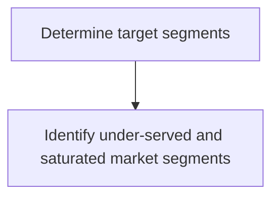
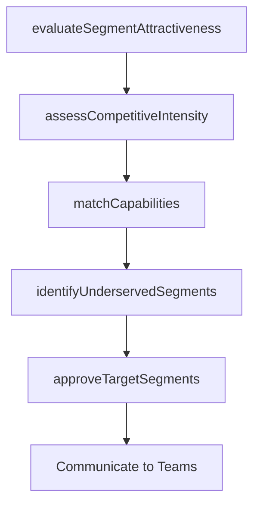

# Determine target segments

> Business-as-Code definition for target segment selection. Models the evaluation of market segments for attractiveness, competitive intensity, and organizational fit to determine which segments to pursue.

## Overview

Identifying the targeted segment of customers. Deduce those particular customer segments that are to be targeted from among the market segments.

## Process Hierarchy



## GraphDL

```yaml
determine:
  object: Target Segments
  actor: MarketingStrategist
  result: TargetSegmentSelection
```

## Actions

| Action | Description |
|--------|-------------|
| evaluateSegmentAttractiveness | Score segments by size, growth, profitability, and accessibility |
| assessCompetitiveIntensity | Measure competitive concentration and barrier levels per segment |
| matchCapabilities | Evaluate organizational fit for serving each candidate segment |
| identifyUnderservedSegments | Detect segments with unmet demand and low competitive saturation |
| approveTargetSegments | Formalize the selection of segments for marketing and sales focus |

## Events

| Event | Description |
|-------|-------------|
| segmentAttractivenessEvaluated | Segment attractiveness scoring completed |
| competitiveIntensityAssessed | Competitive intensity analysis delivered per segment |
| capabilitiesMatched | Capability-to-segment fit assessment finalized |
| underservedSegmentsIdentified | Under-served segment opportunities documented |
| targetSegmentsApproved | Target segment selections formally approved |

## Searches

| Search | Description |
|--------|-------------|
| getSegmentScores | Retrieve attractiveness and fit scores for all candidate segments |
| getTargetSegments | Query approved target segments with rationale |
| getUnderservedOpportunities | List under-served segments ranked by opportunity size |

## Process Flow



## RACI Matrix

| Activity | Responsible | Accountable | Consulted | Informed |
|----------|-------------|-------------|-----------|----------|
| evaluateSegmentAttractiveness | MarketAnalyst | VP Marketing | Finance | Sales |
| assessCompetitiveIntensity | CompetitiveIntelligenceAnalyst | VP Marketing | Sales | Strategy |
| matchCapabilities | MarketingStrategist | CMO | ProductManagement | Operations |
| approveTargetSegments | CMO | CEO | Finance | SalesLeadership |

## Sub-Processes

| ID | Name | Description |
|----|------|-------------|
| 3.1.2.2.1 | Identify under-served and saturated market segments | Determining which groups of potential customers do not yet, or already do have access to the product |

## Related Processes

| Process | Relationship |
|---------|-------------|
| 3.1.1.4 Identify market segments | Upstream - identified segments are candidates for targeting |
| 3.1.2.1 Quantify market opportunities | Upstream - sizing data informs segment selection |
| 3.2.4.4 Select channels for target segments | Downstream - target segments drive channel selection |

## Related Departments

| Department | Role |
|-----------|------|
| Marketing | Leads segment evaluation and targeting decisions |
| Sales | Provides field perspective on segment accessibility |
| Product Management | Assesses product-market fit per segment |
| Finance | Validates revenue potential and investment requirements |

## Related Occupations

| Occupation | Involvement |
|-----------|-------------|
| Marketing Strategist | Evaluates segments and recommends targets |
| Market Research Analyst | Provides segment data and competitive intelligence |
| Sales Director | Advises on segment accessibility and sales feasibility |

## KPIs

| KPI | Description | Unit |
|-----|-------------|------|
| Target Segment Count | Number of formally approved target segments | Count |
| Segment Revenue Coverage | Revenue potential of selected segments vs total market | % |
| Segment Penetration Rate | Percentage of target segment customers acquired | % |

## Usage

```typescript
import { determineTargetSegments } from '@headlessly/determine-target-segments'

const targeting = determineTargetSegments()

// Evaluate attractiveness of candidate segments
const scores = await targeting.evaluateSegmentAttractiveness({
  segments: ['enterprise-finance', 'mid-market-tech', 'smb-retail'],
  criteria: ['size', 'growth', 'profitability', 'accessibility']
})

// Identify under-served segments with high potential
const underserved = await targeting.identifyUnderservedSegments({
  minMarketSize: 100000000,
  maxCompetitorCount: 3
})
```
