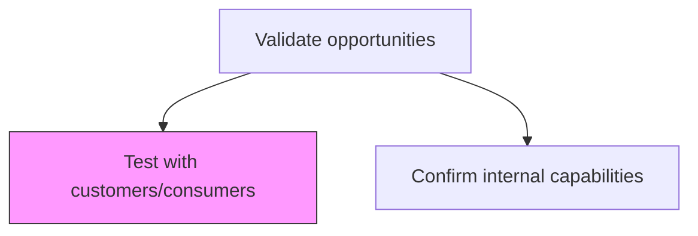
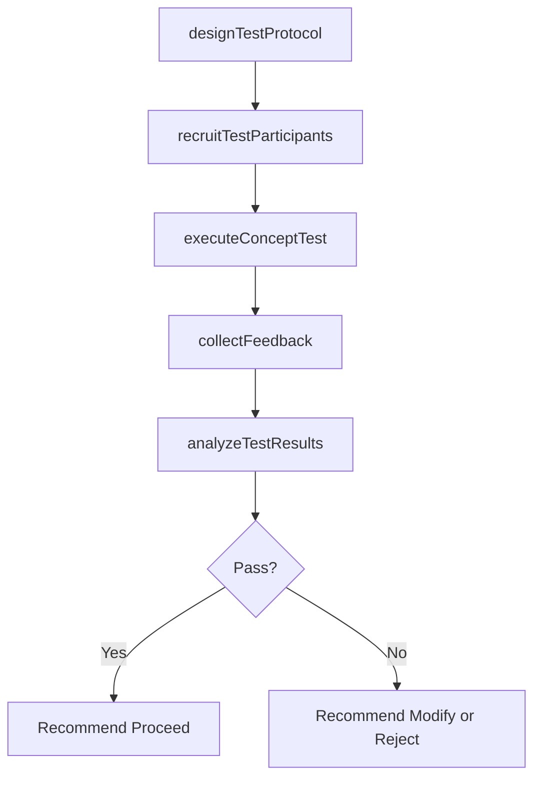

# Test with customers/consumers

> Business-as-Code definition for customer validation testing. Models the design and execution of concept tests, pilot programs, and limited-scale market trials to validate opportunity demand before full-scale commitment.

## Overview

Validating identified market opportunities by testing company's offerings on limited-size samples of the consumer population that are hypothesized to be representative of the target market at large and to have similar purchasing behavior. The feedback gained through consumer testing can be used to modify or reject product offerings before their full scale launch, saving the company valuable resources, should the initial offering not be successful.

## Process Hierarchy



## GraphDL

```yaml
test:
  object: With Customers/consumers
  actor: UXResearcher
  result: CustomerTestResults
```

## Actions

| Action | Description |
|--------|-------------|
| designTestProtocol | Create a structured customer test plan with objectives and success criteria |
| recruitTestParticipants | Identify and recruit a representative sample of target consumers |
| executeConceptTest | Run concept tests, prototypes, or pilot programs with participants |
| collectFeedback | Gather quantitative and qualitative feedback from test participants |
| analyzeTestResults | Evaluate test outcomes against predefined success thresholds |

## Events

| Event | Description |
|-------|-------------|
| testProtocolDesigned | Customer test plan approved and ready for execution |
| testParticipantsRecruited | Test sample recruited and confirmed |
| conceptTestExecuted | Customer concept test completed |
| feedbackCollected | Customer feedback data collected and organized |
| testResultsAnalyzed | Test results analysis delivered with go/no-go recommendation |

## Searches

| Search | Description |
|--------|-------------|
| getTestResults | Retrieve customer test results by opportunity or concept |
| getParticipantFeedback | Query participant feedback data by test or segment |
| getTestHistory | List historical customer tests with outcomes |

## Process Flow



## RACI Matrix

| Activity | Responsible | Accountable | Consulted | Informed |
|----------|-------------|-------------|-----------|----------|
| designTestProtocol | UXResearcher | ProductManager | Marketing | Sales |
| recruitTestParticipants | ResearchCoordinator | UXResearcher | Sales | Marketing |
| executeConceptTest | UXResearcher | ProductManager | Engineering | Marketing |
| analyzeTestResults | UXResearcher | VP Product | Marketing | ExecutiveTeam |

## Related Processes

| Process | Relationship |
|---------|-------------|
| 3.1.2.4.2 Confirm internal capabilities | Parallel - customer validation and capability confirmation run together |
| 3.1.1.1.3 Understand consumer needs | Upstream - consumer needs data informs test design |
| 3.3.5.4 Plan and test promotional activities | Related - shared testing methodologies |

## Related Departments

| Department | Role |
|-----------|------|
| UX Research | Designs and executes customer validation tests |
| Product Management | Sponsors testing and acts on results |
| Marketing | Provides customer segments and recruitment support |
| Sales | Facilitates customer access for testing |

## Related Occupations

| Occupation | Involvement |
|-----------|-------------|
| UX Researcher | Designs test protocols and analyzes results |
| Product Manager | Defines test objectives and success criteria |
| Market Research Analyst | Supports participant recruitment and data analysis |

## KPIs

| KPI | Description | Unit |
|-----|-------------|------|
| Test Completion Rate | Percentage of planned tests completed on schedule | % |
| Customer Acceptance Rate | Percentage of test participants expressing purchase intent | % |
| Feedback Response Rate | Percentage of participants providing actionable feedback | % |
| Test-to-Decision Time | Days from test completion to go/no-go decision | Days |

## Usage

```typescript
import { testWithCustomersConsumers } from '@headlessly/test-with-customers-consumers'

const testing = testWithCustomersConsumers()

// Design a concept test for a new opportunity
const protocol = await testing.designTestProtocol({
  concept: 'AI-Powered Financial Dashboard',
  targetSegment: 'CFOs at mid-market companies',
  sampleSize: 50,
  methodology: 'concept-test'
})

// Analyze test results
const results = await testing.analyzeTestResults({
  testId: protocol.id,
  successThreshold: { purchaseIntent: 0.6, satisfaction: 4.0 }
})
```
