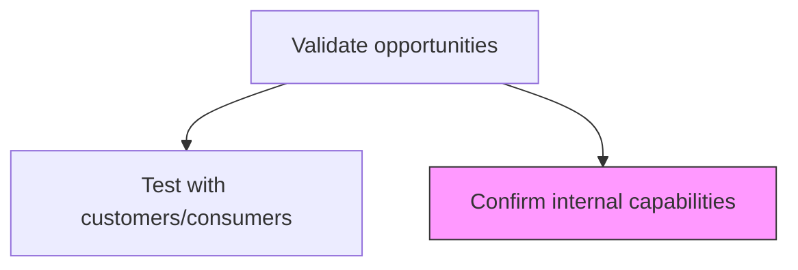
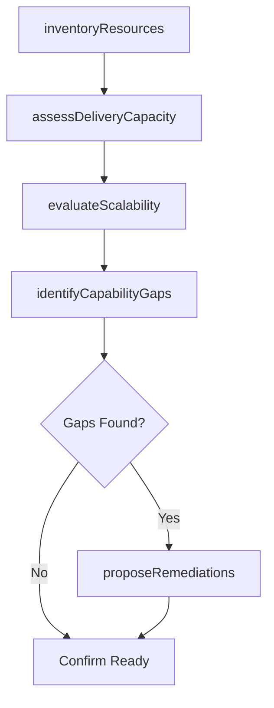

# Confirm internal capabilities

> Business-as-Code definition for internal capability confirmation. Models the verification that the organization has sufficient infrastructure, resources, and scalability to deliver on validated market opportunities.

## Overview

Verifying that the company has sufficient infrastructure and resources to deliver their offerings in a timely and cost-effective manner, and that it is able to scale up from the small-scale market samples, used for consumer testing, to the entire identified market segment.

## Process Hierarchy



## GraphDL

```yaml
confirm:
  object: Internal Capabilities
  actor: OperationsManager
  result: CapabilityConfirmationReport
```

## Actions

| Action | Description |
|--------|-------------|
| inventoryResources | Catalog available personnel, technology, and infrastructure resources |
| assessDeliveryCapacity | Evaluate current and projected delivery capacity against demand |
| evaluateScalability | Determine whether operations can scale from pilot to full market |
| identifyCapabilityGaps | Document gaps between required and available capabilities |
| proposeRemediations | Recommend investments or partnerships to close identified gaps |

## Events

| Event | Description |
|-------|-------------|
| resourcesInventoried | Resource inventory completed and cataloged |
| deliveryCapacityAssessed | Capacity assessment delivered with utilization projections |
| scalabilityEvaluated | Scalability analysis finalized |
| capabilityGapsIdentified | Capability gaps documented with severity ratings |
| remediationsProposed | Gap remediation plan presented to leadership |

## Searches

| Search | Description |
|--------|-------------|
| getCapabilityInventory | Retrieve current resource and capability inventory |
| getCapacityProjections | Query delivery capacity projections by timeframe |
| getGapRemediations | List proposed capability gap remediations with cost estimates |

## Process Flow



## RACI Matrix

| Activity | Responsible | Accountable | Consulted | Informed |
|----------|-------------|-------------|-----------|----------|
| inventoryResources | OperationsManager | VP Operations | HR | Finance |
| assessDeliveryCapacity | OperationsManager | VP Operations | SupplyChain | ProductManagement |
| identifyCapabilityGaps | OperationsManager | VP Operations | Engineering | Strategy |
| proposeRemediations | VP Operations | CMO | Finance | ExecutiveTeam |

## Related Processes

| Process | Relationship |
|---------|-------------|
| 3.1.2.4.1 Test with customers/consumers | Parallel - customer and capability validation proceed together |
| 3.1.1.8 Assess internal and external business environment | Upstream - environment assessment provides capability context |
| 4.0 Deliver Products and Services | Downstream - confirmed capabilities enable delivery planning |

## Related Departments

| Department | Role |
|-----------|------|
| Operations | Leads capability assessment and scalability evaluation |
| Engineering | Evaluates technical infrastructure readiness |
| HR | Assesses talent availability and staffing capacity |
| Finance | Reviews capital investment requirements for gap remediation |

## Related Occupations

| Occupation | Involvement |
|-----------|-------------|
| Operations Manager | Conducts capability audits and scalability assessments |
| Technical Architect | Evaluates technology infrastructure capacity |
| HR Business Partner | Assesses talent and workforce capacity |

## KPIs

| KPI | Description | Unit |
|-----|-------------|------|
| Capability Readiness Score | Composite score of organizational readiness | Score (1-10) |
| Gap Count | Number of identified capability gaps | Count |
| Remediation Cost | Estimated investment to close capability gaps | USD |
| Assessment Turnaround | Days from assessment initiation to final report | Days |

## Usage

```typescript
import { confirmInternalCapabilities } from '@headlessly/confirm-internal-capabilities'

const capabilities = confirmInternalCapabilities()

// Assess delivery capacity for a new market opportunity
const capacity = await capabilities.assessDeliveryCapacity({
  opportunity: 'apac-market-expansion',
  demandProjection: { year1: 5000, year2: 15000, year3: 40000 },
  unit: 'customers'
})

// Identify capability gaps
const gaps = await capabilities.identifyCapabilityGaps({
  opportunity: 'apac-market-expansion',
  dimensions: ['engineering', 'support', 'compliance', 'localization']
})
```
