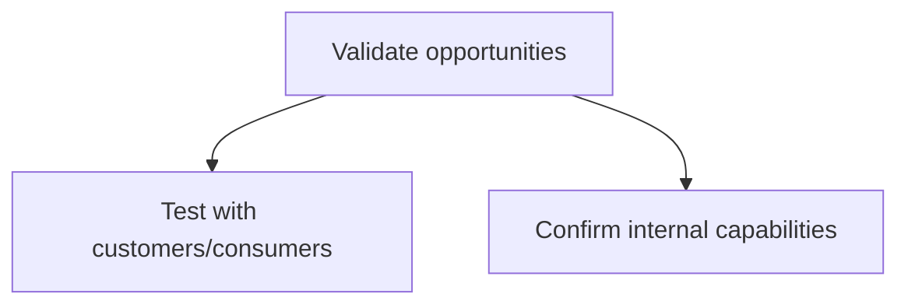
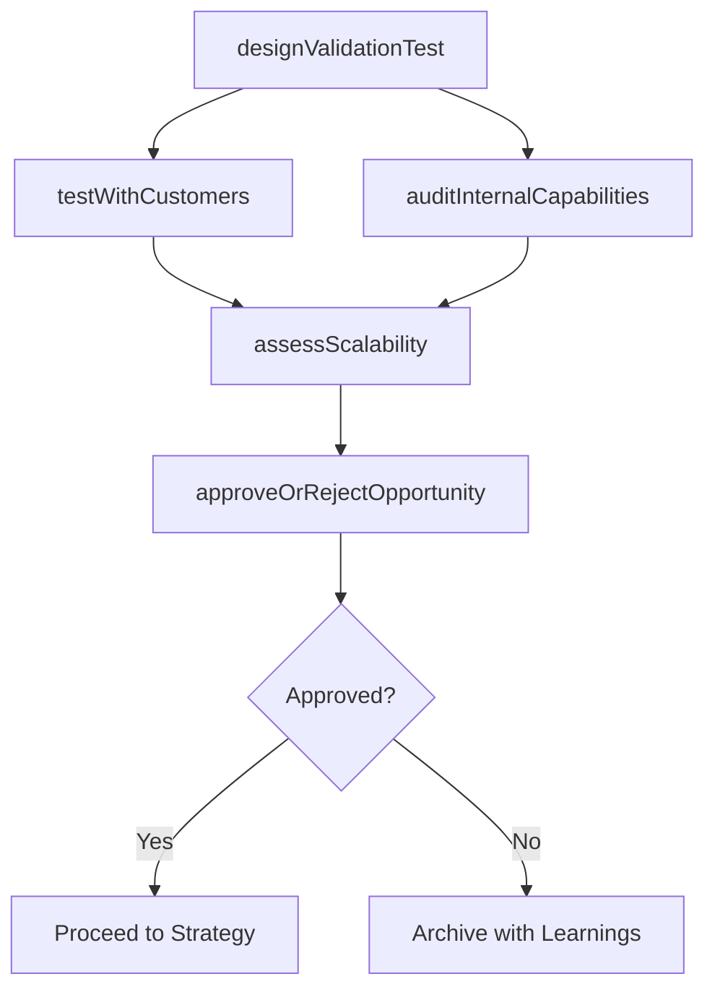

# Validate opportunities

> Business-as-Code definition for market opportunity validation. Models the confirmation of opportunity feasibility through customer testing and internal capability verification before committing resources.

## Overview

Confirming the practicability and reasonableness of the market opportunities that have been identified. Give substance to the real-time feasibility of the market opportunities.

## Process Hierarchy



## GraphDL

```yaml
validate:
  object: Opportunities
  actor: ProductManager
  result: ValidationOutcome
```

## Actions

| Action | Description |
|--------|-------------|
| designValidationTest | Create test plans for customer validation of the opportunity |
| testWithCustomers | Execute limited-scale customer tests to confirm demand |
| auditInternalCapabilities | Verify organizational capacity to deliver at scale |
| assessScalability | Evaluate whether operations can scale from pilot to full market |
| approveOrRejectOpportunity | Make go/no-go decision based on validation evidence |

## Events

| Event | Description |
|-------|-------------|
| validationTestDesigned | Customer test plan approved and ready for execution |
| customerTestCompleted | Customer validation testing completed with results |
| internalCapabilitiesAudited | Internal capability audit finalized |
| scalabilityAssessed | Scalability assessment delivered |
| opportunityDecisionMade | Go/no-go decision formally recorded |

## Searches

| Search | Description |
|--------|-------------|
| getValidationResults | Retrieve customer test results by opportunity |
| getCapabilityAudit | Query internal capability audit findings |
| getValidationStatus | Check current validation status for opportunities in pipeline |

## Process Flow



## RACI Matrix

| Activity | Responsible | Accountable | Consulted | Informed |
|----------|-------------|-------------|-----------|----------|
| testWithCustomers | ProductManager | VP Product | Marketing | Sales |
| auditInternalCapabilities | OperationsManager | VP Operations | Engineering | HR |
| assessScalability | OperationsManager | VP Product | SupplyChain | Finance |
| approveOrRejectOpportunity | VP Product | CMO | Finance | ExecutiveTeam |

## Sub-Processes

| ID | Name | Description |
|----|------|-------------|
| 3.1.2.4.1 | Test with customers/consumers | Validating identified market opportunities by testing company's offerings on limited-size samples of |
| 3.1.2.4.2 | Confirm internal capabilities | Verifying that the company has sufficient infrastructure and resources to deliver their offerings in |

## Related Processes

| Process | Relationship |
|---------|-------------|
| 3.1.2.3 Prioritize opportunities | Upstream - top-priority opportunities are validated |
| 3.2.1 Define offering and customer value proposition | Downstream - validated opportunities proceed to value proposition design |
| 2.2 Manage the product and service development lifecycle | Consumer - validated opportunities trigger product development |

## Related Departments

| Department | Role |
|-----------|------|
| Product Management | Designs and manages customer validation tests |
| Operations | Assesses internal delivery capability and scalability |
| Engineering | Evaluates technical feasibility of proposed offerings |
| Finance | Reviews investment requirements and financial viability |

## Related Occupations

| Occupation | Involvement |
|-----------|-------------|
| Product Manager | Leads customer validation testing |
| Operations Manager | Conducts internal capability audits |
| UX Researcher | Designs and executes customer test protocols |

## KPIs

| KPI | Description | Unit |
|-----|-------------|------|
| Validation Pass Rate | Percentage of opportunities passing validation | % |
| Customer Test Completion Rate | Percentage of planned tests executed on schedule | % |
| Capability Gap Count | Number of capability gaps identified during validation | Count |
| Time to Validate | Average days from prioritization to validation decision | Days |

## Usage

```typescript
import { validateOpportunities } from '@headlessly/validate-opportunities'

const validation = validateOpportunities()

// Test an opportunity with target customers
const testResults = await validation.testWithCustomers({
  opportunity: 'ai-powered-analytics',
  testType: 'concept-test',
  sampleSize: 200,
  segment: 'Enterprise'
})

// Audit internal capabilities for delivery
const audit = await validation.auditInternalCapabilities({
  opportunity: 'ai-powered-analytics',
  dimensions: ['engineering', 'infrastructure', 'talent', 'compliance']
})
```
