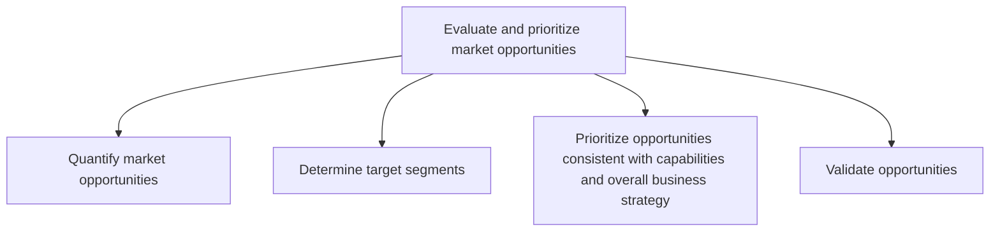
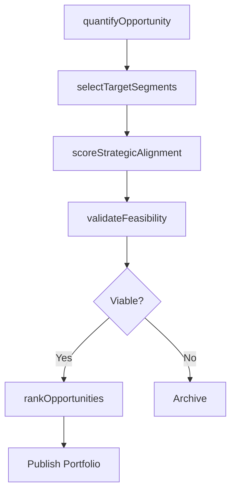

# Evaluate and prioritize market opportunities

> Business-as-Code definition for market opportunity evaluation and prioritization. Models the quantification, segmentation targeting, strategic alignment, and validation of market opportunities to focus investment on highest-value pursuits.

## Overview

Appraising market opportunities by quantifying and subjecting them to prioritization, as well as validation tests. Closely examine the market opportunities that have been identified by Perform customer and market intelligence analysis [10106]. Triangulate those opportunities to capitalize by finding a fit between identified opportunities and the composite of organizational capabilities and business strategy.

## Process Hierarchy



## GraphDL

```yaml
evaluate:
  object: And Prioritize Market Opportunities
  actor: StrategyDirector
  result: PrioritizedOpportunityPortfolio
```

## Actions

| Action | Description |
|--------|-------------|
| quantifyOpportunity | Compute revenue potential, market size, and growth rate for each opportunity |
| selectTargetSegments | Choose customer segments to pursue based on fit and attractiveness |
| scoreStrategicAlignment | Rate each opportunity against corporate strategy and capabilities |
| validateFeasibility | Confirm practical viability through customer testing and capability assessment |
| rankOpportunities | Produce a prioritized list of opportunities for investment |

## Events

| Event | Description |
|-------|-------------|
| opportunityQuantified | Revenue and market sizing estimates completed for an opportunity |
| targetSegmentsSelected | Target customer segments formally approved |
| strategicAlignmentScored | Opportunity-to-strategy alignment assessment delivered |
| feasibilityValidated | Customer test and capability confirmation completed |
| opportunitiesRanked | Final prioritized opportunity portfolio published |

## Searches

| Search | Description |
|--------|-------------|
| getOpportunityPipeline | Retrieve all evaluated opportunities with scoring data |
| getTargetSegments | Query approved target segments with sizing and fit data |
| getAlignmentScores | Retrieve strategic alignment scores across opportunities |

## Process Flow



## RACI Matrix

| Activity | Responsible | Accountable | Consulted | Informed |
|----------|-------------|-------------|-----------|----------|
| quantifyOpportunity | MarketAnalyst | VP Marketing | Finance | Sales |
| selectTargetSegments | MarketingDirector | CMO | Sales | ProductManagement |
| scoreStrategicAlignment | StrategyDirector | CMO | Finance | ExecutiveTeam |
| validateFeasibility | ProductManager | VP Product | Engineering | Operations |
| rankOpportunities | CMO | CEO | Finance | Board |

## Sub-Processes

| ID | Name | Description |
|----|------|-------------|
| 3.1.2.1 | Quantify market opportunities | Attaching quantifiable indicators to opportunities that have been identified in the market. Compute  |
| 3.1.2.2 | Determine target segments | Identifying the targeted segment of customers. Deduce those particular customer segments that are to |
| 3.1.2.3 | Prioritize opportunities consistent with capabilities and overall business strategy | Creating an index of market opportunities, and arrange them in order of preference. Prioritize based |
| 3.1.2.4 | Validate opportunities | Confirming the practicability and reasonableness of the market opportunities that have been identifi |

## Related Processes

| Process | Relationship |
|---------|-------------|
| 3.1.1 Perform customer and market intelligence analysis | Upstream - intelligence findings feed opportunity evaluation |
| 3.2 Develop marketing strategy | Downstream - prioritized opportunities drive strategy development |
| 1.2 Define and evaluate strategic options | Parallel - corporate strategy alignment |

## Related Departments

| Department | Role |
|-----------|------|
| Marketing | Evaluates market attractiveness and segment fit |
| Strategy | Assesses alignment with corporate objectives |
| Finance | Validates financial projections and ROI estimates |
| Product Management | Confirms product-market fit and delivery feasibility |

## Related Occupations

| Occupation | Involvement |
|-----------|-------------|
| Strategy Director | Leads opportunity prioritization against business strategy |
| Market Analyst | Quantifies market opportunity sizing and projections |
| Product Manager | Validates product feasibility for target opportunities |

## KPIs

| KPI | Description | Unit |
|-----|-------------|------|
| Opportunity Pipeline Value | Total estimated revenue of all evaluated opportunities | USD |
| Conversion Rate | Percentage of evaluated opportunities advanced to strategy phase | % |
| Validation Success Rate | Percentage of opportunities passing feasibility validation | % |
| Time to Prioritize | Average days from opportunity identification to prioritization | Days |

## Usage

```typescript
import { evaluateAndPrioritizeMarketOpportunities } from '@headlessly/evaluate-and-prioritize-market-opportunities'

const opportunities = evaluateAndPrioritizeMarketOpportunities()

// Quantify a new market opportunity
const sized = await opportunities.quantifyOpportunity({
  market: 'AI-Powered Analytics',
  geography: 'Global',
  timeHorizon: '5-years'
})

// Rank opportunities by strategic fit and revenue potential
const ranked = await opportunities.rankOpportunities({
  criteria: ['revenueSize', 'strategicAlignment', 'capabilityFit'],
  weights: [0.4, 0.35, 0.25]
})
```
