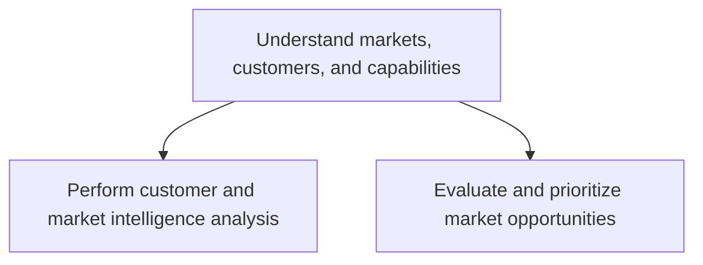
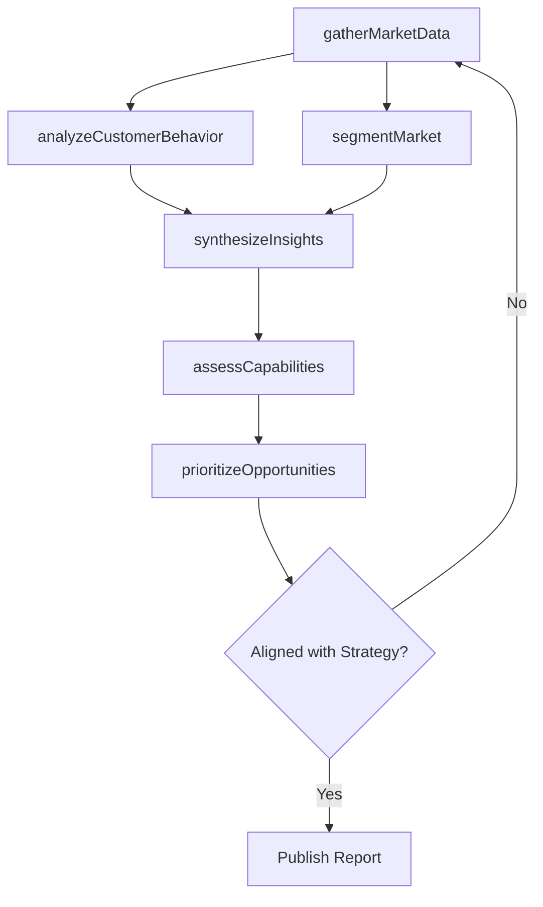

# Understand markets, customers, and capabilities

> Business-as-Code definition for market intelligence and customer insight generation. Models the systematic gathering, analysis, and prioritization of market data, customer behavior, and organizational capabilities.

## Overview

Making sense of the market and customers to identify the right opportunities to be capitalized, given the organization's competencies. Discern trends and shift in the market and customers. Identify the right market opportunities that fit closely with the organization's capabilities and strategy by gathering intelligence on various attributes of different market/customer segments.

## Process Hierarchy



## GraphDL

```yaml
understand:
  object: Markets, Customers, And Capabilities
  actor: MarketResearchAnalyst
  result: MarketIntelligenceReport
```

## Actions

| Action | Description |
|--------|-------------|
| gatherMarketData | Collect primary and secondary market research data across segments |
| analyzeCustomerBehavior | Study purchasing patterns and customer decision drivers |
| assessCapabilities | Evaluate internal organizational strengths relative to market needs |
| segmentMarket | Divide total addressable market into actionable segments |
| prioritizeOpportunities | Rank market opportunities by strategic fit and revenue potential |
| synthesizeInsights | Consolidate findings into actionable market intelligence reports |

## Events

| Event | Description |
|-------|-------------|
| marketDataGathered | Primary and secondary research data collection completed |
| customerBehaviorAnalyzed | Customer purchasing behavior analysis delivered |
| capabilitiesAssessed | Internal capability assessment finalized |
| marketSegmented | Market segmentation model created or updated |
| opportunitiesPrioritized | Market opportunities ranked and approved for pursuit |
| insightsSynthesized | Market intelligence report published to stakeholders |

## Searches

| Search | Description |
|--------|-------------|
| findMarketSegments | List market segments filtered by size, growth rate, or geography |
| getCustomerProfiles | Retrieve customer segment profiles with behavioral attributes |
| getCapabilityGaps | Query gaps between market requirements and internal capabilities |
| getMarketTrends | Retrieve trend data for a given industry or product category |

## Process Flow



## RACI Matrix

| Activity | Responsible | Accountable | Consulted | Informed |
|----------|-------------|-------------|-----------|----------|
| gatherMarketData | MarketResearchAnalyst | VP Marketing | Sales | ProductManagement |
| analyzeCustomerBehavior | CustomerInsightsAnalyst | VP Marketing | CustomerSuccess | Sales |
| segmentMarket | MarketResearchAnalyst | VP Marketing | Finance | ExecutiveTeam |
| assessCapabilities | StrategyAnalyst | CMO | Operations | ProductManagement |
| prioritizeOpportunities | VP Marketing | CMO | Finance | Board |

## Sub-Processes

| ID | Name | Description |
|----|------|-------------|
| 3.1.1 | Perform customer and market intelligence analysis | Gathering intelligence on the market and customers. Closely examine the inherent attributes and coll |
| 3.1.2 | Evaluate and prioritize market opportunities | Appraising market opportunities by quantifying and subjecting them to prioritization, as well as val |

## Related Processes

| Process | Relationship |
|---------|-------------|
| 3.2 Develop marketing strategy | Downstream - market insights inform strategy formulation |
| 3.4 Develop trade customer sales strategy | Downstream - customer intelligence shapes sales planning |
| 1.1 Define the business concept and long-term vision | Upstream - strategic vision guides market focus |

## Related Departments

| Department | Role |
|-----------|------|
| Market Research | Conducts primary and secondary research studies |
| Marketing | Translates insights into positioning and strategy |
| Sales | Provides frontline customer and competitor feedback |
| Product Management | Evaluates product-market fit and competitive gaps |
| Strategy | Aligns market opportunities with corporate direction |

## Related Occupations

| Occupation | Involvement |
|-----------|-------------|
| Market Research Analyst | Primary executor of data collection and analysis |
| Business Intelligence Analyst | Data modeling and trend analysis |
| Product Marketing Manager | Translates market insights into product positioning |

## KPIs

| KPI | Description | Unit |
|-----|-------------|------|
| Market Coverage | Percentage of addressable market segments profiled | % |
| Insight Freshness | Average age of market intelligence reports | Days |
| Opportunity Conversion | Percentage of identified opportunities advanced to strategy | % |
| Segment Accuracy | Predictive accuracy of customer segmentation models | % |

## Usage

```typescript
import { understandMarketsCustomersAndCapabilities } from '@headlessly/understand-markets-customers-and-capabilities'

const intel = understandMarketsCustomersAndCapabilities()

// Gather market data for a specific industry
const marketData = await intel.gatherMarketData({
  industry: 'Healthcare IT',
  geography: 'North America',
  sources: ['primary', 'secondary']
})

// Prioritize identified opportunities
const ranked = await intel.prioritizeOpportunities({
  minMarketSize: 500000000,
  alignmentThreshold: 0.7
})
```
