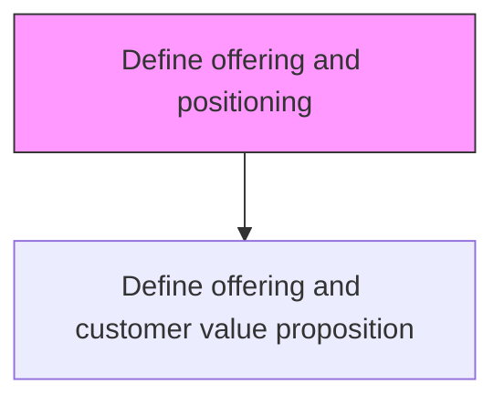
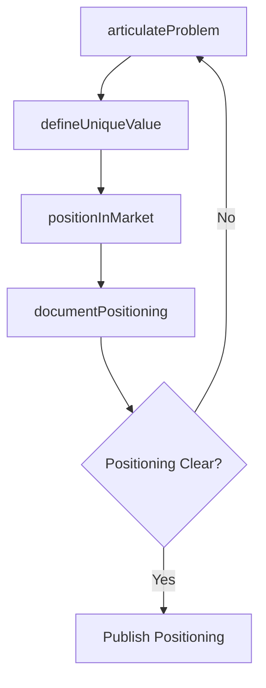

# Define offering and positioning

> Business-as-Code definition for product offering and market positioning. Models the process of articulating the problems products solve, defining unique value, and establishing competitive market position for the organization's offerings.

## Overview

Defining problem(s) that the organization's products/services solve for the customers, thereby determining how they are positioned in the market. Refine the product/service concepts from the perspective of customers. Succinctly outline the problem the organization's offerings solves for the customers, making a case for why the customer should buy a product or use a service. Define the offering's unique value.

## Process Hierarchy



## GraphDL

```yaml
define:
  object: Offering And Positioning
  actor: ProductMarketingManager
  result: OfferingPositionStatement
```

## Actions

| Action | Description |
|--------|-------------|
| articulateProblem | Define the customer problems that the offering addresses |
| defineUniqueValue | Identify differentiating features and unique value of the offering |
| positionInMarket | Establish the offering's competitive position relative to alternatives |
| documentPositioning | Create positioning statement and messaging framework |

## Events

| Event | Description |
|-------|-------------|
| problemArticulated | Customer problem definition completed |
| uniqueValueDefined | Offering differentiation and unique value documented |
| marketPositionEstablished | Competitive positioning determined |
| positioningDocumented | Positioning statement and messaging framework published |

## Searches

| Search | Description |
|--------|-------------|
| getPositioningStatement | Retrieve positioning statements by product or segment |
| getCompetitivePosition | Access competitive positioning analysis data |
| getValueDrivers | Query key value drivers by customer segment |

## Process Flow



## RACI Matrix

| Activity | Responsible | Accountable | Consulted | Informed |
|----------|-------------|-------------|-----------|----------|
| articulateProblem | ProductMarketingManager | VP Marketing | ProductManagement | Sales |
| defineUniqueValue | ProductMarketingManager | VP Marketing | Engineering | CustomerSuccess |
| positionInMarket | ProductMarketingManager | VP Marketing | MarketResearch | Sales |

## Related Processes

| Process | Relationship |
|---------|-------------|
| 3.2.1.2 Develop value proposition including brand positioning for target segments | Downstream - positioning informs value proposition |
| 3.1.1 Perform customer and market intelligence analysis | Upstream - market intelligence informs positioning |
| 3.2.3 Develop and manage brands | Parallel - brand strategy aligns with offering positioning |

## Related Departments

| Department | Role |
|-----------|------|
| Product Marketing | Leads offering definition and positioning strategy |
| Product Management | Provides product capabilities and roadmap context |
| Market Research | Supplies competitive and customer insight data |
| Sales | Provides front-line feedback on positioning effectiveness |

## Related Occupations

| Occupation | Involvement |
|-----------|-------------|
| Product Marketing Manager | Defines offering positioning and messaging |
| Market Research Analyst | Provides competitive positioning data |
| Product Manager | Aligns product features with positioning claims |

## KPIs

| KPI | Description | Unit |
|-----|-------------|------|
| Positioning Clarity Score | Stakeholder rating of positioning statement clarity | Score (1-10) |
| Competitive Win Rate | Deals won versus specific competitors | % |
| Message Recall Rate | Percentage of target audience recalling key positioning messages | % |

## Usage

```typescript
import { defineOfferingAndPositioning } from '@headlessly/define-offering-and-positioning'

const positioning = defineOfferingAndPositioning()

// Define offering positioning for a new product
const position = await positioning.positionInMarket({
  product: 'platform-v3',
  targetSegment: 'enterprise-saas',
  competitors: ['competitor-a', 'competitor-b'],
  differentiators: ['ai-native', 'headless-architecture', 'developer-first']
})
```
