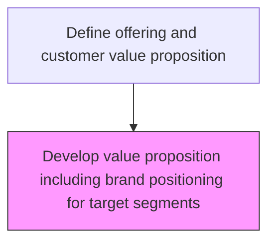
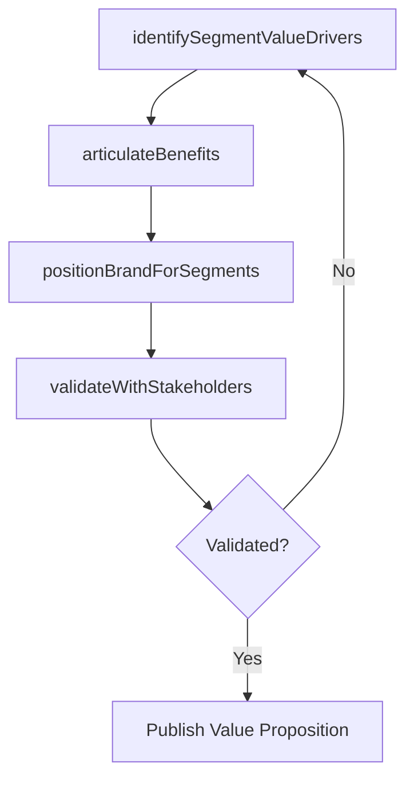

# Develop value proposition including brand positioning for target segments

> Business-as-Code definition for value proposition and brand positioning development. Models the identification of segment-specific value drivers, articulation of customer benefits, and creation of brand positioning that reinforces offering attractiveness for each target segment.

## Overview

Boosting the attractiveness of products/services to the targeted customers, and creating a unique brand projection around these features. Identify and enhance those product/service features that reinforce the attractiveness of these offerings, for these segment of customers. Underscore the perceived value delivered to the customers by clearly specifying the relevance and desirability of these products/services. Once it has been clarified how the organization's offerings meet the customer's expectations or deliver specific benefits, position the brands around these benefits.

## Process Hierarchy



## GraphDL

```yaml
develop:
  object: Value Proposition Including Brand Positioning For Target Segments
  actor: BrandStrategyManager
  result: SegmentValueProposition
```

## Actions

| Action | Description |
|--------|-------------|
| identifySegmentValueDrivers | Determine which product features deliver the most value per segment |
| articulateBenefits | Clearly state how offerings meet customer expectations by segment |
| positionBrandForSegments | Align brand positioning with value drivers for each target segment |
| validateWithStakeholders | Test the value proposition with internal teams and sample customers |

## Events

| Event | Description |
|-------|-------------|
| segmentValueDriversIdentified | Value drivers mapped to each target segment |
| benefitsArticulated | Customer benefits documented for all segments |
| brandPositionedForSegments | Brand positioning aligned with segment-specific value propositions |
| stakeholderValidationComplete | Value proposition validated with internal and external stakeholders |

## Searches

| Search | Description |
|--------|-------------|
| getValueProposition | Retrieve value propositions by segment or product |
| getBrandPositioning | Access brand positioning statements by segment |
| getSegmentValueDrivers | Query value drivers ranked by segment importance |

## Process Flow



## RACI Matrix

| Activity | Responsible | Accountable | Consulted | Informed |
|----------|-------------|-------------|-----------|----------|
| identifySegmentValueDrivers | ProductMarketingManager | VP Marketing | ProductManagement | Sales |
| articulateBenefits | BrandStrategyManager | VP Marketing | CustomerSuccess | Sales |
| positionBrandForSegments | BrandStrategyManager | CMO | Creative | Marketing |

## Related Processes

| Process | Relationship |
|---------|-------------|
| 3.2.1.1 Define offering and positioning | Upstream - positioning guides value proposition development |
| 3.2.1.3 Validate value proposition with target segments | Downstream - value proposition validated with customers |
| 3.2.3 Develop and manage brands | Parallel - brand strategy influences positioning |

## Related Departments

| Department | Role |
|-----------|------|
| Product Marketing | Develops value propositions and segment positioning |
| Brand Strategy | Aligns brand positioning with segment-specific messaging |
| Market Research | Provides customer insight to validate value drivers |
| Sales | Delivers value proposition to customers in the field |

## Related Occupations

| Occupation | Involvement |
|-----------|-------------|
| Brand Strategy Manager | Leads brand positioning for target segments |
| Product Marketing Manager | Defines segment-specific value propositions |
| Market Research Analyst | Validates value drivers through customer research |

## KPIs

| KPI | Description | Unit |
|-----|-------------|------|
| Value Proposition Resonance | Customer survey score on value proposition relevance | Score (1-10) |
| Segment Conversion Rate | Lead-to-customer conversion rate by segment | % |
| Brand Preference Score | Percentage of target segment preferring brand over competitors | % |

## Usage

```typescript
import { developValuePropositionIncludingBrandPositioningForTargetSegments } from '@headlessly/develop-value-proposition-including-brand-positioning-for-target-segments'

const valueProp = developValuePropositionIncludingBrandPositioningForTargetSegments()

// Identify value drivers for enterprise segment
const drivers = await valueProp.identifySegmentValueDrivers({
  segment: 'enterprise',
  product: 'platform-enterprise',
  researchSources: ['customer-interviews', 'usage-data', 'churn-analysis']
})

// Position brand for the segment
const positioning = await valueProp.positionBrandForSegments({
  segment: 'enterprise',
  valueDrivers: drivers.topDrivers,
  competitiveAdvantages: ['scalability', 'security', 'integration-depth']
})
```
