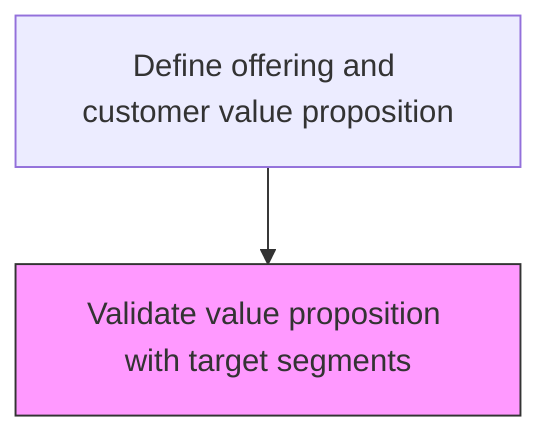
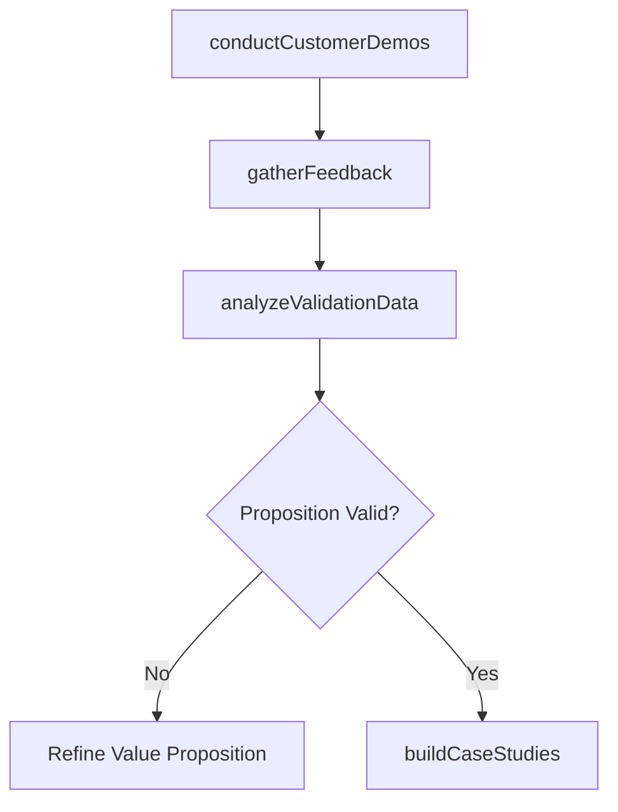

# Validate value proposition with target segments

> Business-as-Code definition for value proposition validation. Models the testing and confirmation of value propositions through customer feedback, demonstrations, surveys, and research to ensure alignment with target segment expectations.

## Overview

Validating the desirability of the perceived value delivered by the organization's offerings, to the targeted customer segment. Substantiate the value of the benefits accrued to the customers through the organization's offerings. Justify the value proposition in light of the targeted segments by gathering feedback (using teaser demonstrations, surveys, interviews, primary research studies, and customer case studies). Corroborate the benefits of the organization's offerings.

## Process Hierarchy



## GraphDL

```yaml
validate:
  object: Value Proposition With Target Segments
  actor: MarketResearchManager
  result: ValidationReport
```

## Actions

| Action | Description |
|--------|-------------|
| conductCustomerDemos | Run teaser demonstrations with target segment representatives |
| gatherFeedback | Collect customer feedback through surveys, interviews, and research |
| analyzeValidationData | Assess feedback data to determine value proposition resonance |
| buildCaseStudies | Create customer case studies that substantiate value claims |

## Events

| Event | Description |
|-------|-------------|
| customerDemosConducted | Target segment demonstrations completed |
| feedbackGathered | Customer feedback collected through all research methods |
| validationDataAnalyzed | Value proposition resonance analysis completed |
| caseStudiesBuilt | Customer case studies produced and published |

## Searches

| Search | Description |
|--------|-------------|
| getValidationResults | Retrieve value proposition validation scores by segment |
| getFeedbackSummary | Access consolidated customer feedback data |
| getCaseStudies | Query published case studies by product or segment |

## Process Flow



## RACI Matrix

| Activity | Responsible | Accountable | Consulted | Informed |
|----------|-------------|-------------|-----------|----------|
| conductCustomerDemos | ProductMarketingManager | VP Marketing | Sales | ProductManagement |
| gatherFeedback | MarketResearchManager | VP Marketing | CustomerSuccess | Sales |
| analyzeValidationData | MarketResearchAnalyst | MarketResearchManager | ProductMarketing | ExecutiveTeam |

## Related Processes

| Process | Relationship |
|---------|-------------|
| 3.2.1.2 Develop value proposition including brand positioning for target segments | Upstream - value proposition to be validated |
| 3.2.1.4 Develop new branding | Downstream - validated propositions inform branding |
| 3.1.2.4 Validate opportunities | Parallel - both processes test with target customers |

## Related Departments

| Department | Role |
|-----------|------|
| Market Research | Designs and executes validation studies |
| Product Marketing | Provides value proposition materials for testing |
| Sales | Facilitates customer access for feedback gathering |
| Customer Success | Shares customer experience data for case studies |

## Related Occupations

| Occupation | Involvement |
|-----------|-------------|
| Market Research Manager | Designs validation methodology and oversees execution |
| UX Researcher | Conducts qualitative customer interviews and demos |
| Content Marketing Manager | Produces case studies from validation findings |

## KPIs

| KPI | Description | Unit |
|-----|-------------|------|
| Validation Score | Average customer rating of value proposition relevance | Score (1-10) |
| Feedback Response Rate | Percentage of invited customers providing feedback | % |
| Case Study Production Rate | Number of case studies published per quarter | Count |

## Usage

```typescript
import { validateValuePropositionWithTargetSegments } from '@headlessly/validate-value-proposition-with-target-segments'

const validation = validateValuePropositionWithTargetSegments()

// Gather feedback from target segment
const feedback = await validation.gatherFeedback({
  segment: 'mid-market',
  methods: ['survey', 'interview', 'demo-session'],
  sampleSize: 50,
  valuePropositionId: 'vp-platform-v3'
})

// Analyze validation results
const analysis = await validation.analyzeValidationData({
  feedbackId: feedback.id,
  dimensions: ['relevance', 'differentiation', 'willingness-to-pay']
})
```
