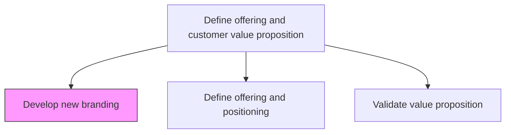
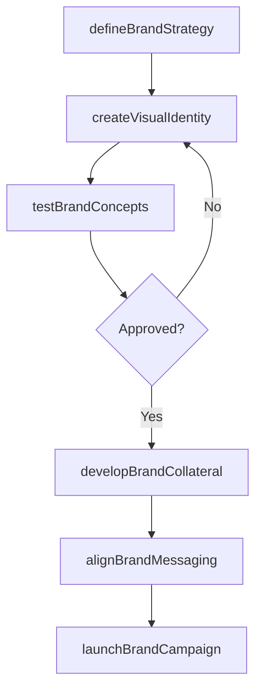

# Develop new branding

> Business-as-Code definition for new brand development. Models the end-to-end creation of brand identities, collateral systems, and launch campaigns for products and services.

## Overview

Creating branding collaterals and campaigns that carve a significant and differentiated presence for the organization's offerings. Create new collaterals, which include names, designs, and symbols, for their products/services. Ensure collaterals reflect the unique value proposition of the respective offerings through a consistent theme. Create advertising and promotion campaigns.

## Process Hierarchy



## GraphDL

```yaml
develop:
  object: New Branding
  actor: BrandManager
  result: BrandIdentityPackage
```

## Actions

| Action | Description |
|--------|-------------|
| defineBrandStrategy | Establish brand positioning, personality, and architecture for the new offering |
| createVisualIdentity | Design logos, color palettes, typography, and visual guidelines |
| developBrandCollateral | Produce branded materials including templates, packaging, and digital assets |
| testBrandConcepts | Conduct focus groups and surveys to validate brand concepts with target audiences |
| launchBrandCampaign | Execute the go-to-market campaign introducing the new brand |
| alignBrandMessaging | Ensure all communications reflect the brand value proposition consistently |

## Events

| Event | Description |
|-------|-------------|
| brandStrategyDefined | Brand positioning and architecture approved by leadership |
| visualIdentityCreated | Logo and visual identity system finalized and documented |
| brandCollateralDeveloped | Full set of branded materials produced and distributed |
| brandConceptsTested | Brand validation research completed with target audience feedback |
| brandCampaignLaunched | Go-to-market brand campaign activated across channels |
| brandMessagingAligned | All touchpoints verified for brand consistency |

## Searches

| Search | Description |
|--------|-------------|
| getBrandAssets | Retrieve brand collateral by product line, format, or creation date |
| findBrandGuidelines | Look up visual identity and messaging guidelines for a specific brand |
| getBrandTestResults | Retrieve focus group and survey results for brand concept validation |
| listBrandCampaigns | Query active and historical brand launch campaigns |

## Process Flow



## RACI Matrix

| Activity | Responsible | Accountable | Consulted | Informed |
|----------|-------------|-------------|-----------|----------|
| defineBrandStrategy | BrandManager | VP Marketing | ProductManagement | Sales |
| createVisualIdentity | CreativeDirector | BrandManager | DesignTeam | Marketing |
| testBrandConcepts | MarketResearchAnalyst | BrandManager | CustomerInsights | ProductManagement |
| developBrandCollateral | GraphicDesigner | CreativeDirector | BrandManager | ChannelPartners |
| launchBrandCampaign | CampaignManager | VP Marketing | Sales | ExecutiveTeam |

## Related Processes

| Process | Relationship |
|---------|-------------|
| 3.2.1.1 Define offering and positioning | Upstream - positioning informs brand strategy |
| 3.2.3 Develop and manage brands | Downstream - new brand feeds ongoing brand management |
| 3.3.1 Develop and manage advertising | Downstream - brand assets used in advertising |

## Related Departments

| Department | Role |
|-----------|------|
| Brand Marketing | Owns brand strategy and identity creation |
| Creative Services | Designs visual identity and collateral |
| Market Research | Validates brand concepts with target audiences |
| Product Management | Provides product positioning inputs |

## Related Occupations

| Occupation | Involvement |
|-----------|-------------|
| Brand Manager | Leads brand strategy and development |
| Graphic Designer | Creates visual identity and collateral |
| Market Research Analyst | Conducts brand concept testing |

## KPIs

| KPI | Description | Unit |
|-----|-------------|------|
| Brand Awareness Lift | Increase in aided brand awareness post-launch | % |
| Brand Development Cycle Time | Time from strategy definition to campaign launch | Weeks |
| Concept Test Approval Rate | Percentage of brand concepts passing audience validation | % |
| Brand Consistency Score | Audit score measuring collateral alignment with guidelines | % |

## Usage

```typescript
import { developNewBranding } from '@headlessly/develop-new-branding'

const branding = developNewBranding()

// Define brand strategy for a new product line
const strategy = await branding.defineBrandStrategy({
  productLine: 'Enterprise Analytics',
  positioning: 'premium',
  targetAudience: ['CTO', 'VP Engineering']
})

// Test brand concepts with target audience
const testResults = await branding.testBrandConcepts({
  brandId: strategy.id,
  methodology: 'focus-group',
  sampleSize: 120
})
```
