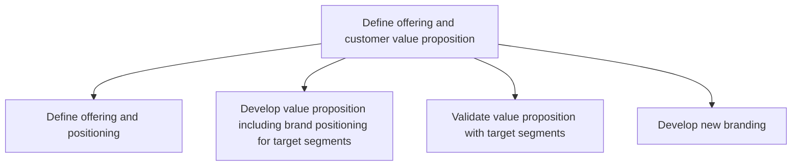
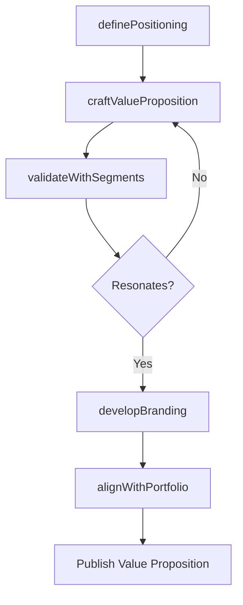

# Define offering and customer value proposition

> Business-as-Code definition for offering and value proposition development. Models the articulation of product positioning, brand alignment, and customer value delivery for each target segment.

## Overview

Refining the attributes of organizational offerings to define their value proposition for the customer. Clearly define the suite of offerings in terms of the value delivered, from the perspective of what the customer desires. Validate the benefits delivered to the customers against target market segments, using techniques such as minimum viable product. Position brands for the respective products/services, in line with their unique value proposition and aligned with customers needs.

## Process Hierarchy



## GraphDL

```yaml
define:
  object: Offering And Customer Value Proposition
  actor: ProductMarketingManager
  result: ValuePropositionDocument
```

## Actions

| Action | Description |
|--------|-------------|
| definePositioning | Establish product positioning against competitor offerings |
| craftValueProposition | Articulate the unique benefits and outcomes for target customers |
| validateWithSegments | Test value proposition resonance with target customer segments |
| developBranding | Create brand identity and messaging for the offering |
| alignWithPortfolio | Ensure consistency across the broader product portfolio |

## Events

| Event | Description |
|-------|-------------|
| positioningDefined | Product market positioning established and documented |
| valuePropositionCrafted | Value proposition statement approved for target segments |
| segmentsValidated | Value proposition validated through customer testing |
| brandingDeveloped | New brand elements created and approved |
| portfolioAligned | Offering positioned consistently within brand portfolio |

## Searches

| Search | Description |
|--------|-------------|
| getValuePropositions | Retrieve value propositions by product or segment |
| getPositioningMaps | Query competitive positioning data for product categories |
| getBrandAssets | Access brand identity assets and guidelines |

## Process Flow



## RACI Matrix

| Activity | Responsible | Accountable | Consulted | Informed |
|----------|-------------|-------------|-----------|----------|
| definePositioning | ProductMarketingManager | VP Marketing | Sales | ProductManagement |
| craftValueProposition | ProductMarketingManager | CMO | CustomerInsights | Sales |
| validateWithSegments | UXResearcher | VP Marketing | Sales | Marketing |
| developBranding | BrandManager | CMO | Creative | Legal |

## Sub-Processes

| ID | Name | Description |
|----|------|-------------|
| 3.2.1.1 | Define offering and positioning | Defining problem(s) that the organization's products/services solve for the customers, thereby deter |
| 3.2.1.2 | Develop value proposition including brand positioning for target segments | Boosting the attractiveness of products/services to the targeted customers, and creating a unique br |
| 3.2.1.3 | Validate value proposition with target segments | Validating the desirability of the perceived value delivered by the organization's offerings, to the |
| 3.2.1.4 | Develop new branding | Creating branding collaterals and campaigns that carve a significant and differentiated presence for |

## Related Processes

| Process | Relationship |
|---------|-------------|
| 3.1.2 Evaluate and prioritize market opportunities | Upstream - validated opportunities drive value proposition design |
| 3.2.2 Define pricing strategy | Downstream - value proposition shapes pricing strategy |
| 3.2.3 Develop and manage brands | Parallel - branding and value proposition are interdependent |

## Related Departments

| Department | Role |
|-----------|------|
| Product Marketing | Leads positioning and value proposition development |
| Brand Management | Creates brand identity aligned with value proposition |
| Sales | Validates value proposition resonance with customers |
| Product Management | Provides product capability inputs for positioning |

## Related Occupations

| Occupation | Involvement |
|-----------|-------------|
| Product Marketing Manager | Crafts positioning and value proposition statements |
| Brand Strategist | Develops brand identity and messaging frameworks |
| Copywriter | Creates customer-facing value proposition content |

## KPIs

| KPI | Description | Unit |
|-----|-------------|------|
| Value Proposition Clarity | Customer comprehension score from testing | Score (1-10) |
| Positioning Differentiation | Degree of perceived differentiation vs competitors | Score (1-10) |
| Brand Consistency | Alignment score across all customer touchpoints | % |
| Segment Resonance | Percentage of target customers finding proposition compelling | % |

## Usage

```typescript
import { defineOfferingAndCustomerValueProposition } from '@headlessly/define-offering-and-customer-value-proposition'

const proposition = defineOfferingAndCustomerValueProposition()

// Craft value proposition for an enterprise segment
const vp = await proposition.craftValueProposition({
  offering: 'Enterprise Analytics Platform',
  targetSegment: 'Fortune 500 CFOs',
  differentiators: ['real-time insights', 'AI-powered forecasting', 'compliance-ready']
})

// Validate with target segment
const validation = await proposition.validateWithSegments({
  propositionId: vp.id,
  testMethod: 'A/B-messaging-test',
  sampleSize: 300
})
```
