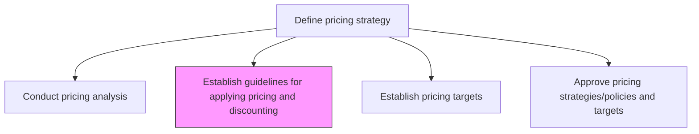
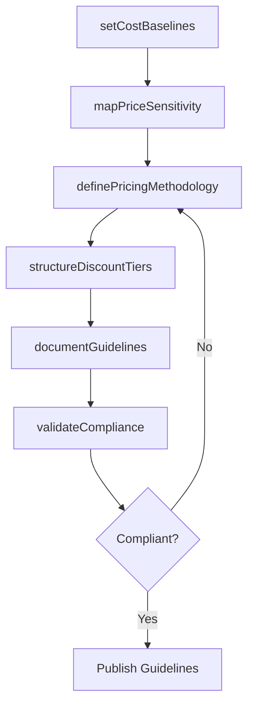

# Establish guidelines for applying pricing and discounting of products/services

> Business-as-Code definition for pricing and discounting guideline creation. Models the development of uniform pricing frameworks that balance cost structures, competitive positioning, and discount governance.

## Overview

Creating a framework that allows for a uniform methodology while determining the price of individual offerings. Devise a blueprint for establishing the pricing of specific products/services. Create guidelines that factor in the cost of production/servicing, price sensitivity, product lifecycle, and the price of competing/substitute products.

## Process Hierarchy



## GraphDL

```yaml
establish:
  object: Guidelines For Applying Pricing And Discounting Of Products/services
  actor: PricingManager
  result: PricingGuidelinesDocument
```

## Actions

| Action | Description |
|--------|-------------|
| definePricingMethodology | Create the standardized approach for calculating product and service prices |
| setCostBaselines | Establish production, distribution, and servicing cost baselines for each offering |
| mapPriceSensitivity | Analyze customer willingness-to-pay across segments and price points |
| structureDiscountTiers | Define discount levels, eligibility criteria, and approval thresholds |
| documentGuidelines | Produce the formal pricing and discounting policy document |
| validateCompliance | Audit existing prices against the new guidelines for conformance |

## Events

| Event | Description |
|-------|-------------|
| pricingMethodologyDefined | Standardized pricing calculation approach approved |
| costBaselinesSet | Cost structures documented for all product lines |
| priceSensitivityMapped | Willingness-to-pay analysis completed across segments |
| discountTiersStructured | Discount framework with approval thresholds finalized |
| guidelinesDocumented | Pricing and discounting policy published |
| complianceValidated | Price audit against guidelines completed |

## Searches

| Search | Description |
|--------|-------------|
| getPricingGuidelines | Retrieve current pricing guidelines by product category or region |
| getDiscountPolicies | Look up discount tier structures and approval thresholds |
| findPriceExceptions | Query prices that deviate from established guidelines |
| getCostBaselines | Retrieve cost baselines by product line or service type |

## Process Flow



## RACI Matrix

| Activity | Responsible | Accountable | Consulted | Informed |
|----------|-------------|-------------|-----------|----------|
| definePricingMethodology | PricingManager | VP Marketing | Finance | Sales |
| setCostBaselines | FinancialAnalyst | CFO | ProductManagement | PricingManager |
| structureDiscountTiers | PricingManager | VP Sales | Finance | ChannelPartners |
| documentGuidelines | PricingAnalyst | PricingManager | Legal | SalesOperations |
| validateCompliance | PricingAnalyst | PricingManager | Finance | Sales |

## Related Processes

| Process | Relationship |
|---------|-------------|
| 3.2.2.1 Conduct pricing analysis | Upstream - analysis informs guideline development |
| 3.2.2.3 Establish pricing targets | Downstream - guidelines constrain target setting |
| 3.2.2.4 Approve pricing strategies/policies and targets | Downstream - guidelines require formal approval |
| 3.4.3 Manage sales orders | Consumer - sales applies discount guidelines to orders |

## Related Departments

| Department | Role |
|-----------|------|
| Pricing | Develops and maintains pricing frameworks |
| Finance | Provides cost structures and margin requirements |
| Sales | Applies guidelines in deal negotiations |
| Product Management | Supplies product lifecycle and positioning data |

## Related Occupations

| Occupation | Involvement |
|-----------|-------------|
| Pricing Manager | Leads guideline development and governance |
| Financial Analyst | Analyzes cost structures and margin impacts |
| Sales Operations Analyst | Ensures guideline adoption in sales workflows |

## KPIs

| KPI | Description | Unit |
|-----|-------------|------|
| Guideline Compliance Rate | Percentage of transactions priced within guidelines | % |
| Discount Approval Cycle Time | Average time to approve discount requests | Hours |
| Price Consistency Index | Variance of actual prices versus guideline targets | % |
| Margin Preservation Rate | Percentage of deals meeting minimum margin thresholds | % |

## Usage

```typescript
import { establishGuidelinesForApplyingPricingAndDiscountingOfProductsServices } from '@headlessly/establish-guidelines-for-applying-pricing-and-discounting-of-products-services'

const guidelines = establishGuidelinesForApplyingPricingAndDiscountingOfProductsServices()

// Define pricing methodology for a product line
const methodology = await guidelines.definePricingMethodology({
  productLine: 'SaaS Platform',
  model: 'value-based',
  competitorBenchmark: true
})

// Structure discount tiers with approval thresholds
const discounts = await guidelines.structureDiscountTiers({
  tiers: ['standard', 'volume', 'strategic'],
  maxDiscount: 0.35,
  approvalLevels: { above20: 'VP Sales', above30: 'CFO' }
})
```
