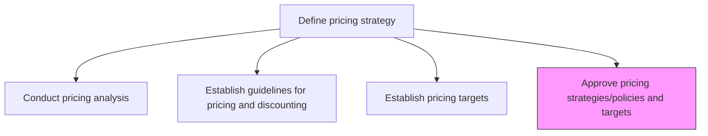
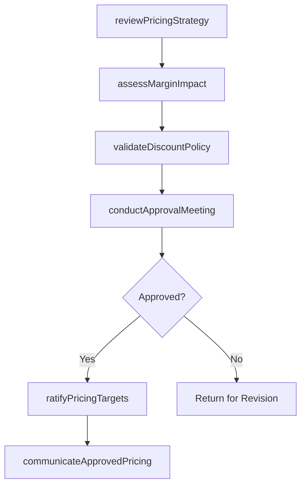

# Approve pricing strategies/policies and targets

> Business-as-Code definition for pricing strategy and policy approval governance. Models the review, validation, and formal sign-off of pricing methodologies, discount policies, and price targets.

## Overview

Confirming the strategy and specifications developed for pricing the organization's products/services. Approve pricing guidelines by vetting the soundness of the methodology and the guidelines' alignment with the value proposition.

## Process Hierarchy



## GraphDL

```yaml
approve:
  object: Pricing Strategies/policies And Targets
  actor: PricingCommittee
  result: ApprovedPricingPolicy
```

## Actions

| Action | Description |
|--------|-------------|
| reviewPricingStrategy | Evaluate the proposed pricing methodology for market alignment and soundness |
| assessMarginImpact | Analyze projected gross and net margin effects of proposed pricing targets |
| validateDiscountPolicy | Verify discount tiers and approval workflows meet governance standards |
| conductApprovalMeeting | Convene the pricing committee to review and vote on pricing proposals |
| ratifyPricingTargets | Formally approve final price points and discount thresholds |
| communicateApprovedPricing | Distribute approved pricing policies to sales, finance, and channel partners |

## Events

| Event | Description |
|-------|-------------|
| pricingStrategyReviewed | Pricing methodology review completed with findings documented |
| marginImpactAssessed | Financial impact analysis of proposed prices finalized |
| discountPolicyValidated | Discount governance framework verified and cleared |
| approvalMeetingConducted | Pricing committee meeting concluded with voting record |
| pricingTargetsRatified | Price targets formally approved by authorized signatories |
| approvedPricingCommunicated | Approved pricing distributed to all stakeholder teams |

## Searches

| Search | Description |
|--------|-------------|
| getPendingApprovals | Retrieve pricing proposals awaiting committee review |
| getApprovalHistory | Query historical pricing approvals by product line or date range |
| findPricingExceptions | List approved exceptions or deviations from standard pricing policy |

## Process Flow



## RACI Matrix

| Activity | Responsible | Accountable | Consulted | Informed |
|----------|-------------|-------------|-----------|----------|
| reviewPricingStrategy | PricingManager | VP Marketing | Finance | Sales |
| assessMarginImpact | FinancialAnalyst | CFO | PricingManager | ExecutiveTeam |
| validateDiscountPolicy | PricingManager | VP Sales | Legal | ChannelPartners |
| conductApprovalMeeting | PricingCommitteeChair | CEO | ProductManagement | Marketing |
| ratifyPricingTargets | PricingCommitteeChair | CFO | VP Sales | SalesOperations |

## Related Processes

| Process | Relationship |
|---------|-------------|
| 3.2.2.1 Conduct pricing analysis | Upstream - analysis provides data for approval decisions |
| 3.2.2.2 Establish guidelines for applying pricing and discounting | Upstream - guidelines require formal approval |
| 3.2.2.3 Establish pricing targets | Upstream - targets submitted for ratification |
| 3.4.2 Develop and manage sales plans | Downstream - approved pricing feeds sales planning |

## Related Departments

| Department | Role |
|-----------|------|
| Pricing | Prepares pricing proposals for committee review |
| Finance | Validates margin impact and financial soundness |
| Sales | Provides market feedback on pricing competitiveness |
| Executive Leadership | Final approval authority for pricing strategies |

## Related Occupations

| Occupation | Involvement |
|-----------|-------------|
| Pricing Manager | Presents pricing proposals and supports approval process |
| Chief Financial Officer | Approves financial impact of pricing decisions |
| VP Sales | Validates market competitiveness of proposed prices |

## KPIs

| KPI | Description | Unit |
|-----|-------------|------|
| Approval Cycle Time | Average days from proposal submission to final approval | Days |
| First-Pass Approval Rate | Percentage of pricing proposals approved without revision | % |
| Policy Adherence Rate | Percentage of post-approval transactions within approved parameters | % |
| Approval Backlog | Number of pricing proposals pending committee review | Count |

## Usage

```typescript
import { approvePricingStrategiesPoliciesAndTargets } from '@headlessly/approve-pricing-strategies-policies-and-targets'

const approval = approvePricingStrategiesPoliciesAndTargets()

// Review a pending pricing strategy proposal
const review = await approval.reviewPricingStrategy({
  proposalId: 'PRICE-2024-Q3-SaaS',
  productLine: 'SaaS Platform',
  reviewScope: ['methodology', 'competitiveness', 'margin']
})

// Ratify approved pricing targets
const ratified = await approval.ratifyPricingTargets({
  proposalId: 'PRICE-2024-Q3-SaaS',
  approvedBy: 'PricingCommittee',
  effectiveDate: '2024-07-01'
})
```
