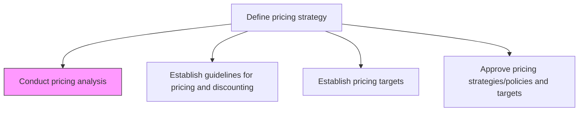
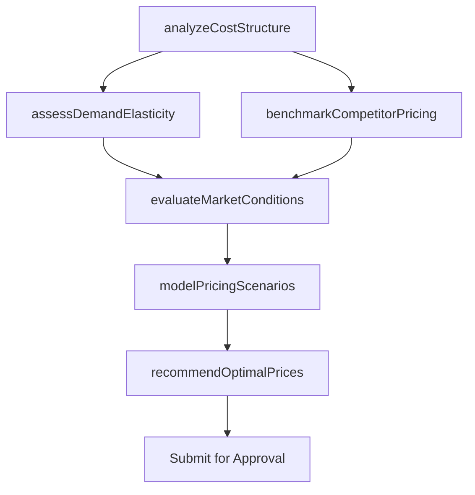

# Conduct pricing analysis

> Business-as-Code definition for pricing analysis execution. Models the systematic evaluation of costs, demand elasticity, competitor pricing, and market conditions to determine optimal price points.

## Overview

Analyzing marketing objectives, consumer demand, product attributes, competitors' pricing, and economic trends to determine optimum prices for the set of products and services that the company offers or intends to offer by delivering maximum ROI.

## Process Hierarchy



## GraphDL

```yaml
conduct:
  object: Pricing Analysis
  actor: PricingAnalyst
  result: PricingAnalysisReport
```

## Actions

| Action | Description |
|--------|-------------|
| analyzeCostStructure | Calculate fully-loaded costs including production, distribution, and overhead |
| assessDemandElasticity | Model how quantity demanded responds to price changes across segments |
| benchmarkCompetitorPricing | Collect and compare competitor and substitute product pricing |
| evaluateMarketConditions | Assess macroeconomic trends, inflation, and market maturity factors |
| modelPricingScenarios | Simulate revenue and margin outcomes under alternative pricing models |
| recommendOptimalPrices | Synthesize analysis into price point recommendations per product |

## Events

| Event | Description |
|-------|-------------|
| costStructureAnalyzed | Product cost analysis completed with unit economics documented |
| demandElasticityAssessed | Price elasticity models validated for target segments |
| competitorPricingBenchmarked | Competitor price data collected and indexed |
| marketConditionsEvaluated | Macroeconomic and market trend assessment finalized |
| pricingScenariosModeled | Revenue and margin simulations completed under multiple scenarios |
| optimalPricesRecommended | Price point recommendations delivered to stakeholders |

## Searches

| Search | Description |
|--------|-------------|
| getPricingAnalyses | Retrieve completed pricing analyses by product or date range |
| getCompetitorPrices | Look up competitor pricing data by product category |
| getElasticityModels | Query demand elasticity models for specific products or segments |
| getPricingScenarios | Retrieve scenario simulation results by product line |

## Process Flow



## RACI Matrix

| Activity | Responsible | Accountable | Consulted | Informed |
|----------|-------------|-------------|-----------|----------|
| analyzeCostStructure | PricingAnalyst | PricingManager | Finance | ProductManagement |
| assessDemandElasticity | DataScientist | PricingManager | MarketResearch | Sales |
| benchmarkCompetitorPricing | CompetitiveIntelligenceAnalyst | PricingManager | Marketing | Strategy |
| modelPricingScenarios | PricingAnalyst | PricingManager | Finance | VP Marketing |
| recommendOptimalPrices | PricingManager | VP Marketing | Sales | CFO |

## Related Processes

| Process | Relationship |
|---------|-------------|
| 3.2.2.2 Establish guidelines for applying pricing and discounting | Downstream - analysis informs guideline development |
| 3.2.2.3 Establish pricing targets | Downstream - analysis feeds target price setting |
| 3.1.1.6 Analyze competing organizations | Upstream - competitor intelligence supports price benchmarking |

## Related Departments

| Department | Role |
|-----------|------|
| Pricing | Leads analysis and price modeling |
| Finance | Provides cost data and validates margin projections |
| Market Research | Supplies demand and elasticity data |
| Competitive Intelligence | Provides competitor pricing benchmarks |

## Related Occupations

| Occupation | Involvement |
|-----------|-------------|
| Pricing Analyst | Executes cost analysis and pricing models |
| Data Scientist | Builds demand elasticity and scenario models |
| Financial Analyst | Validates cost structures and margin assumptions |

## KPIs

| KPI | Description | Unit |
|-----|-------------|------|
| Analysis Accuracy | Variance between recommended and actual optimal price | % |
| Competitive Price Index | Ratio of own prices to market average | Ratio |
| Scenario Coverage | Number of pricing scenarios modeled per analysis | Count |
| Analysis Turnaround Time | Days from analysis initiation to recommendation delivery | Days |

## Usage

```typescript
import { conductPricingAnalysis } from '@headlessly/conduct-pricing-analysis'

const pricing = conductPricingAnalysis()

// Analyze cost structure for a product line
const costs = await pricing.analyzeCostStructure({
  productLine: 'Enterprise Platform',
  includeOverhead: true,
  period: 'FY2024'
})

// Model pricing scenarios with different strategies
const scenarios = await pricing.modelPricingScenarios({
  productId: 'ENT-001',
  models: ['cost-plus', 'value-based', 'competitive'],
  targetMargin: 0.65
})
```
