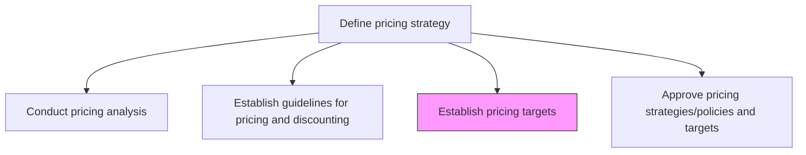
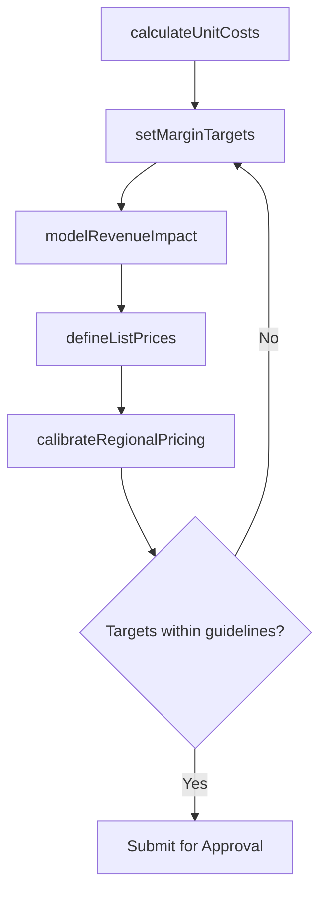

# Establish pricing targets

> Business-as-Code definition for setting product and service price targets. Models the determination of optimal price points based on cost structures, competitive analysis, and margin objectives.

## Overview

Determining optimum prices for individual products or services on the basis of the cost of producing, distributing and marketing the offerings, pricing analysis and general pricing strategy.

## Process Hierarchy



## GraphDL

```yaml
establish:
  object: Pricing Targets
  actor: PricingManager
  result: PriceTargetSchedule
```

## Actions

| Action | Description |
|--------|-------------|
| calculateUnitCosts | Determine the total cost per unit including production, distribution, and marketing |
| setMarginTargets | Define gross and net margin goals for each product tier |
| defineListPrices | Set the standard list price for each product or service SKU |
| modelRevenueImpact | Project revenue outcomes at various price points |
| calibrateRegionalPricing | Adjust price targets for geographic and currency variations |

## Events

| Event | Description |
|-------|-------------|
| unitCostsCalculated | Fully-loaded unit cost analysis completed |
| marginTargetsSet | Margin goals approved for product tiers |
| listPricesDefined | List prices published for all SKUs |
| revenueImpactModeled | Revenue projection models validated at target prices |
| regionalPricingCalibrated | Geo-adjusted price schedules finalized |

## Searches

| Search | Description |
|--------|-------------|
| getPriceTargets | Retrieve current price targets by product, region, or tier |
| getMarginAnalysis | Query margin projections at specified price points |
| findPriceHistory | Look up historical price changes for a product or SKU |
| getRegionalPrices | Retrieve geo-adjusted price schedules by market |

## Process Flow



## RACI Matrix

| Activity | Responsible | Accountable | Consulted | Informed |
|----------|-------------|-------------|-----------|----------|
| calculateUnitCosts | FinancialAnalyst | PricingManager | ProductManagement | Finance |
| setMarginTargets | PricingManager | VP Marketing | CFO | Sales |
| defineListPrices | PricingAnalyst | PricingManager | Sales | ChannelPartners |
| modelRevenueImpact | DataAnalyst | PricingManager | Finance | ExecutiveTeam |

## Related Processes

| Process | Relationship |
|---------|-------------|
| 3.2.2.1 Conduct pricing analysis | Upstream - analysis data informs target setting |
| 3.2.2.2 Establish guidelines for applying pricing and discounting | Upstream - guidelines constrain target parameters |
| 3.2.2.4 Approve pricing strategies/policies and targets | Downstream - targets submitted for formal approval |
| 3.4.1 Develop sales forecast | Consumer - price targets feed revenue forecasting |

## Related Departments

| Department | Role |
|-----------|------|
| Pricing | Sets and maintains price targets |
| Finance | Validates cost inputs and margin projections |
| Product Management | Provides product cost and positioning data |
| Sales | Validates market competitiveness of targets |

## Related Occupations

| Occupation | Involvement |
|-----------|-------------|
| Pricing Manager | Leads price target development and calibration |
| Financial Analyst | Calculates unit costs and models revenue impact |
| Product Manager | Provides product-level cost and feature data |

## KPIs

| KPI | Description | Unit |
|-----|-------------|------|
| Target Margin Achievement | Percentage of products meeting margin targets at set prices | % |
| Price-to-Value Ratio | Customer-perceived value relative to list price | Ratio |
| Regional Price Parity | Variance of regional prices from global baseline | % |
| Revenue Forecast Accuracy | Variance between projected and actual revenue at target prices | % |

## Usage

```typescript
import { establishPricingTargets } from '@headlessly/establish-pricing-targets'

const targets = establishPricingTargets()

// Calculate unit costs for a product line
const costs = await targets.calculateUnitCosts({
  productLine: 'Analytics Suite',
  includeCOGS: true,
  includeDistribution: true,
  includeMarketing: true
})

// Define list prices based on cost and margin analysis
const prices = await targets.defineListPrices({
  productLine: 'Analytics Suite',
  targetMargin: 0.70,
  competitorBaseline: 'market-median'
})
```
