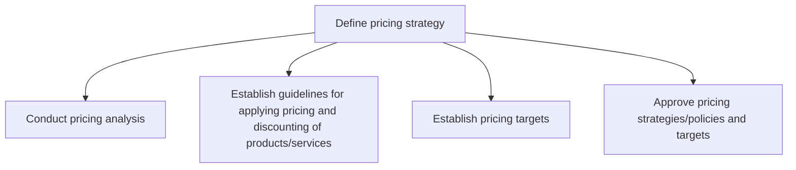
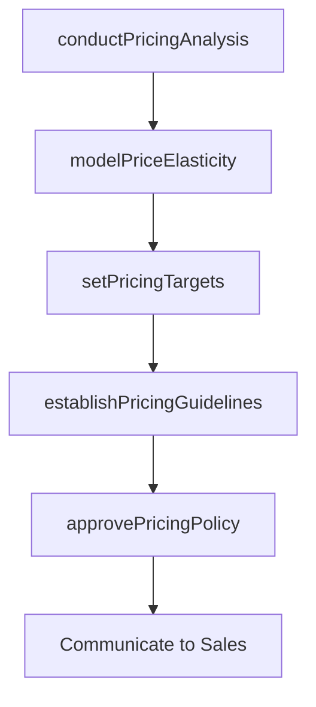

# Define pricing strategy

> Business-as-Code definition for pricing strategy formulation. Models the analysis, structuring, and approval of pricing frameworks that balance customer value perception, competitive positioning, and margin objectives.

## Overview

Creating a pricing strategy and mechanism that aligns with the benefits of the products/services, as perceived by customers. Chart a strategic course and a methodology that can guide the pricing of products/services. Draw heavily from the customer value proposition, and balance the expectations of different divisions inside the organization, while delivering the maximum ROI.

## Process Hierarchy



## GraphDL

```yaml
define:
  object: Pricing Strategy
  actor: PricingManager
  result: PricingStrategyFramework
```

## Actions

| Action | Description |
|--------|-------------|
| conductPricingAnalysis | Analyze cost structures, demand curves, and competitive pricing |
| establishPricingGuidelines | Create rules for pricing and discounting across products |
| setPricingTargets | Define target price points and margin thresholds per product |
| approvePricingPolicy | Formally approve pricing strategies and discount governance |
| modelPriceElasticity | Analyze sensitivity of demand to price changes |

## Events

| Event | Description |
|-------|-------------|
| pricingAnalysisConducted | Cost, demand, and competitive pricing analysis completed |
| pricingGuidelinesEstablished | Pricing and discount framework published |
| pricingTargetsSet | Target price points approved for all products |
| pricingPolicyApproved | Pricing strategy formally ratified by leadership |
| priceElasticityModeled | Demand elasticity model validated |

## Searches

| Search | Description |
|--------|-------------|
| getPricingStrategy | Retrieve current pricing strategy by product or segment |
| getDiscountGuidelines | Query discount policies and approval thresholds |
| getPriceElasticity | Retrieve price elasticity data by product and segment |
| getCompetitivePricing | Access competitor pricing intelligence |

## Process Flow



## RACI Matrix

| Activity | Responsible | Accountable | Consulted | Informed |
|----------|-------------|-------------|-----------|----------|
| conductPricingAnalysis | PricingAnalyst | PricingManager | Finance | Marketing |
| establishPricingGuidelines | PricingManager | CMO | Sales | Legal |
| setPricingTargets | PricingManager | CFO | ProductManagement | Sales |
| approvePricingPolicy | CFO | CEO | CMO | SalesLeadership |

## Sub-Processes

| ID | Name | Description |
|----|------|-------------|
| 3.2.2.1 | Conduct pricing analysis | Analyzing marketing objectives, consumer demand, product attributes, competitors' pricing, and econo |
| 3.2.2.2 | Establish guidelines for applying pricing and discounting of products/services | Creating a framework that allows for a uniform methodology while determining the price of individual |
| 3.2.2.3 | Establish pricing targets | Determining optimum prices for individual products or services on the basis of the cost of producing |
| 3.2.2.4 | Approve pricing strategies/policies and targets | Confirming the strategy and specifications developed for pricing the organization's products/service |

## Related Processes

| Process | Relationship |
|---------|-------------|
| 3.2.1 Define offering and customer value proposition | Upstream - value proposition shapes pricing rationale |
| 3.3.4 Develop and manage pricing | Downstream - strategy guides operational pricing execution |
| 3.1.1.6 Analyze competing organizations | Upstream - competitive intelligence informs pricing analysis |

## Related Departments

| Department | Role |
|-----------|------|
| Pricing | Leads pricing analysis, modeling, and guideline development |
| Finance | Validates margin targets and financial impact |
| Sales | Implements pricing in deals and provides market feedback |
| Product Management | Provides cost structure and value differentiation inputs |

## Related Occupations

| Occupation | Involvement |
|-----------|-------------|
| Pricing Manager | Designs pricing strategy and discount governance |
| Pricing Analyst | Conducts competitive analysis and elasticity modeling |
| Revenue Manager | Optimizes pricing for revenue maximization |

## KPIs

| KPI | Description | Unit |
|-----|-------------|------|
| Gross Margin | Average gross margin across product portfolio | % |
| Price Realization | Actual vs list price across all transactions | % |
| Discount Rate | Average discount as percentage of list price | % |
| Competitive Price Index | Price position relative to key competitors | Index |

## Usage

```typescript
import { definePricingStrategy } from '@headlessly/define-pricing-strategy'

const pricing = definePricingStrategy()

// Conduct pricing analysis for a product line
const analysis = await pricing.conductPricingAnalysis({
  productLine: 'Analytics Platform',
  includeCompetitorPricing: true,
  includeElasticity: true
})

// Set pricing targets
const targets = await pricing.setPricingTargets({
  productLine: 'Analytics Platform',
  marginFloor: 0.65,
  competitivePosition: 'premium'
})
```
