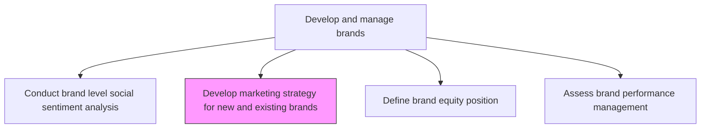
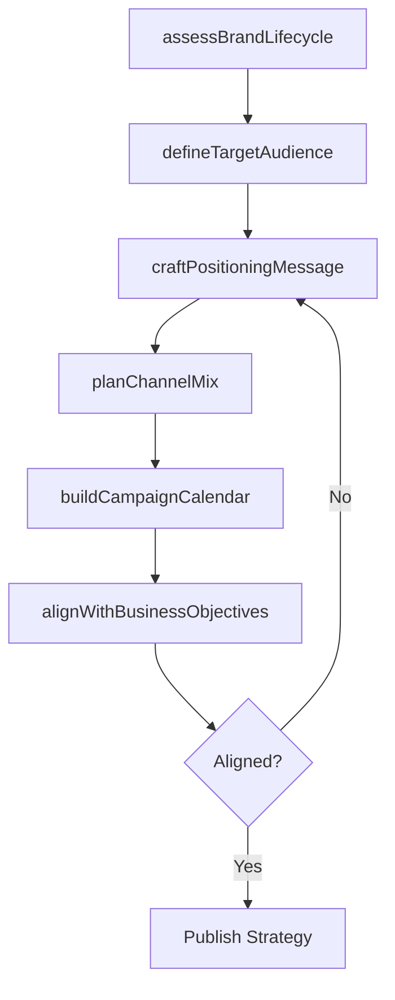

# Develop marketing strategy for new and existing brands

> Business-as-Code definition for brand marketing strategy development. Models the creation and refinement of marketing strategies that support both new brand launches and the evolution of established brands.

## Overview

Creating comprehensive marketing strategies that drive brand growth for both new and existing brands. Defining target audiences, positioning messages, channel mix, and campaign calendars. Aligning brand marketing plans with overall business objectives, market insights, and competitive dynamics to maximize brand awareness, consideration, and revenue contribution.

## Process Hierarchy



## GraphDL

```yaml
develop:
  object: Marketing Strategy For New And Existing Brands
  actor: BrandMarketer
  result: BrandMarketingStrategyDocument
```

## Actions

| Action | Description |
|--------|-------------|
| assessBrandLifecycle | Determine current brand lifecycle stage and corresponding strategy needs |
| defineTargetAudience | Identify and profile the target audience segments for the brand |
| craftPositioningMessage | Develop the core positioning statement and messaging hierarchy |
| planChannelMix | Select and allocate budget across marketing channels for the brand |
| buildCampaignCalendar | Create the annual brand campaign calendar with milestones |
| alignWithBusinessObjectives | Ensure brand strategy supports overarching revenue and growth goals |

## Events

| Event | Description |
|-------|-------------|
| brandLifecycleAssessed | Brand lifecycle analysis completed with strategic implications |
| targetAudienceDefined | Target audience segments profiled and validated |
| positioningMessageCrafted | Core brand positioning and messaging hierarchy approved |
| channelMixPlanned | Marketing channel allocation and budget approved |
| campaignCalendarBuilt | Annual brand campaign calendar published |
| businessAlignmentConfirmed | Brand strategy alignment with business objectives verified |

## Searches

| Search | Description |
|--------|-------------|
| getBrandStrategies | Retrieve brand marketing strategies by brand, lifecycle stage, or period |
| findTargetAudiences | Query target audience profiles linked to specific brands |
| getCampaignCalendars | Look up brand campaign calendars by brand or quarter |
| getChannelAllocations | Retrieve marketing budget allocations by brand and channel |

## Process Flow



## RACI Matrix

| Activity | Responsible | Accountable | Consulted | Informed |
|----------|-------------|-------------|-----------|----------|
| assessBrandLifecycle | BrandManager | CMO | MarketResearch | ProductManagement |
| defineTargetAudience | MarketingAnalyst | BrandManager | Sales | CustomerInsights |
| craftPositioningMessage | BrandManager | CMO | CreativeDirector | PR |
| planChannelMix | MediaPlanner | BrandManager | DigitalMarketing | Finance |
| buildCampaignCalendar | CampaignManager | BrandManager | Sales | ChannelPartners |

## Related Processes

| Process | Relationship |
|---------|-------------|
| 3.2.3.1 Conduct brand level social sentiment analysis | Upstream - sentiment informs strategy refinement |
| 3.2.3.3 Define brand equity position | Downstream - strategy shapes equity positioning |
| 3.2.6 Develop marketing communication strategy | Downstream - brand strategy feeds communication planning |
| 3.3.1 Develop and manage advertising | Consumer - strategy guides advertising execution |

## Related Departments

| Department | Role |
|-----------|------|
| Brand Marketing | Develops and owns brand marketing strategies |
| Market Research | Provides audience insights and competitive data |
| Creative Services | Translates strategy into creative concepts |
| Media Planning | Executes channel mix and budget allocation |

## Related Occupations

| Occupation | Involvement |
|-----------|-------------|
| Brand Manager | Leads strategy development and cross-functional alignment |
| Marketing Analyst | Provides data-driven audience and performance insights |
| Media Planner | Plans channel mix and media buying strategy |

## KPIs

| KPI | Description | Unit |
|-----|-------------|------|
| Brand Strategy Completion Rate | Percentage of brands with current, approved marketing strategies | % |
| Campaign Calendar Adherence | Percentage of planned campaigns launched on schedule | % |
| Channel ROI | Return on marketing investment by channel | Ratio |
| Target Audience Reach | Percentage of defined target audience reached by campaigns | % |

## Usage

```typescript
import { developMarketingStrategyForNewAndExistingBrands } from '@headlessly/develop-marketing-strategy-for-new-and-existing-brands'

const strategy = developMarketingStrategyForNewAndExistingBrands()

// Assess brand lifecycle stage
const lifecycle = await strategy.assessBrandLifecycle({
  brand: 'Enterprise Analytics',
  metrics: ['awareness', 'revenue', 'marketShare']
})

// Plan channel mix for the brand
const channels = await strategy.planChannelMix({
  brand: 'Enterprise Analytics',
  budget: 500000,
  channels: ['paid-search', 'content-marketing', 'events', 'social']
})
```
