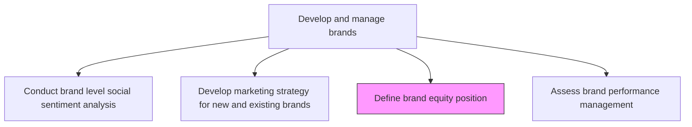
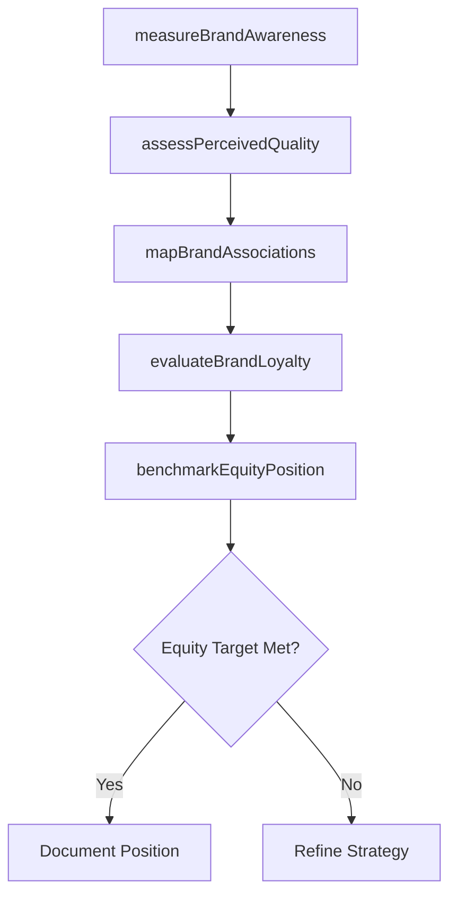

# Define brand equity position

> Business-as-Code definition for brand equity positioning. Models the measurement and strategic placement of brand value across awareness, perceived quality, associations, and loyalty dimensions.

## Overview

Establishing the equity position of the organization's brands by measuring and benchmarking brand value components. Quantifying brand awareness, perceived quality, customer associations, and loyalty to determine the brand's competitive strength and financial contribution. Defining strategic positioning that maximizes long-term brand equity growth.

## Process Hierarchy



## GraphDL

```yaml
define:
  object: Brand Equity Position
  actor: BrandStrategist
  result: BrandEquityAssessment
```

## Actions

| Action | Description |
|--------|-------------|
| measureBrandAwareness | Quantify aided and unaided brand recognition across target markets |
| assessPerceivedQuality | Evaluate customer perceptions of brand quality relative to competitors |
| mapBrandAssociations | Identify and catalog the attributes, benefits, and imagery customers associate with the brand |
| evaluateBrandLoyalty | Measure customer retention, repeat purchase rates, and advocacy levels |
| benchmarkEquityPosition | Compare brand equity metrics against competitors and industry benchmarks |

## Events

| Event | Description |
|-------|-------------|
| brandAwarenessMeasured | Brand recognition study completed across target markets |
| perceivedQualityAssessed | Customer quality perception survey results finalized |
| brandAssociationsMapped | Brand association map created with key attribute clusters |
| brandLoyaltyEvaluated | Customer loyalty and advocacy metrics calculated |
| equityPositionBenchmarked | Competitive brand equity benchmarking report delivered |

## Searches

| Search | Description |
|--------|-------------|
| getBrandEquityScores | Retrieve brand equity composite scores by brand and market |
| getAwarenessMetrics | Query brand awareness levels by segment or geography |
| getBrandAssociationMap | Look up brand association clusters and strength ratings |
| getLoyaltyMetrics | Retrieve customer loyalty and advocacy scores by brand |

## Process Flow



## RACI Matrix

| Activity | Responsible | Accountable | Consulted | Informed |
|----------|-------------|-------------|-----------|----------|
| measureBrandAwareness | MarketResearchAnalyst | BrandManager | MarketResearch | Marketing |
| assessPerceivedQuality | BrandAnalyst | BrandManager | ProductManagement | Sales |
| mapBrandAssociations | BrandStrategist | CMO | CreativeDirector | PR |
| benchmarkEquityPosition | BrandAnalyst | CMO | Finance | ExecutiveTeam |

## Related Processes

| Process | Relationship |
|---------|-------------|
| 3.2.3.1 Conduct brand level social sentiment analysis | Upstream - sentiment feeds equity assessment |
| 3.2.3.2 Develop marketing strategy for new and existing brands | Upstream - strategy informs equity goals |
| 3.2.3.4 Assess brand performance management | Downstream - equity position feeds performance tracking |

## Related Departments

| Department | Role |
|-----------|------|
| Brand Management | Owns equity definition and strategic positioning |
| Market Research | Conducts awareness and perception studies |
| Finance | Values brand equity as an intangible asset |
| Marketing | Executes programs to strengthen equity dimensions |

## Related Occupations

| Occupation | Involvement |
|-----------|-------------|
| Brand Strategist | Leads equity positioning and benchmarking |
| Market Research Analyst | Conducts awareness and perception studies |
| Financial Analyst | Quantifies brand equity financial contribution |

## KPIs

| KPI | Description | Unit |
|-----|-------------|------|
| Brand Equity Index | Composite score across awareness, quality, associations, and loyalty | Score (0-100) |
| Unaided Awareness | Percentage of target market recalling brand without prompting | % |
| Net Promoter Score | Customer likelihood to recommend the brand | Score (-100 to 100) |
| Brand Premium | Price premium customers will pay versus generic alternatives | % |

## Usage

```typescript
import { defineBrandEquityPosition } from '@headlessly/define-brand-equity-position'

const equity = defineBrandEquityPosition()

// Measure brand awareness across target markets
const awareness = await equity.measureBrandAwareness({
  brand: 'Enterprise Platform',
  markets: ['North America', 'EMEA'],
  method: 'survey',
  sampleSize: 1500
})

// Benchmark equity position against competitors
const benchmark = await equity.benchmarkEquityPosition({
  brand: 'Enterprise Platform',
  competitors: ['CompetitorA', 'CompetitorB', 'CompetitorC'],
  dimensions: ['awareness', 'quality', 'loyalty']
})
```
