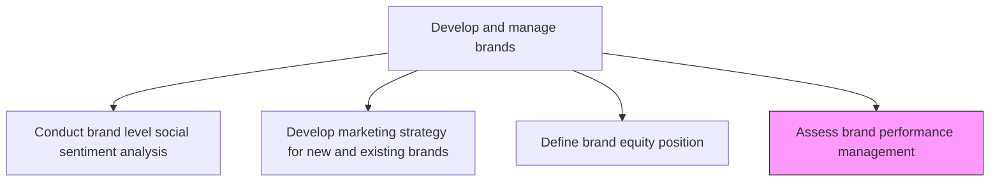
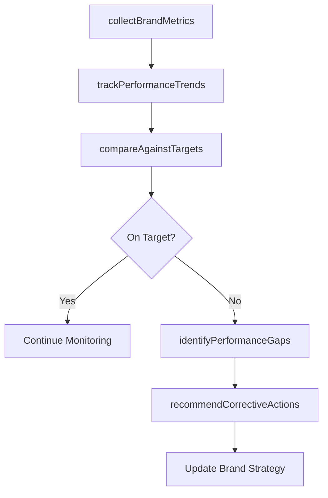

# Assess brand performance management

> Business-as-Code definition for brand performance assessment. Models the measurement, analysis, and optimization of brand health metrics against strategic targets and market benchmarks.

## Overview

Evaluating the performance of brand assets against established equity, revenue, and awareness targets. Tracking brand health indicators over time, identifying performance gaps, and recommending corrective actions. Ensuring brand investments deliver measurable returns and that brand strength translates into competitive advantage and revenue growth.

## Process Hierarchy



## GraphDL

```yaml
assess:
  object: Brand Performance Management
  actor: BrandAnalyst
  result: BrandPerformanceReport
```

## Actions

| Action | Description |
|--------|-------------|
| collectBrandMetrics | Gather brand health data from surveys, social listening, and sales analytics |
| trackPerformanceTrends | Monitor brand KPIs over time to identify trajectories and anomalies |
| compareAgainstTargets | Evaluate current brand metrics versus planned equity and revenue goals |
| identifyPerformanceGaps | Pinpoint areas where brand performance falls short of expectations |
| recommendCorrectiveActions | Propose strategy adjustments to address brand performance deficiencies |

## Events

| Event | Description |
|-------|-------------|
| brandMetricsCollected | Brand health data aggregated from all measurement sources |
| performanceTrendsTracked | Brand KPI trend analysis updated with latest period data |
| targetsCompared | Brand performance comparison against targets completed |
| performanceGapsIdentified | Performance gap analysis documented with root causes |
| correctiveActionsRecommended | Brand strategy adjustment recommendations delivered |

## Searches

| Search | Description |
|--------|-------------|
| getBrandPerformanceReports | Retrieve brand performance reports by brand, period, or metric |
| findPerformanceGaps | Query identified performance gaps by brand or dimension |
| getPerformanceTrends | Look up brand KPI trends over specified time periods |

## Process Flow



## RACI Matrix

| Activity | Responsible | Accountable | Consulted | Informed |
|----------|-------------|-------------|-----------|----------|
| collectBrandMetrics | BrandAnalyst | BrandManager | MarketResearch | Marketing |
| trackPerformanceTrends | BrandAnalyst | BrandManager | DataScience | Finance |
| compareAgainstTargets | BrandManager | CMO | Sales | ExecutiveTeam |
| recommendCorrectiveActions | BrandManager | CMO | CreativeDirector | ProductManagement |

## Related Processes

| Process | Relationship |
|---------|-------------|
| 3.2.3.3 Define brand equity position | Upstream - equity targets serve as performance benchmarks |
| 3.2.3.1 Conduct brand level social sentiment analysis | Upstream - sentiment data feeds performance assessment |
| 3.2.3.2 Develop marketing strategy for new and existing brands | Consumer - performance gaps drive strategy adjustments |

## Related Departments

| Department | Role |
|-----------|------|
| Brand Management | Leads performance tracking and strategy optimization |
| Market Research | Provides brand health measurement data |
| Marketing Analytics | Aggregates and visualizes brand performance metrics |
| Finance | Evaluates brand investment return |

## Related Occupations

| Occupation | Involvement |
|-----------|-------------|
| Brand Analyst | Collects metrics and produces performance reports |
| Brand Manager | Interprets results and drives corrective actions |
| Marketing Analyst | Supports data aggregation and trend analysis |

## KPIs

| KPI | Description | Unit |
|-----|-------------|------|
| Brand Health Index | Composite score tracking overall brand vitality | Score (0-100) |
| Brand Revenue Contribution | Revenue directly attributable to brand strength | Currency |
| Brand Awareness Trend | Quarter-over-quarter change in brand awareness | % |
| Performance Gap Count | Number of metrics below target thresholds | Count |

## Usage

```typescript
import { assessBrandPerformanceManagement } from '@headlessly/assess-brand-performance-management'

const performance = assessBrandPerformanceManagement()

// Collect brand metrics across all sources
const metrics = await performance.collectBrandMetrics({
  brand: 'Enterprise Platform',
  sources: ['survey', 'social-listening', 'sales-data'],
  period: 'Q4-2024'
})

// Compare current performance against equity targets
const comparison = await performance.compareAgainstTargets({
  brand: 'Enterprise Platform',
  targets: { awareness: 45, nps: 50, revenueGrowth: 15 }
})
```
